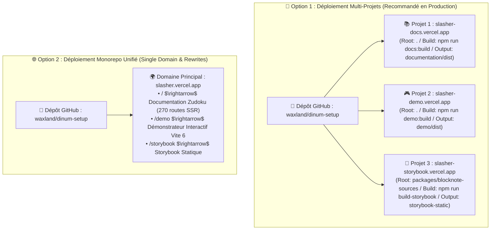

# 🚀 Guide & Feuille de Route de Déploiement Vercel — Projet Slasher (`VERCEL_TODO.md`)

> **Projet :** **Slasher** (`@blocknote/xl-external-sources` & Presets Souverains DINUM)  
> **Destinataires :** DevOps, Administrateurs Vercel, Développeurs & Mainteneurs  
> **Date de Référence :** 17 Septembre 2026  
> **Cibles de Déploiement :**
> 1. 📚 **Portail Documentaire Zudoku** (`documentation/` $\rightarrow$ `documentation/dist/`)
> 2. 🎮 **Démonstrateur Web Standalone** (`demo/` $\rightarrow$ `demo/dist/`)
> 3. 🎨 **Storybook des Composants BlockNote** (`packages/blocknote-sources/` $\rightarrow$ `storybook-static/`)

---

## 🧭 1. Stratégies de Déploiement Vercel

Deux architectures de déploiement sont envisageables sur Vercel :



---

## 📋 2. Plan d'Action & Checkboxes d'Exécution

---

### 📦 PHASE 1 : Prérequis & Configuration du Monorepo Racine

**Objectif :** Garantir que les scripts de build et les workspaces npm sont nativement exécutables dans l'environnement CI/CD Vercel (Node.js 22 LTS).

- [ ] **Tâche 1.1 : Validation des Dépendances & Workspaces npm**
  - Vérifier que `package.json` racine déclare :
    ```json
    "workspaces": [
      "packages/*",
      "documentation",
      "demo"
    ]
    ```
- [ ] **Tâche 1.2 : Configuration de la Version Node.js sur Vercel**
  - Dans les paramètres Vercel (*Project Settings* $\rightarrow$ *General* $\rightarrow$ *Node.js Version*), sélectionner **`22.x`**.
  - Ou ajouter dans `package.json` :
    ```json
    "engines": {
      "node": ">=22.0.0",
      "npm": ">=10.0.0"
    }
    ```
- [ ] **Tâche 1.3 : Validation des Scripts de Build Autonomes**
  - Tester en local que les commandes de build isolées s'exécutent sans accroc :
    ```bash
    # 1. Build Packages TypeScript
    npm run packages:build
    # 2. Build Documentation Zudoku
    npm run docs:build
    # 3. Build Démonstrateur Web
    npm run demo:build
    ```

---

### 📚 PHASE 2 : Déploiement du Portail Documentaire Zudoku

**Projet Vercel Cible :** `slasher-docs` (ex: `https://slasher-docs.vercel.app`)

- [ ] **Tâche 2.1 : Configuration `vercel.json` pour la Documentation**
  - *Fichier :* `vercel.json` à la racine :
    ```json
    {
      "$schema": "https://openapi.vercel.sh/vercel.json",
      "buildCommand": "npm run build",
      "outputDirectory": "documentation/dist",
      "cleanUrls": true,
      "trailingSlash": false,
      "headers": [
        {
          "source": "/assets/(.*)",
          "headers": [
            {
              "key": "Cache-Control",
              "value": "public, max-age=31536000, immutable"
            }
          ]
        },
        {
          "source": "/(.*)",
          "headers": [
            {
              "key": "X-Frame-Options",
              "value": "DENY"
            },
            {
              "key": "X-Content-Type-Options",
              "value": "nosniff"
            },
            {
              "key": "Referrer-Policy",
              "value": "strict-origin-when-cross-origin"
            }
          ]
        }
      ]
    }
    ```
- [ ] **Tâche 2.2 : Déploiement via la CLI Vercel**
  ```bash
  # Connexion à Vercel
  vercel login

  # Lier le projet local au projet Vercel
  vercel link --project slasher-docs

  # Déploiement en prévisualisation
  vercel

  # Déploiement officiel en production
  vercel --prod
  ```
- [ ] **Tâche 2.3 : Critères d'Acceptation Documentation**
  - Accès à la landing page bilingue (`/`).
  - 270 routes pré-rendues fonctionnelles sans erreur 404 ni hydratation brisée.
  - Recherche plein texte Pagefind active (`/pagefind/pagefind.js`).

---

### 🎮 PHASE 3 : Déploiement du Démonstrateur Web Standalone

**Projet Vercel Cible :** `slasher-demo` (ex: `https://slasher-demo.vercel.app`)

- [ ] **Tâche 3.1 : Création de la Configuration Dédiée `demo/vercel.json`**
  - *Fichier à créer :* `demo/vercel.json` :
    ```json
    {
      "$schema": "https://openapi.vercel.sh/vercel.json",
      "buildCommand": "npm run packages:build && npm --prefix demo run build",
      "outputDirectory": "dist",
      "cleanUrls": true,
      "rewrites": [
        {
          "source": "/(.*)",
          "destination": "/index.html"
        }
      ]
    }
    ```
- [ ] **Tâche 3.2 : Déploiement du Démonstrateur via la CLI Vercel**
  ```bash
  # Depuis le dossier demo/
  cd demo
  vercel link --project slasher-demo
  vercel --prod
  ```
- [ ] **Tâche 3.3 : Critères d'Acceptation Démo**
  - Chargement instantané de l'éditeur BlockNote 0.54.
  - Sélecteur de pays 🇫🇷 🇩🇪 🇳🇱 🇪🇺 fonctionnel.
  - Commutation dynamique des 3 formats d'affichage (*Callout*, *Card*, *Inline Link*).
  - Mode sombre / clair opérationnel.

---

### 🎨 PHASE 4 : Déploiement du Storybook des Composants BlockNote

**Projet Vercel Cible :** `slasher-storybook` (ex: `https://slasher-storybook.vercel.app`)

- [ ] **Tâche 4.1 : Configuration du Script de Build Storybook**
  - *Vérifier dans `packages/blocknote-sources/package.json` :*
    ```json
    "scripts": {
      "build-storybook": "storybook build -o storybook-static"
    }
    ```
- [ ] **Tâche 4.2 : Configuration `packages/blocknote-sources/vercel.json`**
  - *Fichier :* `packages/blocknote-sources/vercel.json` :
    ```json
    {
      "$schema": "https://openapi.vercel.sh/vercel.json",
      "buildCommand": "npm run build && npm run build-storybook",
      "outputDirectory": "storybook-static",
      "cleanUrls": true
    }
    ```
- [ ] **Tâche 4.3 : Déploiement du Storybook**
  ```bash
  cd packages/blocknote-sources
  vercel link --project slasher-storybook
  vercel --prod
  ```

---

### 🌐 PHASE 5 : Option Unifiée Monorepo (Tout sur un Seul Domaine)

Si vous préférez exposer la documentation **ET** la démo sous un **domaine unique** (ex: `https://slasher.gouv.fr` ou `https://slasher.vercel.app`) :

- [ ] **Tâche 5.1 : Script de Build Combiné dans `package.json` racine**
  ```json
  "scripts": {
    "build:all": "npm run packages:build && npm --prefix documentation run build && npm --prefix demo run build && cp -r demo/dist documentation/dist/demo"
  }
  ```
- [ ] **Tâche 5.2 : Configuration `vercel.json` Monorepo Unifié**
  ```json
  {
    "$schema": "https://openapi.vercel.sh/vercel.json",
    "buildCommand": "npm run build:all",
    "outputDirectory": "documentation/dist",
    "cleanUrls": true,
    "rewrites": [
      {
        "source": "/demo",
        "destination": "/demo/index.html"
      },
      {
        "source": "/demo/(.*)",
        "destination": "/demo/$1"
      }
    ]
  }
  ```

---

### 🤖 PHASE 6 : Intégration Continue (CI/CD GitHub Actions & Vercel)

- [ ] **Tâche 6.1 : Configuration des Secrets GitHub Actions**
  - Ajouter dans le dépôt GitHub (`Settings` $\rightarrow$ `Secrets and variables` $\rightarrow$ `Actions`) :
    - `VERCEL_TOKEN` (Généré depuis le compte Vercel : *Account Settings* $\rightarrow$ *Tokens*)
    - `VERCEL_ORG_ID` (Visible dans `.vercel/project.json` après un `vercel link`)
    - `VERCEL_PROJECT_ID` (ID du projet Vercel)
- [ ] **Tâche 6.2 : Workflow GitHub Actions Dédié (`.github/workflows/deploy-vercel.yml`)**
  ```yaml
  name: Deploy to Vercel

  on:
    push:
      branches:
        - main
    pull_request:

  jobs:
    deploy:
      runs-on: ubuntu-latest
      steps:
        - name: Checkout Code
          uses: actions/checkout@v4

        - name: Setup Node.js 22
          uses: actions/setup-node@v4
          with:
            node-version: 22
            cache: 'npm'

        - name: Install Dependencies
          run: npm ci

        - name: Run Unit Tests
          run: npm run packages:test

        - name: Build All Workspaces
          run: npm run build

        - name: Deploy to Vercel (Production)
          if: github.ref == 'refs/heads/main'
          uses: amondnet/vercel-action@v25
          with:
            vercel-token: ${{ secrets.VERCEL_TOKEN }}
            vercel-org-id: ${{ secrets.VERCEL_ORG_ID }}
            vercel-project-id: ${{ secrets.VERCEL_PROJECT_ID }}
            vercel-args: '--prod'
  ```

---

## 🛠️ 3. Commandes CLI Utiles pour Vercel

| Action | Commande Vercel CLI | Description |
| :--- | :--- | :--- |
| **Authentification** | `vercel login` | Connecte la CLI Vercel à votre compte |
| **Lier le projet** | `vercel link` | Associe le répertoire local à un projet Vercel |
| **Variables d'environnement** | `vercel env pull .env.local` | Télécharge les variables configurées sur Vercel |
| **Déploiement Preview** | `vercel` | Déploie une branche ou un état local en prévisualisation |
| **Déploiement Production** | `vercel --prod` | Déploie directement en production |
| **Inspection des logs** | `vercel logs <deployment-url>` | Affiche les logs d'exécution en temps réel |
| **Redirection de domaine** | `vercel domains add <domaine>` | Associe un nom de domaine personnalisé |

---

## 🎯 4. Matrice de Validation Post-Déploiement

Une fois les déploiements effectués sur Vercel, vérifier la checklist suivante :

- [ ] ✅ **HTTPS & Certificat SSL :** Le certificat Let's Encrypt / Vercel est actif avec redirection HTTP $\rightarrow$ HTTPS.
- [ ] ✅ **Portail Zudoku (`/`) :** Les 270 pages pré-rendues répondent en HTTP 200 avec temps de chargement < 200 ms.
- [ ] ✅ **Playground Live :** L'éditeur BlockNote sur la page d'accueil de la documentation s'initialise et répond aux commandes `/loi`.
- [ ] ✅ **Démonstrateur (`/demo`) :** Les 4 presets souverains (🇫🇷 🇩🇪 🇳🇱 🇪🇺) commutent instantanément les blocs de données.
- [ ] ✅ **Headers de Sécurité :** Vérifier la présence de `X-Content-Type-Options: nosniff` et `X-Frame-Options: DENY`.
- [ ] ✅ **Assets Statiques Immuables :** Les fichiers sous `/assets/` sont servis avec `Cache-Control: public, max-age=31536000, immutable`.
