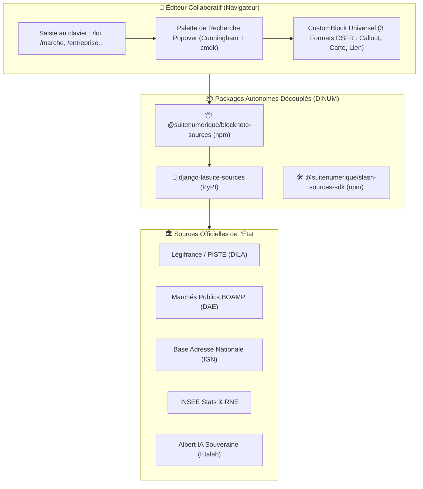

import { Mermaid } from "../../src/components/Mermaid";
import { FeatureCard, FeatureGrid } from "../../src/components/Cards";
import { BlockNoteSlashPlayground } from "../../src/components/slash-preview/BlockNoteSlashPlayground";

Bienvenue sur le portail d'ingénierie et d'orchestration locale de **La Suite numérique** de l'État français (DINUM) !

Ce dépôt a été initié dans le cadre de la collaboration **42 x DINUM** à l'occasion du hackathon organisé à **Forty 2 (Île d'Oléron)** du 14 au 18 septembre 2026. Il centralise l'architecture, les packages souverains, l'onboarding accéléré et la spécification des **Commandes Slash (`/slash`)**.

🔗 **Ressources Rapides :** [Challenge 42 x DINUM](/00-accueil/challenge-42) • [📅 Planning & Agenda](/00-accueil/planning) • [Portail La Suite](https://lasuite.numerique.gouv.fr/) • [GitHub suitenumerique](https://github.com/suitenumerique) • [DINUM](https://www.numerique.gouv.fr/) • [42](https://42.fr/)

---

## 🎨 Références Officielles du Design System & Maquettes Figma

Pour assurer une cohérence visuelle parfaite entre les applications de La Suite et respecter la charte graphique de l'État :

<FeatureGrid cols={3}>
  <FeatureCard
    icon="📄"
    title="Figma La Suite Docs"
    badge="Maquette Officielle"
    description="Maquettes Figma de référence de l'éditeur collaboratif Docs (Impress), vues de documents et CustomBlocks."
    href="https://www.figma.com/design/qdCWR4tTUr7vQSecEjCyqO/Docs?node-id=9722-19469&p=f&t=r1O6Np4JgTbRWrCR-0"
  />
  <FeatureCard
    icon="🎨"
    title="Figma La Suite UI Kit"
    badge="Cunningham Tokens"
    description="Bibliothèque de composants UI Kit La Suite basée sur Cunningham et le Design System officiel."
    href="https://www.figma.com/community/file/1562860630562131728/lasuite-ui-kit"
  />
  <FeatureCard
    icon="📖"
    title="Storybook Cunningham"
    badge="Composants Live"
    description="Documentation interactive et bac à sable des composants UI (@openfun/cunningham-tokens)."
    href="https://suitenumerique.github.io/cunningham/storybook/"
  />
</FeatureGrid>

---

## ⚡ Le Projet Phare : Le Socle des Commandes Souveraines (`/slash`)

Le projet **`/slash`** dote l'éditeur **La Suite Docs** d'un accès direct aux **12 grandes bases de données souveraines de l'État français** au fil de la frappe.



### ⚖️ La Première Proposition Pionnière : `/loi` & la Vision Juridique
La commande **/loi** (alias `/legifrance`, `/code`, `/article`) constitue la première brique emblématique de cette vision :
- **Sécurité Juridique Absolue :** Interrogation en temps réel de l'API officielle **PISTE / DILA** pour certifier que l'article de loi ou le décret cité est **en vigueur**.
- **Veille d'Abrogation Continue :** Tâche Celery scannant les documents pour avertir automatiquement les agents si un article cité vient d'être modifié ou abrogé au Journal Officiel.
- **Rendu aux 3 Formats DSFR :** Permutation instantanée entre l'**Encadré officiel Marianne** (`#000091`), la **Carte 3 colonnes** de métadonnées et la **Pastille Lien inline**.
- **Export Vectoriel Parfait :** Préservation de la bordure Marianne et des hyperliens lors de l'export vers PDF, Word (.docx) ou LibreOffice (.odt).

---

## 🎮 Démonstrateur Interactif BlockNote.js en Direct

Testez ci-dessous le moteur d'édition en direct avec les commandes `/loi`, `/entreprise`, `/adresse`, `/marche`, `/stats` :

<BlockNoteSlashPlayground />

---

## 🧭 Explorer les Sections du Portail

<FeatureGrid cols={3}>
  <FeatureCard
    icon="🚀"
    title="01. Onboarding & Démarrage"
    description="Checklist du 1er jour, configuration VS Code 1-clic, Git/SSH et environnement système."
    href="/01-onboarding"
    badge="Démarrage"
  />
  <FeatureCard
    icon="🏛️"
    title="02. Architecture Globale"
    description="Schémas Mermaid interactifs, flux OIDC ProConnect, synchronisation Yjs CRDT et stockage S3."
    href="/02-architecture"
    badge="Système"
  />
  <FeatureCard
    icon="📦"
    title="03. Matrice des Projets"
    description="Fiches détaillées des applications : Docs, Meet, Tchap, Grist, Drive, Transfers, Projects, People."
    href="/03-projets"
    badge="Applications"
  />
  <FeatureCard
    icon="🎨"
    title="04. Design System (DSFR & Cunningham)"
    description="Composants officiels, typographie Marianne, tokens de couleur et conformité RGAA v4.1 AA."
    href="/04-design-system"
    badge="UI / UX"
  />
  <FeatureCard
    icon="🧰"
    title="05. Ressources & Outils"
    description="Templates de PR, feuille de route pluriannuelle et canaux d'entraide communautaire."
    href="/05-ressources/communaute"
    badge="Ressources"
  />
  <FeatureCard
    icon="🤖"
    title="07. Skills d'Agent & Ingénierie"
    description="Procédures, directives strictes (Zéro any, Zéro cast) et compétences spécialisées."
    href="/07-skills"
    badge="Méthode"
  />
  <FeatureCard
    icon="⚡"
    title="08. Socle Souverain & Packages /slash"
    description="Dossier technique complet, 12 connecteurs, SDK développeur et dossiers de Pull Requests."
    href="/08-slash"
    badge="Majeur"
  />
</FeatureGrid>

---

## ⚡ Commandes Principales d'Orchestration

```bash
# 1. Cloner tous les dépôts de La Suite dans ./src
make clone

# 2. Préparer les fichiers d'environnement locaux (.env)
make env

# 3. Amorcer les conteneurs et les bases de données
make bootstrap

# 4. Lancer les services en mode développement
make dev

# 5. Démarrer le portail documentaire local Zudoku
make docs-dev
```
