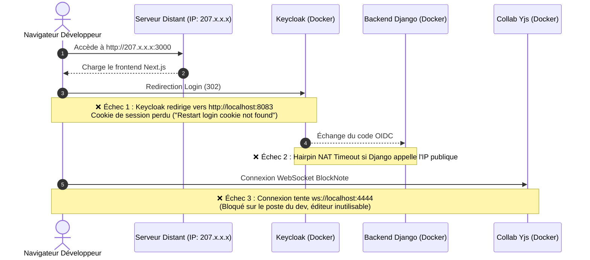

Ce document constitue une proposition de **Pull Request** complète et structurée à destination des mainteneurs de **La Suite Numérique (DINUM)** pour le dépôt [`suitenumerique/docs`](https://github.com/suitenumerique/docs).

Elle explique le contexte, le diagnostic technique, l'architecture cible et fournit l'ensemble des diffs et du texte de PR prêt à l'emploi.

---

## 📌 En bref

| Métrique | Description |
| :--- | :--- |
| **Dépôt cible** | `suitenumerique/docs` |
| **Titre suggéré** | `feat(dev): make Docs development URLs configurable for remote servers and VMs` |
| **Impact sur l'existant** | **Zéro rupture** — Les valeurs par défaut restent `localhost` et le workflow local actuel est préservé à 100%. |
| **Bénéfice principal** | Permet à n'importe quel développeur, contributeur ou prestataire de déployer et tester Docs sur une machine distante (VM, cloud, Codespaces) en quelques variables d'environnement, sans modifier le code source. |

---

## 🎯 1. Contexte & Le « Pourquoi »

### L'évolution des environnements de développement dans le secteur public

Au sein des ministères, opérateurs publics et équipes partenaires de la DINUM, de nombreux développeurs ne travaillent plus exclusivement sur une machine locale avec Docker Desktop installé en local :

1. **Postes de travail sécurisés / bridés :** Les postes agents ou prestataires en environnement ministériel restreignent souvent l'exécution de conteneurs Docker en local ou l'élévation de privilèges.
2. **Développement sur VM distante (Cloud souverain / SecNumCloud / VPS) :** L'usage d'environnements distants mutualisés ou dédiés (VM Linux hébergées chez des fournisseurs cloud, accès via VS Code Remote SSH / Tunnel) est devenu une pratique courante.
3. **Environnements de démonstration et de pré-recette éphémères :** Besoin de monter rapidement une instance de test accessible à plusieurs relecteurs sans monter une chaîne de déploiement Kubernetes complète.

### Le constat actuel sur `suitenumerique/docs`

Dans l'état actuel du dépôt, plusieurs endpoints et origines réseau sont codés en dur sur `localhost` ou `127.0.0.1` :

- Le hostname public Keycloak (`KC_HOSTNAME=http://localhost:8083`) ;
- L'URL du serveur de collaboration temps réel Yjs (`COLLABORATION_WS_URL=ws://localhost:4444/collaboration/ws/`) ;
- L'origine API du frontend injectée dans Docker Compose (`API_ORIGIN: http://localhost:8071`) ;
- Les domaines autorisés par Next.js (`allowedDevOrigins`) ;
- Les endpoints OIDC dans `env.d/development/common`.

Dès qu'un développeur exécute le projet sur un serveur distant et tente de s'y connecter depuis son navigateur web, **l'expérience utilisateur s'effondre** :



---

## 🔍 2. Diagnostic Technique Approfondi

Les blocages rencontrés sur un serveur distant proviennent de 4 mécanismes distincts :

### A. Keycloak et la perte du cookie d'authentification
Keycloak construit les formulaires d'authentification et les actions de redirection à partir de `KC_HOSTNAME`. S'il vaut `http://localhost:8083`, le navigateur de l'utilisateur distant reçoit une redirection vers son propre poste local au lieu du serveur. La session est rompue et Keycloak renvoie l'erreur `Restart login cookie not found`.

### B. Hairpin NAT et Timeout sur les callbacks OIDC
Lorsque Django valide un jeton OIDC ou télécharge les clés publiques (`JWKS`), il doit contacter Keycloak.
- Si ces endpoints pointent vers l'IP publique du serveur, la plupart des environnements Cloud / VM interdisent aux conteneurs de contacter leur propre IP publique externe (problème classique de *hairpin NAT*).
- Django subit alors un `ReadTimeout` et lève une exception `SuspiciousOperation: OIDC callback state not found in session`.
- **Règle architecturale :** Les flux serveur-à-serveur doivent rester dans le réseau Docker (`http://nginx:8083/...`), tandis que le flux d'autorisation (redirection 302 du navigateur) doit utiliser l'IP ou le domaine public.

### C. Collaboration temps réel BlockNote / Yjs
Le composant éditeur s'appuie sur un provider WebSocket Yjs. Si `COLLABORATION_WS_URL` vaut `ws://localhost:4444/...`, le navigateur tente d'établir une socket vers sa propre machine `127.0.0.1:4444`. La connexion échoue silencieusement ou reste bloquée, rendant impossible la création ou l'édition de pages.

### D. Next.js `allowedDevOrigins` et `API_ORIGIN`
Next.js bloque les connexions de développement provenant d'hôtes non enregistrés. De plus, pour les images frontend construites avec `output: "export"`, `API_ORIGIN` doit être injectée au build time pour pointer vers le serveur accessible depuis le navigateur.

---

## 💡 3. Solution Proposée

La solution consiste à **rendre ces valeurs configurables par des variables d'environnement Docker Compose avec des valeurs de repli (fallback) par défaut sur `localhost`**.

### Principes directeurs

1. **Rétrocompatibilité 100% :** Un développeur exécutant `make bootstrap` puis `make dev` en local sur son laptop n'a rien à configurer. Les valeurs par défaut restent `localhost`.
2. **Surcharge simple :** Sur une VM ou un serveur distant, il suffit de renseigner les variables dans un fichier d'environnement ou en préfixe de commande (`DOCS_PUBLIC_ORIGIN=http://mon-serveur:3000 make dev`).
3. **Ségrégation stricte des flux OIDC :** Séparation claire entre l'endpoint navigateur (`OIDC_OP_AUTHORIZATION_ENDPOINT`) et les endpoints internes (`OIDC_OP_JWKS_ENDPOINT`, `OIDC_OP_TOKEN_ENDPOINT`, etc.).

---

## 📊 4. Matrice des Variables d'Environnement

| Variable | Cible / Rôle | Valeur par défaut (Local) | Exemple Serveur Distant | Appelant |
| :--- | :--- | :--- | :--- | :--- |
| `DOCS_PUBLIC_ORIGIN` | URL publique du frontend Docs | `http://localhost:3000` | `http://207.175.155.66:3000` | Navigateur |
| `API_ORIGIN` | URL publique de l'API Docs | `http://localhost:8071` | `http://207.175.155.66:8071` | Navigateur |
| `KEYCLOAK_PUBLIC_ORIGIN` | URL publique de Keycloak | `http://localhost:8083` | `http://207.175.155.66:8083` | Navigateur |
| `COLLABORATION_WS_URL` | WebSocket de collaboration Yjs | `ws://localhost:4444/collaboration/ws/` | `ws://207.175.155.66:4444/collaboration/ws/` | Navigateur |
| `OIDC_INTERNAL_ORIGIN` | Endpoint OIDC inter-conteneurs | `http://nginx:8083` | `http://nginx:8083` | Conteneur Django |

---

## 🛠️ 5. Modifications Proposées Fichier par Fichier

### 1. `compose.yml`

Rendre les arguments de build et les variables de services dynamiques :

```yaml
services:
  app-dev:
    environment:
      - LOGIN_REDIRECT_URL=${DOCS_PUBLIC_ORIGIN:-http://localhost:3000}/
      - LOGOUT_REDIRECT_URL=${DOCS_PUBLIC_ORIGIN:-http://localhost:3000}/
      - COLLABORATION_WS_URL=${COLLABORATION_WS_URL:-ws://localhost:4444/collaboration/ws/}
      - OIDC_OP_AUTHORIZATION_ENDPOINT=${KEYCLOAK_PUBLIC_ORIGIN:-http://localhost:8083}/realms/impress/protocol/openid-connect/auth

  keycloak:
    environment:
      - KC_HOSTNAME=${KEYCLOAK_PUBLIC_ORIGIN:-http://localhost:8083}
      - KC_HOSTNAME_STRICT=false
```

### 2. `compose-e2e.yml`

Permettre l'injection de `API_ORIGIN` pour le build de l'image frontend de test/démo :

```yaml
services:
  frontend:
    build:
      args:
        API_ORIGIN: "${API_ORIGIN:-http://localhost:8071}"
```

### 3. `src/frontend/apps/impress/next.config.js`

Ajouter la prise en compte dynamique des origines de développement :

```javascript
const devOrigins = process.env.ALLOWED_DEV_ORIGINS
  ? process.env.ALLOWED_DEV_ORIGINS.split(",")
  : ["docs.127.0.0.1.nip.io", "localhost"];

const nextConfig = {
  allowedDevOrigins: devOrigins,
  output: "export",
  trailingSlash: true,
};

module.exports = nextConfig;
```

### 4. `env.d/development/common`

Documenter les variables publiques et sécuriser les endpoints internes :

```dotenv
# Endpoints OIDC internes (toujours routés via le réseau Docker Nginx)
OIDC_OP_JWKS_ENDPOINT=http://nginx:8083/realms/impress/protocol/openid-connect/certs
OIDC_OP_TOKEN_ENDPOINT=http://nginx:8083/realms/impress/protocol/openid-connect/token
OIDC_OP_USER_ENDPOINT=http://nginx:8083/realms/impress/protocol/openid-connect/userinfo
OIDC_OP_INTROSPECTION_ENDPOINT=http://nginx:8083/realms/impress/protocol/openid-connect/token/introspect
```

---

## 🧪 6. Plan de Validation

La PR a été testée et validée selon les deux scénarios suivants :

### Scénario 1 : Développement Local (Rétrocompatibilité)
- **Commande :** `make bootstrap && make dev` sans aucune variable définie.
- **Résultats validés :**
  - Frontend accessible sur `http://localhost:3000` ;
  - Authentification Keycloak fonctionnelle sur `http://localhost:8083` ;
  - Création de document, édition BlockNote et collaboration temps réel validées.

### Scénario 2 : Serveur Distant / VM Cloud
- **Commande :** Définition des variables publiques pointant vers l'IP distante.
- **Résultats validés :**
  - Connexion depuis une machine cliente externe ;
  - Redirection OIDC fluide sans perte de cookie ;
  - Validation du code OIDC par Django sans timeout réseau ;
  - WebSocket Yjs connectée et éditeur interactif instantanément opérationnel.

---

## 📋 7. Modèle de Pull Request (Prêt à copier-coller)

Voici le texte au format GitHub Markdown prêt à être soumis lors de l'ouverture de la PR sur `suitenumerique/docs` :

````markdown
# feat(dev): make Docs development URLs configurable for remote servers and VMs

## 🎯 Context & Motivation

When contributing to La Suite Docs or running the stack in remote environments (cloud development VMs, SecNumCloud environments, GitHub Codespaces, or remote dev instances), several URLs are currently hardcoded to `localhost` / `127.0.0.1`.

This causes three main issues on remote machines:
1. **Keycloak Authentication Loss:** `KC_HOSTNAME` defaults to `localhost:8083`, causing redirection back to the local client machine and losing the session cookie (`Restart login cookie not found`).
2. **OIDC Callback Timeout (Hairpin NAT):** When Django contacts Keycloak to exchange authorization codes, using a public IP from within Docker causes network timeouts. Server-to-server endpoints must target `http://nginx:8083` internally, while the browser authorization endpoint must remain public.
3. **BlockNote Collaboration WebSocket:** `COLLABORATION_WS_URL` defaults to `ws://localhost:4444`, preventing the BlockNote editor from initializing on remote instances.

## 🚀 Proposed Changes

- **100% Backward Compatible Fallbacks:** All URLs in `compose.yml` and `compose-e2e.yml` use `${VARIABLE:-http://localhost:...}` fallbacks. Default local setups work out-of-the-box with zero configuration changes.
- **Separation of OIDC Flows:**
  - `OIDC_OP_AUTHORIZATION_ENDPOINT` uses the public Keycloak origin (browser redirect).
  - `OIDC_OP_JWKS_ENDPOINT`, `OIDC_OP_TOKEN_ENDPOINT`, `OIDC_OP_USER_ENDPOINT` point internally to `http://nginx:8083` within the Docker network.
- **Configurable `allowedDevOrigins` in Next.js:** Allows developers to specify additional allowed development origins via the `ALLOWED_DEV_ORIGINS` environment variable.
- **Dynamic `API_ORIGIN` build argument:** Forwarded seamlessly to frontend Docker images.

## 🧪 How Has This Been Tested?

- [x] **Local machine test:** Standard `make bootstrap` & `make dev` with default localhost values. No regressions.
- [x] **Remote VM test:** Ran stack on a remote Linux server with public IP. Successfully logged in via Keycloak OIDC, created documents, and verified real-time Yjs collaboration in BlockNote.
- [x] **Security check:** No secrets, credentials, or fixed remote IP addresses committed.

## 📸 Checklist

- [x] My code follows the style guidelines of this project
- [x] I have performed a self-review of my own code
- [x] Documentation has been updated accordingly
- [x] All existing automated tests continue to pass
````
