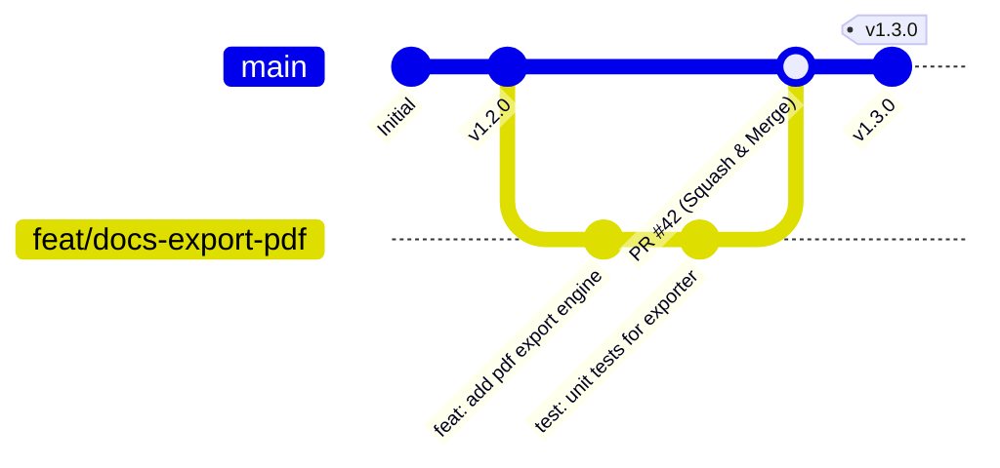

Ce guide vous accompagne pas à pas pour soumettre votre toute première contribution sur les dépôts de **La Suite numérique** dans le respect des standards de qualité et de traçabilité de l'équipe.

---

## 📋 1. La Spécification Conventional Commits

Tous les dépôts de l'organisation imposent la convention [Conventional Commits v1.0.0](https://www.conventionalcommits.org/fr/v1.0.0/) afin d'automatiser la génération des changelogs et la gestion sémantique des versions (_SemVer_).

### Structure d'un message de commit

```text
<type>(<scope optionnel>): <description courte à l'impératif>

[corps optionnel détaillant le contexte et la justification]

[pied de page optionnel avec les tickets liés]
```

### Types autorisés

| Type       | Rôle / Signification                                   | Exemple                                              |
| ---------- | ------------------------------------------------------ | ---------------------------------------------------- |
| `feat`     | Ajout d'une nouvelle fonctionnalité utilisateur        | `feat(docs): add real-time cursor presence`          |
| `fix`      | Correction d'un bogue en production                    | `fix(meet): resolve audio stuttering on Safari`      |
| `docs`     | Modification exclusive de la documentation             | `docs(api): document oidc callback endpoints`        |
| `style`    | Ajustement cosmétique ou formatage sans impact logique | `style(ui): align button paddings to DSFR 1.35`      |
| `refactor` | Refactorisation interne du code                        | `refactor(auth): simplify jwt verification logic`    |
| `perf`     | Optimisation mesurable des performances                | `perf(crdt): reduce Yjs state vector overhead`       |
| `test`     | Ajout ou correction de tests automatisés               | `test(transfers): add s3 multipart upload mock`      |
| `chore`    | Maintenance de l'outillage, dépendances ou CI          | `chore(deps): update @codegouvfr/react-dsfr to 1.35` |

---

## 🌿 2. Cycle de Vie d'une Branche & Pull Request



### Étape par étape

1. **Créer une branche explicite à partir de `main` :**

   ```bash
   git checkout main
   git pull origin main
   git checkout -b feat/docs-export-pdf
   ```

2. **Développer et valider localement :**

   ```bash
   # Linter et formatage
   pnpm lint

   # Exécution des tests unitaires
   pnpm test
   ```

3. **Signer et commiter vos modifications :**

   ```bash
   git add src/
   git commit -S -m "feat(docs): add pdf document export via typst"
   ```

4. **Pousser votre branche et ouvrir la Pull Request :**
   ```bash
   git push -u origin feat/docs-export-pdf
   ```

---

## 🔍 3. Règles de Validation d'une PR

Pour qu'une Pull Request soit fusionnée dans la branche principale `main` :

- ✅ **Tous les workflows GitHub Actions doivent être verts** (Lint, TypeScript compilation, Unit Tests, E2E Playwright).
- ✅ **Au moins une approbation (_Approve_)** d'un mainteneur du projet.
- ✅ **Pas de secrets ou de tokens committés** (vérifié automatiquement par les scanners de secrets CI).
- ✅ **Fusion par Squash & Merge** pour garder un historique Git linéaire et propre.
