# 🏗️ Architecture Globale & Choix Techniques

Ce document constitue la référence d'architecture pour comprendre en profondeur le fonctionnement, les briques logicielles, les choix technologiques et les flux de communication de l'ensemble des projets de **La Suite numérique** (DINUM / ANCT).

---

## 🌐 1. Vue d'Ensemble de l'Écosystème

L'écosystème de La Suite repose sur une architecture distribuée de micro-applications spécialisées, fédérées par une identité unique (**OpenID Connect**) et interconnectées via des API REST et des flux temps réel (**WebSockets / CRDT / WebRTC**).

```mermaid
graph TB
    subgraph Clients["📱 Navigateurs & Postes Clients"]
        UserBrowser["Navigateur Utilisateur"]
    end

    subgraph AuthLayer["🔐 Couche Identité & SSO"]
        Keycloak["Keycloak / ProConnect (OIDC)<br/><i>Port: 8080 / 8083</i>"]
        Accounts["Accounts (Gestion Identités)<br/><i>Port: 9900</i>"]
    end

    subgraph AppLayer["🚀 Applications & Micro-services"]
        DocsFront["Docs (Next.js/React)<br/><i>Port: 3000</i>"]
        DocsBack["Docs API (Django 5)<br/><i>Port: 8071</i>"]
        DocsYjs["Docs Yjs CRDT Server<br/><i>Port: 4444</i>"]
        Docspec["Docspec Conversion API<br/><i>Port: 4000</i>"]

        ProjectsApp["Projects (Node.js/Sails/React)<br/><i>Port: 8000</i>"]

        MeetFront["Meet Frontend (React/LiveKit)<br/><i>Port: 3001</i>"]
        MeetLiveKit["LiveKit SFU (WebRTC Engine)<br/><i>Port: 7880 / UDP</i>"]
        MeetAgents["Meet IA Agents (Transcription/Summary)"]

        TransfersFront["Transfers (Vite/TanStack)<br/><i>Port: 8980</i>"]
        TransfersBack["Transfers API (Django/Celery)<br/><i>Port: 8981</i>"]

        PeopleApp["People (Django/React - Annuaire)<br/><i>Port: 8071</i>"]
    end

    subgraph DataLayer["💾 Couche Données & Stockage"]
        PostgresDocs[(PostgreSQL Docs<br/><i>Port: 15432</i>)]
        PostgresProjects[(PostgreSQL Projects)]
        PostgresTransfers[(PostgreSQL Transfers)]
        PostgresKC[(PostgreSQL Keycloak<br/><i>Port: 5433</i>)]
        RedisCache[(Redis Cache & Queues<br/><i>Port: 6379</i>)]
        S3Storage[(Stockage S3 / MinIO / RustFS<br/><i>Port: 9000/9001</i>)]
    end

    %% Relations Auth
    UserBrowser -->|1. Authentification OIDC| Keycloak
    Keycloak <--> Accounts
    DocsFront -.->|JWT Token| Keycloak
    ProjectsApp -.->|JWT Token| Keycloak
    MeetFront -.->|JWT Token| Keycloak
    TransfersFront -.->|JWT Token| Keycloak

    %% Relations Docs
    UserBrowser -->|HTTPS / UI| DocsFront
    UserBrowser -->|CRDT WebSocket| DocsYjs
    DocsFront -->|REST API| DocsBack
    DocsBack --> PostgresDocs
    DocsBack --> RedisCache
    DocsBack --> S3Storage
    DocsBack --> Docspec

    %% Relations Projects
    UserBrowser -->|HTTP + WebSocket| ProjectsApp
    ProjectsApp --> PostgresProjects
    ProjectsApp --> S3Storage

    %% Relations Meet
    UserBrowser <-->|WebRTC Audio/Vidéo| MeetLiveKit
    MeetFront -->|Room Tokens| MeetLiveKit
    MeetLiveKit <--> MeetAgents

    %% Relations Transfers
    UserBrowser -->|Upload Multipart S3| TransfersFront
    TransfersFront -->|REST API| TransfersBack
    TransfersBack --> PostgresTransfers
    TransfersBack --> RedisCache
    TransfersBack --> S3Storage

    %% Relations People
    PeopleApp -.->|Rôles & Permissions| DocsBack
    PeopleApp -.->|Rôles & Permissions| ProjectsApp
```

---

## ⚡ 2. Matrice Technique Comparative

| Projet | Backend | Frontend | Base de Données | Temps Réel / Flux | Ports Locaux |
|---|---|---|---|---|---|
| **Docs** | Python 3.14 (Django 5) | TypeScript (Next.js 16) | PostgreSQL 16 | WebSockets + Yjs CRDT | `3000` (Front), `8071` (API), `4444` (Yjs), `8080/8083` (Auth) |
| **Projects** | JavaScript (Node.js 22 / Sails) | JavaScript/TypeScript (React 18) | PostgreSQL 16 | WebSockets (Socket.io) | `8000` (App) |
| **Meet** | Python (Django) / Go (LiveKit) | TypeScript (React) | PostgreSQL / Redis | WebRTC / LiveKit SFU | `3001` (Front), `7880` (LiveKit SFU) |
| **Transfers** | Python (Django 5 / Celery) | TypeScript (React / Vite) | PostgreSQL / S3 | REST + Presigned S3 | `8980` (Front), `8981` (API), `8902` (KC) |
| **People** | Python (Django) | TypeScript (React) | PostgreSQL | REST (TS Client SDK) | `8071` (API) |
| **Accounts** | Python (Django) | TypeScript (Next.js) | PostgreSQL | REST / OIDC | `9900` (App) |

---

## 📑 Thématiques Associées

- **[Authentification & SSO (OIDC / Keycloak)](auth.md)** : Flux d'authentification partagé et configuration locale.
- **[Hot-Reload & Environnement de Dev](hot-reload.md)** : Stratégie de développement à chaud conteneur vs machine hôte.
- **[Variables d'Environnement & Secrets](env.md)** : Gestion et arborescence des fichiers `.env` et `.local`.
- **[Gestion des Secrets (SOPS & age)](secrets-sops.md)** : Chiffrement GitOps des secrets pour la CI et le déploiement.
