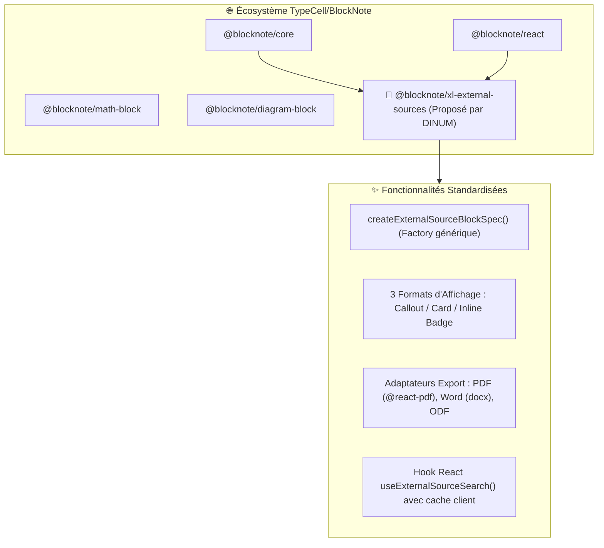

import { Mermaid } from "../../../src/components/Mermaid";
import { FeatureCard, FeatureGrid } from "../../../src/components/Cards";

Au-delà de l'intégration dans **La Suite Docs**, les travaux d'ingénierie conduits par la DINUM apportent une **contribution méthodologique majeure à l'ensemble de l'écosystème open source [`TypeCellOS/BlockNote`](https://github.com/TypeCellOS/BlockNote)** (éditeur WYSIWYG basé sur Prosemirror et Tiptap).

Ce document détaille la **RFC officielle (Request for Comments)** et le package d'extension amont proposé à l'équipe **TypeCell** : `@blocknote/xl-external-sources`.

---

## 🧭 1. Vision & Plaidoyer pour l'Écosystème BlockNote

### 🎯 Le Problème Identifié dans les Éditeurs Riches
BlockNote excelle dans la manipulation de blocs textuels, multimédias, mathématiques (`@blocknote/math-block`) et diagrammes (`@blocknote/diagram-block`).  
Cependant, il **n'existe aucun standard officiel** dans l'écosystème BlockNote pour insérer des **données connectées distantes** (APIs publiques, bases SQL, référentiels d'entreprise, open data) avec :
1. Une **palette de recherche contextuelle accessible** (`cmd + k` ou `/commande`).
2. Une **représentation multi-formats permutable sans perte** (Encadré mis en valeur, Carte de métadonnées, Pastille inline).
3. Une **sérialisation d'exportation documentaire** (PDF, Word DOCX, LibreOffice ODT) préservant l'intégrité visuelle du bloc externe.



---

## 📦 2. Spécification de l'Architecture `@blocknote/xl-external-sources`

### 🔧 2.1. L'Interface Générique `ExternalSourceItem`

```typescript
export type DisplayMode = 'callout' | 'card' | 'link';

export interface ExternalSourceItem {
  id: string;
  sourceType: string;
  title: string;
  subtitle?: string;
  url?: string;
  statusBadge?: {
    label: string;
    variant: 'success' | 'warning' | 'info' | 'neutral' | 'error';
  };
  metadata?: Record<string, string | number | boolean | null>;
  bodyText?: string;
}

export interface ExternalSourceBlockProps {
  sourceId: string;
  sourceType: string;
  displayMode: DisplayMode;
  title: string;
  subtitle: string;
  url: string;
  statusLabel: string;
  statusVariant: string;
  bodySnippet: string;
  metadataJson: string;
}
```

---

### 🎨 2.2. Le Pattern Universel aux 3 Formats d'Affichage

<FeatureGrid cols={3}>
  <FeatureCard
    icon="📢"
    title="1. Mode Callout"
    badge="Mise en avant"
    description="Encadré institutionnel avec liseré latéral, icône thématique, titre cliquable et extrait de texte complet."
  />
  <FeatureCard
    icon="🗂️"
    title="2. Mode Card"
    badge="Métadonnées"
    description="Grille 3 colonnes compacte affichant les identifiants clés, la date d'effet, l'auteur et le statut."
  />
  <FeatureCard
    icon="🔗"
    title="3. Mode Inline Link"
    badge="Pastille discrète"
    description="Pastille inline insérée au fil du texte avec infobulle interactive révélant le résumé au survol."
  />
</FeatureGrid>

---

### 📄 2.3. Les Mappeurs d'Exportation Universels

```typescript
// PDF Exporter Mapping (@blocknote/xl-pdf-exporter)
export const createExternalSourcePdfMapping = (options?: ExternalSourcePdfOptions) => ({
  render: ({ block }: { block: ExternalSourceBlock }) => {
    // Rendu vectoriel React-PDF avec View, Text et Link
  }
});

// Docx Exporter Mapping (@blocknote/xl-docx-exporter)
export const createExternalSourceDocxMapping = (options?: ExternalSourceDocxOptions) => ({
  render: ({ block }: { block: ExternalSourceBlock }) => {
    // Rendu table et paragraphes DOCX avec bordures personnalisées
  }
});

// ODT Exporter Mapping (@blocknote/xl-odt-exporter)
export const createExternalSourceOdtMapping = (options?: ExternalSourceOdtOptions) => ({
  render: ({ block }: { block: ExternalSourceBlock }) => {
    // Rendu XML LibreOffice Writer
  }
});
```

---

## 📝 3. Modèle de RFC GitHub Prêt à Soumettre sur `TypeCellOS/BlockNote`

```markdown
# RFC: Standardized External Data Sources & Multi-Format Connected Blocks for BlockNote

**Author:** Direction Interministérielle du Numérique (DINUM - French Government) & La Suite Team  
**Status:** Proposal / Draft RFC  
**Proposed Package:** `@blocknote/xl-external-sources` (or addition to `@blocknote/xl-*` suite)

## 📌 Context & Motivation
Modern collaborative document editors frequently need to reference, embed, and synchronize live entities from external systems:
- Public registers & open data APIs (legal codes, corporate registries, address gazetteers).
- Internal enterprise services (CRM tickets, ERP assets, user profiles).
- AI vector store retrievals (RAG citation blocks).

Currently, developers using BlockNote must handcraft custom blocks, manage their own popover menus, handle tricky multi-format state switches, and write custom export adapters for PDF and DOCX from scratch.

## 💡 Proposed Solution: `@blocknote/xl-external-sources`
We propose a lightweight, zero-UI-framework-agnostic extension providing:

1. **`createExternalSourceBlockSpec(config)`**: A high-level factory to instantiate connected blocks supporting seamless switching between **Callout**, **Card**, and **Inline Pill** display formats.
2. **Accessible Search Popover Hook**: React hook with debounce, abort controller, and keyboard-first navigation (`ArrowUp`/`ArrowDown`/`Enter`/`Escape`).
3. **Turnkey Export Mappers**: Native adapters for `@blocknote/xl-pdf-exporter`, `@blocknote/xl-docx-exporter`, and `@blocknote/xl-odt-exporter`.

## 🧪 Proof of Concept
This architecture has been battle-tested in **La Suite Docs** (France's inter-ministerial collaborative editor) across 12 national APIs with 100% keyboard accessibility (RGAA/WCAG AA compliant) and flawless PDF vector export.

We would be thrilled to contribute this package upstream to the BlockNote core ecosystem!
```

---

## 🏆 Bénéfices de la Contribution pour la DINUM et BlockNote

| Dimension | Impact pour l'Écosystème BlockNote | Impact & Rayonnement pour la DINUM |
| :--- | :--- | :--- |
| **Normalisation** | Établit le premier standard open source de blocs de données distantes. | Positionne l'État français comme un contributeur open source de référence mondiale. |
| **Maintenabilité** | Réduit la duplication de code dans tous les projets utilisant BlockNote. | Assure la pérennité long-terme des CustomBlocks de La Suite Docs. |
| **Interopérabilité** | Facilite l'export fidèle vers les suites bureautiques (MS Word, LibreOffice). | Garantie de souveraineté documentaire et zéro verrouillage propriétaire. |
