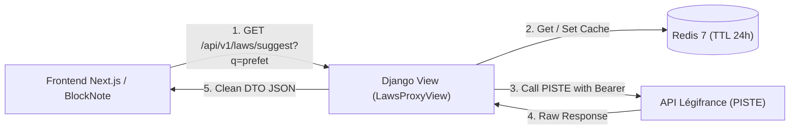

Pour des raisons de **sécurité** (ne jamais exposer les secrets client PISTE dans le navigateur client) et de **performance** (mise en cache serveur partagée), l'ensemble des requêtes passe par un proxy backend Django 5.

---

## 🏛️ 1. Architecture du Proxy Backend



---

## 🐍 2. Code du Service Python Django (`laws/services/piste.py`)

```python
import time
import requests
from django.conf import settings
from django.core.cache import cache

class PisteLégifranceService:
    TOKEN_CACHE_KEY = "piste:auth:access_token"
    SUGGEST_URL = f"{settings.PISTE_API_BASE_URL}/suggest"
    SEARCH_URL = f"{settings.PISTE_API_BASE_URL}/search"

    @classmethod
    def get_access_token(cls) -> str:
        token = cache.get(cls.TOKEN_CACHE_KEY)
        if token:
            return token

        # Obtenir un nouveau token via OAuth2 Client Credentials
        response = requests.post(
            settings.PISTE_OAUTH_TOKEN_URL,
            data={
                "grant_type": "client_credentials",
                "client_id": settings.PISTE_CLIENT_ID,
                "client_secret": settings.PISTE_CLIENT_SECRET,
                "scope": "openid",
            },
            timeout=5.0,
        )
        response.raise_for_status()
        data = response.json()
        token = data["access_token"]
        expires_in = data.get("expires_in", 3600)

        # Mettre en cache avec une marge de sécurité de 100s
        cache.set(cls.TOKEN_CACHE_KEY, token, timeout=max(60, expires_in - 100))
        return token

    @classmethod
    def suggest(cls, query: str, fonds: list[str] = None) -> list[dict]:
        cache_key = f"piste:suggest:{query}"
        cached = cache.get(cache_key)
        if cached:
            return cached

        token = cls.get_access_token()
        headers = {
            "Authorization": f"Bearer {token}",
            "Content-Type": "application/json",
            "Accept": "application/json",
        }
        payload = {
            "searchText": query,
            "supplies": fonds or ["ALL_SUGGEST"],
        }
        resp = requests.post(cls.SUGGEST_URL, json=payload, headers=headers, timeout=4.0)
        resp.raise_for_status()
        results = resp.json().get("results", [])

        cache.set(cache_key, results, timeout=86400) # 24h
        return results
```

---

## 🛣️ 3. Définition de la Vue DRF (`laws/views.py`)

```python
from rest_framework.views import APIView
from rest_framework.response import Response
from rest_framework.permissions import IsAuthenticated
from .services.piste import PisteLégifranceService

class LawSuggestView(APIView):
    permission_classes = [IsAuthenticated]

    def get(self, request):
        query = request.query_params.get("q", "").strip()
        if len(query) < 2:
            return Response({"results": []})

        results = PisteLégifranceService.suggest(query)
        return Response({"results": results})
```
