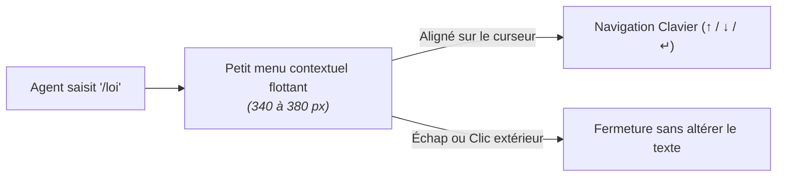
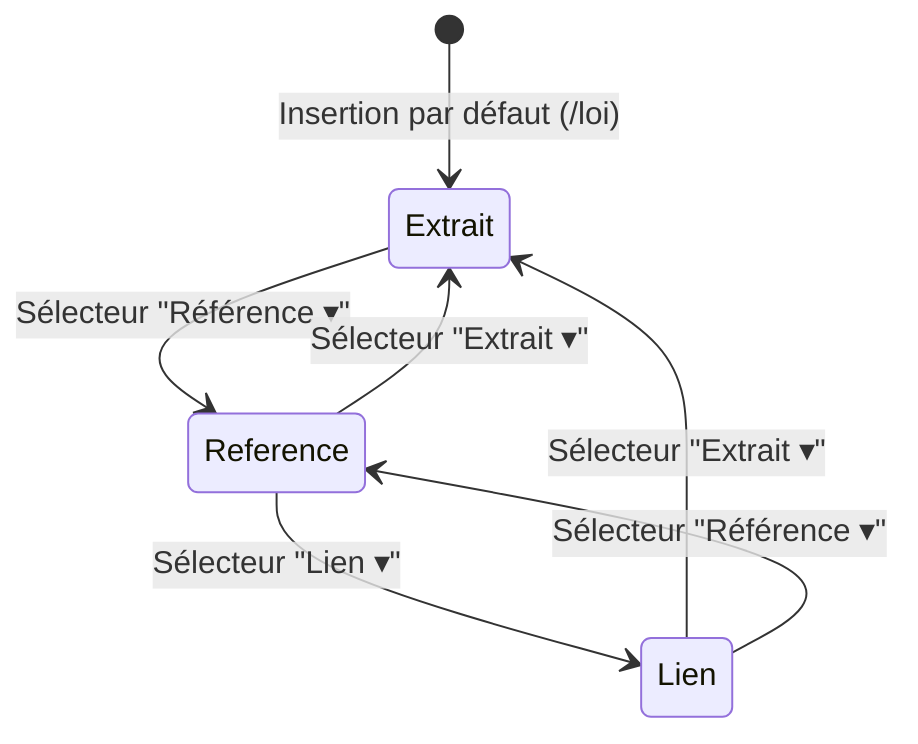

import { LawSlashPreview } from "../../../src/components/LawSlashPreview";
import { Mermaid } from "../../../src/components/Mermaid";

Ce document définit les spécifications complètes d'interface utilisateur (UI) et d'ergonomie (UX) pour rechercher, insérer et manipuler une référence juridique au sein de l'éditeur collaboratif **La Suite Docs**.

Le parcours est conçu pour être **extrêmement discret, rapide et fluide**, sans jamais sortir l'agent public de son flux de rédaction.

---

## 🎮 Démonstrateur Interactif des 4 États

Testez ci-dessous les 4 états de l'interface en cliquant sur les onglets du démonstrateur :

<LawSlashPreview />

---

## 🎨 1. Règles Visuelles Générales

L'interface de la commande `/loi` s'intègre rigoureusement dans l'identité visuelle de **La Suite** et du **Design System de l'État (DSFR)** :

- **Respect du style existant :** Réutilisation des composants, des couleurs institutionnelles, des typographies et des icônes de la plateforme.
- **Palette sobre :** Fond blanc (`#ffffff`), texte principal gris foncé (`#1e1e1e` / `#2b2b2b`) et bleu institutionnel (`#000091` / `#0063cb`) réservé aux liens, aux éléments actifs et aux sélections.
- **Bordures & Ombres légères :** Bordures fines gris clair (`#e5e5e5` / `#d1d5db`), angles légèrement arrondis (radius de 6 à 8 px). Une ombre portée douce (`shadow-md` / `shadow-lg`) est appliquée **uniquement sur les menus flottants contextuels**.
- **Aucune ombre sur les blocs insérés :** Les blocs intégrés dans le texte conservent un rendu plat et net.
- **Zéro perturbation globale :** Aucune modification de la barre de navigation supérieure, du panneau latéral ou de la mise en page générale de l'éditeur.
- **Pas de modale intrusive :** Interdiction des grandes modales plein écran, des panneaux latéraux imposants ou des fonds assombris (_backdrops_ opaques) qui bloquent la lecture.
- **Typographie proportionnelle :** Le texte juridique utilise une typographie proportionnelle normale et lisible. L'analogie avec un bloc de code concerne uniquement la barre d'outils et le sélecteur d'affichage.

---

## ⚡ 2. Déclenchement & Ouverture du Menu `/loi`

L'ouverture du menu s'effectue directement au clavier lors de la rédaction :



### Règles de Positionnement
- **Ancrage dynamique :** Le menu s'ouvre sous la commande `/loi`, au plus près du curseur et aligné sur le bord gauche du paragraphe.
- **Dimensions maîtrisées :** Largeur comprise entre **340 px et 380 px** sur écran d'ordinateur. Hauteur maximale plafonnée à environ **320 px** (la liste défile au-delà).
- **Inversion spatiale :** Si le bas de l'écran ne dispose pas d'un espace suffisant, le menu pivote automatiquement au-dessus du curseur.
- **Adaptation mobile :** Sur petit écran, le menu réduit sa largeur pour garantir une marge de sécurité d'au moins **12 px** de chaque côté du viewport.
- **Fermeture propre :** Une pression sur la touche <kbd>Échap</kbd> ou un clic à l'extérieur ferme immédiatement le menu sans supprimer le texte saisi.

---

## 🔍 3. Anatomie du Menu de Recherche

Le menu flottant comporte 5 zones ordonnées :

```
┌──────────────────────────────────────────────┐
│  Rechercher une référence                    │  <-- Titre compact
├──────────────────────────────────────────────┤
│  🔍  Sujet, article ou nom d'un texte...     │  <-- Champ de recherche (Focus auto)
├──────────────────────────────────────────────┤
│  <u>Tout</u>        Codes        Lois         │  <-- Filtres discrets (Soulignement bleu)
├──────────────────────────────────────────────┤
│  📄 Article 1240                             │
│     Code civil · En vigueur            [ ↵ ] │  <-- Résultat sélectionné (Fond gris clair)
│ ──────────────────────────────────────────── │
│  📄 Article 1241                             │
│     Code civil · En vigueur                  │
│ ──────────────────────────────────────────── │
│  📄 Code civil — Parcourir les articles  [ › ]│  <-- Parcours de code
├──────────────────────────────────────────────┤
│  ↑ ↓ Naviguer · ↵ Insérer · Échap Fermer     │  <-- Raccourcis clavier (Pied de menu)
└──────────────────────────────────────────────┘
```

### Comportement des Filtres
1. **Filtre « Tout » (Actif par défaut) :** Recherche simultanément dans les codes consolidés et dans les lois historiques ou non codifiées.
2. **Filtre « Codes » :** Filtre sur les 75+ codes officiels de la République et leurs articles.
3. **Filtre « Lois » :** Filtre sur les lois ordinaires, organiques et ordonnances (ex: _Loi informatique et libertés_, _Loi 3DS_).
4. **Style discret :** L'état actif est matérialisé par un texte bleu et un soulignement fin (aucun gros bouton ou pastille encombrante).
5. **Recherche directe :** L'utilisateur n'a jamais l'obligation de choisir un code avant de lancer sa recherche.

---

## 📋 4. Présentation des Résultats & Navigation dans un Code

- **Hauteur des lignes :** 52 à 60 px par résultat pour un confort de clic optimal.
- **Structure de ligne :**
  - À gauche : petite icône de document (`📄`).
  - Ligne 1 : Titre en gras, ex. **« Article 1240 »**.
  - Ligne 2 : Contexte en plus petit et gris, ex. **« Code civil · En vigueur »**.
  - À droite : petite flèche <kbd>↵</kbd> sur la ligne sélectionnée.
- **Parcours d'un Code (« Drill-down ») :**
  - Un résultat **« Code civil — Parcourir les articles »** affiche un chevron `›`.
  - En cliquant sur cette ligne ou en appuyant sur <kbd>Entrée</kbd>, le menu se transforme en liste des articles du code sélectionné, avec un bouton discret **« ← Retour »** dans l'en-tête.

---

## ⏳ 5. États de la Recherche

| État | Comportement & Affichage |
| :--- | :--- |
| **Initialisation** | Focus automatique placé dans l'input, sélection sur le 1er résultat. |
| **Chargement** | Affichage de la mention **« Recherche… »** dans la liste, sans faire sauter les dimensions du menu. |
| **Aucun résultat** | Message sobre : **« Aucun résultat. Essayez un autre terme. »**. |
| **Erreur réseau** | Mention **« Recherche indisponible »** accompagnée d'une action cliquable **« Réessayer »**. |
| **Par défaut** | La recherche cible les versions actuellement **en vigueur** sans encombrer l'interface d'un sélecteur de date. |

---

## 🎯 6. Les 3 Modes d'Affichage après Insertion

Lors de la validation, la commande `/loi` est remplacée par la référence juridique choisie. Le mode **Extrait** est activé par défaut.

L'utilisateur peut à tout moment basculer entre **3 modes complémentaires** selon la densité d'information souhaitée :



---

### 📖 Mode 1 : « Extrait » (Bloc Intégré Complet)

Idéal pour citer intégralement le texte d'un article et en faire le cœur d'une argumentation.

- **Structure du bloc :**
  - **Barre supérieure (gris très clair) :** Icône balance + `Référence juridique` à gauche ; sélecteur `Extrait ▾` et bouton `…` à droite.
  - **Titre & Statut :** `Article 1240 · Code civil` en gras, suivi de `En vigueur · Source : Légifrance`.
  - **Corps de texte :** Texte intégral de l'article en italique avec retrait visuel.
  - **Pied de bloc :** Lien discret `Consulter la source ↗`.

---

### 🏷️ Mode 2 : « Référence » (Ligne Compacte Encadrée)

Idéal pour mentionner une base légale sans alourdir la lecture de la note.

- **Hauteur compacte :** 48 à 56 px.
- **Éléments affichés :**
  - Petite icône de document à gauche.
  - Titre cliquable en bleu : **« Article 1240 · Code civil »** avec icône de lien externe.
  - À droite : Sélecteur `Référence ▾` et menu `…`.
  - Suppression de tout le corps de texte et des métadonnées secondaires.

---

### 🔗 Mode 3 : « Lien » (Lien Fluide dans le Paragraphe)

Idéal pour intégrer la référence au cœur d'une phrase naturelle.

- **Rendu dans le texte :** `« Voir l'Article 1240 du Code civil pour le fondement juridique. »` (lien bleu souligné).
- **Barre contextuelle au clic :**
  - Hauteur : 36 à 40 px, largeur : environ 300 px.
  - Bouton **« Légifrance ↗ »** pour ouvrir la source officielle dans un nouvel onglet.
  - Sélecteur **« Lien ▾ »** pour rebasculer en mode Extrait ou Référence.
  - Bouton de menu `…`.
  - Se masque automatiquement lors d'un clic en dehors du lien.

---

## 🎛️ 7. Sélecteur du Mode d'Affichage & Menu `…`

### Le Menu Sélecteur (~210 px)
Accessible depuis la barre d'outils de chaque mode, il présente les 3 options :

| Option | Description Secondaire | Action |
| :--- | :--- | :--- |
| **Extrait** | Texte et source | Affiche le bloc complet avec l'extrait certifié. |
| **Référence** | Titre uniquement | Affiche la ligne compacte encadrée. |
| **Lien** | Lien dans le texte | Convertit en lien hypertexte dans le paragraphe. |

- L'option active affiche une coche bleue (`✓`).
- Le changement s'applique **instantanément sans rechargement ni nouvelle requête réseau**.
- L'action est annulable via le raccourci classique <kbd>Ctrl+Z</kbd> / <kbd>Cmd+Z</kbd>.

### Le Menu Secondaire `…`
Propose 3 actions fonctionnelles indispensables :
1. **Ouvrir la source :** Ouvre la page officielle de l'article sur Légifrance dans un nouvel onglet.
2. **Copier le lien :** Copie l'URL permanente de l'article dans le presse-papier.
3. **Supprimer la référence :** Supprime la référence du document tout en préservant le texte voisin.

---

## 🔄 8. Règles de Conversion entre Lien et Bloc

- **Préservation intégrale du texte environnant :** Aucun mot avant ou après le lien n'est altéré.
- **Scission propre lors du passage en bloc :**
  ```text
  [Texte avant le lien]
  ┌──────────────────────────────────────────────┐
  │ Bloc Extrait / Référence                     │
  └──────────────────────────────────────────────┘
  [Texte après le lien]
  ```
- **Remplacement en place lors du passage en lien :** Le bloc est remplacé à son emplacement exact par un lien textuel inséré dans le paragraphe.

---

## ♿ 9. Vérifications d'Interface & Accessibilité (RGAA)

- ✅ **Navigation 100% Clavier :** Ouverture, recherche, navigation fléchée, sélection et bascule de mode entièrement réalisables sans souris.
- ✅ **Focus & Piège de focus :** Restitution précise du focus après fermeture d'un menu ou changement de mode.
- ✅ **Noms accessibles :** Tous les boutons à icônes seules (ex: `…`, `›`, `↗`) disposent d'un attribut `aria-label` ou `title` explicite.
- ✅ **Isolation multi-instances :** Plusieurs références juridiques peuvent coexister dans un même document sans conflit d'état.
- ✅ **Persistance CRDT :** Le mode d'affichage choisi (`extrait`, `reference`, `lien`) est stocké dans l'arbre Yjs et restitué fidèlement à la réouverture du document.
