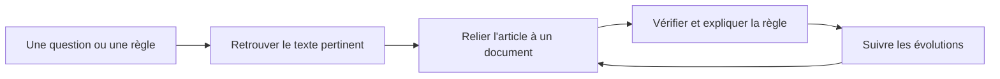

import { Mermaid } from "../../../src/components/Mermaid";

Ce chapitre décrit les **situations de travail réelles** auxquelles la commande `/loi` doit répondre. Un cas d'usage précise toujours :

- **qui** utilise la fonctionnalité ;
- **dans quel service** ;
- **dans quelle situation** ;
- **quel problème** est rencontré ;
- **quel objectif** doit être atteint ;
- **quelle valeur** apporte la solution.

L'objectif n'est pas de remplacer l'analyse d'un juriste. Il s'agit de rendre la source juridique **facile à retrouver, à vérifier et à relier** aux documents métier.

---

## 🧭 1. Les quatre parcours principaux

Les 20 cas recensés se regroupent en quatre parcours simples :



| Parcours | Question métier | Fonction attendue |
| :--- | :--- | :--- |
| **Document vers texte** | « Quelle règle fonde ce document ? » | Cliquer sur une référence et ouvrir l'article ou le texte officiel. |
| **Texte vers document** | « Quels documents citent cette règle ? » | Retrouver les procédures, notes ou décisions liées à un texte. |
| **Document vers document** | « Quels documents dépendent de celui-ci ? » | Naviguer entre doctrine, procédure, fiche réflexe et compte rendu. |
| **Veille juridique** | « Que faut-il mettre à jour après une réforme ? » | Identifier les références modifiées et les documents potentiellement impactés. |

<Mermaid chart={`flowchart TD
    D["Document métier"] -->|Référence cliquable| A["Article, loi, décret ou arrêté"]
    A -->|Documents associés| D2["Procédure, note, décision"]
    A -->|Réforme ou nouvelle version| V["Vérification de l'évolution"]
    V -->|Dépendances à revoir| D
`} />

---

## 🔎 2. Retrouver et vérifier une source juridique

Ces cas correspondent au besoin le plus immédiat : un agent rencontre une règle ou une référence et veut accéder rapidement à une source fiable.

### Cas 1 — Agent instructeur sur le terrain

- **Service :** service opérationnel / terrain.
- **Situation :** l'agent traite un dossier et rencontre une règle juridique qu'il ne maîtrise pas.
- **Objectif :** vérifier rapidement la règle applicable.
- **Lien utile :** `document_vers_texte_juridique`.
- **Valeur apportée :** la procédure ou la fiche métier ouvre directement le texte officiel, sans recherche manuelle dans plusieurs référentiels.

### Cas 2 — Gestionnaire administratif

- **Service :** service opérationnel.
- **Situation :** le gestionnaire doit appliquer une procédure et veut en comprendre le fondement.
- **Objectif :** accéder à l'article précis qui justifie l'action demandée.
- **Lien utile :** `document_vers_article_precis`.
- **Valeur apportée :** la référence explique le « pourquoi » de la procédure et facilite sa bonne application.

### Cas 5 — Juriste qui contrôle une procédure

- **Service :** service juridique / expertise.
- **Situation :** le juriste analyse une note ou une procédure métier contenant plusieurs références.
- **Objectif :** vérifier les références juridiques utilisées.
- **Lien utile :** `document_vers_texte_juridique`.
- **Valeur apportée :** chaque référence est contrôlable depuis sa source, avec son identifiant et sa version.

### Cas 7 — Chef de bureau

- **Service :** niveau encadrement.
- **Situation :** le chef de bureau doit valider une procédure.
- **Objectif :** vérifier son fondement réglementaire avant validation.
- **Lien utile :** `document_vers_texte_juridique`.
- **Valeur apportée :** la validation s'appuie sur une source consultable plutôt que sur une citation isolée.

### Cas 9 — Contrôleur ou auditeur

- **Service :** contrôle interne.
- **Situation :** l'auditeur contrôle une procédure ou une décision.
- **Objectif :** vérifier sa conformité juridique.
- **Lien utile :** `document_vers_texte_juridique`.
- **Valeur apportée :** le parcours de preuve est plus court : document, référence, article source.

### Cas 10 — Agent nouvellement affecté

- **Service :** service opérationnel.
- **Situation :** l'agent apprend une procédure nouvelle.
- **Objectif :** comprendre immédiatement pourquoi elle existe.
- **Lien utile :** `document_vers_texte_juridique`.
- **Valeur apportée :** l'apprentissage associe la consigne à son fondement au lieu de présenter une règle interne isolée.

### Cas 11 — Agent support ou expert

- **Service :** centre de services.
- **Situation :** l'agent répond à une question posée par un collègue.
- **Objectif :** répondre avec une source fiable.
- **Lien utile :** `document_vers_texte_juridique`.
- **Valeur apportée :** la réponse contient un lien officiel vérifiable et réutilisable.

### Cas 12 — Rédacteur administratif

- **Service :** service métier.
- **Situation :** le rédacteur produit une note ou une circulaire.
- **Objectif :** référencer les textes sources.
- **Lien utile :** `document_vers_texte_juridique`.
- **Valeur apportée :** les citations sont homogènes, précises et directement accessibles.

---

## ✍️ 3. Rédiger, expliquer et tracer une décision

Ici, la référence juridique devient un élément de rédaction et de traçabilité, pas seulement un lien de consultation.

### Cas 3 — Référent métier qui rédige une procédure

- **Service :** bureau / service métier.
- **Situation :** le référent rédige ou met à jour une procédure.
- **Objectif :** identifier les textes qui la justifient.
- **Lien utile :** `document_vers_texte_juridique`.
- **Valeur apportée :** les références sont insérées pendant la rédaction et restent attachées à la procédure.

### Cas 6 — Juriste qui rédige une analyse

- **Service :** service juridique.
- **Situation :** le juriste rédige une analyse juridique.
- **Objectif :** relier l'analyse aux textes sources.
- **Lien utile :** `texte_juridique_vers_document`.
- **Valeur apportée :** le lecteur peut passer de l'analyse au texte et comprendre le raisonnement suivi.

### Cas 8 — Chef de service qui explique une décision

- **Service :** niveau encadrement.
- **Situation :** le chef de service doit expliquer une décision prise par son équipe.
- **Objectif :** retrouver rapidement sa base légale.
- **Lien utile :** `decision_vers_texte_juridique`.
- **Valeur apportée :** la décision est accompagnée de son fondement et peut être expliquée de manière transparente.

### Cas 17 — Référent métier qui ajoute plusieurs références

- **Service :** service métier.
- **Situation :** le référent enrichit une procédure avec plusieurs sources : un code, un décret et une circulaire.
- **Objectif :** rendre la procédure immédiatement vérifiable.
- **Lien utile :** `document_vers_texte_juridique`.

Exemple :

```text
Procédure « Traitement d'une demande X »
    ├── Code Y, article L. 123-4
    ├── Décret Z, article 12
    └── Circulaire du XX/XX/XXXX
```

La solution doit permettre plusieurs références dans un même document, sans les confondre et sans effacer le texte métier qui les entoure.

### Cas 19 — Encadrement, contrôle ou audit

- **Service :** encadrement, contrôle ou audit.
- **Situation :** l'équipe doit étayer la base juridique d'une note, d'une décision ou d'un compte rendu.
- **Objectif :** suivre le chemin **décision → texte juridique → article précis**.
- **Lien utile :** `decision_vers_texte_juridique`.
- **Valeur apportée :** la traçabilité du raisonnement est conservée et la référence peut être vérifiée par un tiers.

---

## 🔄 4. Suivre les évolutions et les dépendances

Ces cas forment le parcours de veille : une référence change, puis l'organisation cherche les documents à relire.

### Cas 4 — Référent métier face à une évolution réglementaire

- **Service :** bureau / service métier.
- **Situation :** une réglementation évolue.
- **Objectif :** identifier les documents potentiellement impactés.
- **Lien utile :** `texte_juridique_vers_documents`.
- **Valeur apportée :** la référence juridique devient un point d'entrée vers les procédures, notes et fiches qui doivent être vérifiées.

### Cas 14 — Direction ou administration centrale

- **Service :** niveau stratégique.
- **Situation :** la direction modifie une réglementation.
- **Objectif :** mesurer les documents et procédures à mettre à jour.
- **Lien utile :** `texte_juridique_vers_documents`.
- **Valeur apportée :** la réforme peut être accompagnée d'une liste de dépendances documentaires à examiner.

### Cas 18 — Référent métier ou juriste en veille

- **Service :** service métier ou juridique.
- **Situation :** l'équipe consulte les textes associés à une procédure et veut repérer ceux qui ont évolué.
- **Objectif :** identifier les changements et les documents à revoir.
- **Lien utile :** `texte_juridique_vers_documents`.
- **Valeur apportée :** la fonctionnalité constitue un cas d'évolution possible vers une veille juridique et documentaire.

> **Nuance importante :** repérer un article modifié ne signifie pas automatiquement qu'une procédure est juridiquement obsolète. Une personne compétente doit confirmer l'impact de la modification.

<Mermaid chart={`sequenceDiagram
    participant J as Juriste ou référent métier
    participant L as Référentiel juridique
    participant D as Corpus Docs
    J->>L: Consulte une nouvelle version
    L-->>J: Article modifié ou abrogé
    J->>D: Recherche des documents liés
    D-->>J: Procédures, notes et fiches candidates
    J->>D: Analyse et valide les mises à jour nécessaires
`} />

---

## 🗂️ 5. Relier les documents entre eux

La valeur de `/loi` s'étend au-delà du lien vers Légifrance : les documents métier doivent pouvoir se référencer entre eux pour conserver le contexte.

### Cas 13 — Responsable documentaire

- **Service :** service métier.
- **Situation :** le responsable maintient un corpus documentaire.
- **Objectif :** cartographier les dépendances entre documents.
- **Lien utile :** `document_vers_document`.
- **Valeur apportée :** il visualise les relations entre procédures, notes, modèles et fiches réflexes.

### Cas 15 — Responsable qualité

- **Service :** service qualité / contrôle.
- **Situation :** le responsable recherche l'origine d'une règle interne.
- **Objectif :** garantir la traçabilité documentaire.
- **Lien utile :** `document_vers_document_vers_texte_juridique`.
- **Valeur apportée :** le parcours complet devient visible : document interne → document de référence → texte juridique.

### Cas 20 — Relier des documents de natures différentes

- **Service :** tous les services.
- **Situation :** une équipe doit relier une note métier à une autre ressource interne.
- **Objectif :** propager une information avec son contexte.
- **Lien utile :** `document_vers_document_vers_texte_juridique`.

Exemple de chaîne documentaire :

```text
Note de doctrine → Fiche procédure → Article de loi
```

Cette chaîne permet de comprendre à la fois la règle, son interprétation métier et la manière dont elle est appliquée.

---

## 📊 6. Matrice synthétique des 20 cas

| Cas | Profil principal | Situation | Objectif | Parcours |
| :---: | :--- | :--- | :--- | :--- |
| 1 | Agent instructeur | Rencontre une règle en traitant un dossier | Vérifier la règle applicable | Document → texte |
| 2 | Gestionnaire administratif | Applique une procédure | Comprendre son fondement | Document → article |
| 3 | Référent métier | Rédige une procédure | Identifier les textes sources | Document → texte |
| 4 | Référent métier | Une réglementation évolue | Trouver les documents impactés | Texte → documents |
| 5 | Juriste | Analyse une procédure | Vérifier les références | Document → texte |
| 6 | Juriste | Rédige une analyse | Relier l'analyse aux sources | Texte → document |
| 7 | Chef de bureau | Valide une procédure | Vérifier le fondement réglementaire | Document → texte |
| 8 | Chef de service | Explique une décision | Retrouver sa base légale | Décision → texte |
| 9 | Contrôleur / auditeur | Contrôle une procédure | Vérifier la conformité | Document → texte |
| 10 | Agent nouvellement affecté | Apprend une procédure | Comprendre pourquoi elle existe | Document → texte |
| 11 | Agent support / expert | Répond à une question | Fournir une source fiable | Document → texte |
| 12 | Rédacteur administratif | Produit une note | Référencer les textes sources | Document → texte |
| 13 | Responsable documentaire | Maintient un corpus | Cartographier les dépendances | Document → document |
| 14 | Direction / administration centrale | Modifie une réglementation | Mesurer les mises à jour | Texte → documents |
| 15 | Responsable qualité | Recherche l'origine d'une règle | Garantir la traçabilité | Document → document → texte |
| 16 | Gestionnaire / instructeur | Clique sur une référence d'une procédure | Éviter une recherche manuelle | Document → article |
| 17 | Référent métier | Ajoute plusieurs sources à une procédure | Rendre la procédure vérifiable | Document → textes |
| 18 | Référent métier / juriste | Suit les textes d'une procédure | Repérer les évolutions | Texte → documents |
| 19 | Encadrement / audit | Étaye une décision ou une note | Sécuriser la traçabilité | Décision → article |
| 20 | Tous | Relie des documents de natures différentes | Propager le contexte | Document → document → texte |

---

## ✅ 7. Priorités fonctionnelles proposées

Pour garder une première version simple et utile, les cas peuvent être livrés par étapes :

1. **MVP — Document vers article :** cas 1, 2, 5, 7, 9, 10, 11, 12 et 16. La commande `/loi` insère un article avec une source Légifrance vérifiable.
2. **Rédaction structurée :** cas 3, 6, 8 et 17. Un document peut contenir plusieurs références et relier une analyse ou une décision à ses sources.
3. **Navigation documentaire :** cas 13, 15 et 20. Les documents métier peuvent être reliés entre eux et parcourus dans les deux sens.
4. **Veille et impact :** cas 4, 14 et 18. Une référence modifiée permet d'identifier des documents candidats à une revue humaine.
5. **Audit et traçabilité :** cas 19. Le parcours de preuve est visible et exportable sans prétendre automatiser l'analyse juridique.

---

## 🎯 Critères d'acceptation communs

Une implémentation répondant à ces cas doit permettre :

- d'identifier le profil et le service à l'origine d'une consultation ;
- d'ouvrir une source officielle depuis une référence insérée ;
- de conserver l'identifiant, la version et le statut fournis par la source ;
- d'insérer plusieurs références dans une même procédure ;
- de naviguer entre document, article et documents associés ;
- de distinguer une simple alerte d'évolution d'une validation juridique ;
- de préserver le texte métier autour des références ;
- de fonctionner au clavier et d'être lisible dans les exports.

👉 **[Retour au sommaire du dossier Loi & Légifrance](/08-slash/loi)**
