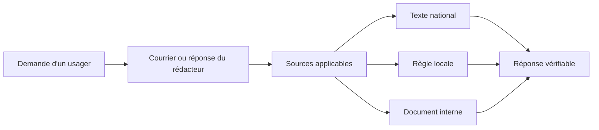
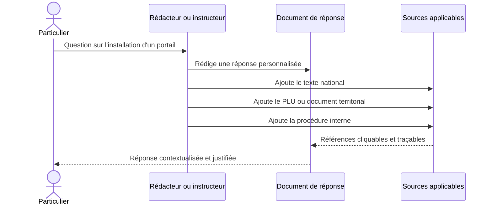
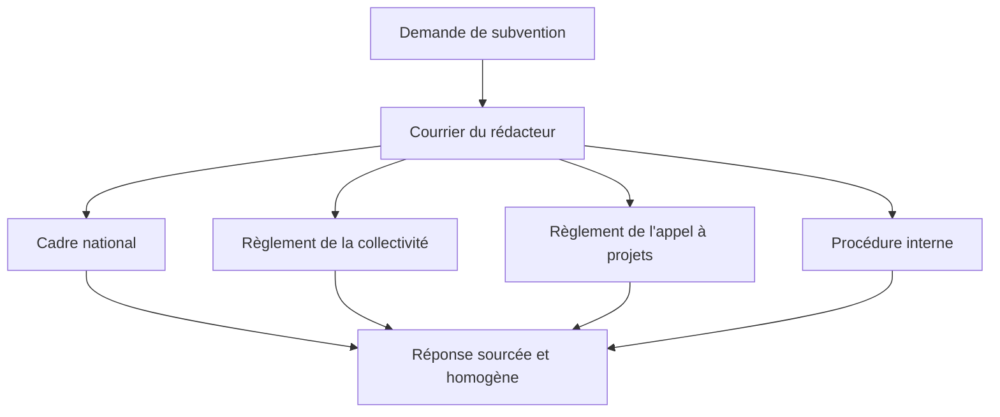

import { Mermaid } from "../../../src/components/Mermaid";

Les cas d'usage décrivent des situations de travail. Les **user stories** les transforment en besoins fonctionnels directement exploitables par l'équipe produit :

> **En tant que** rédacteur administratif, **je souhaite** associer une source juridique à mon document, **afin de** retrouver et justifier rapidement le fondement de ma réponse.

Ces scénarios montrent comment une réponse administrative peut relier plusieurs niveaux de sources :

1. un texte national ;
2. une règle locale ou territoriale ;
3. une procédure ou un document interne.

---

## 🧭 Parcours fonctionnel commun

Dans le document, chaque référence doit être **cliquable**, identifiable et conservée avec son titre, son type, son lien et sa date ou version lorsque cette information est disponible.

---

## User story 1 — Répondre à une question sur l'installation d'un portail

### Formulation

> **En tant que** rédacteur administratif ou agent instructeur, **je souhaite** associer à mon courrier les sources juridiques et documentaires utilisées, **afin de** répondre rapidement à un particulier et de justifier la règle applicable à son projet.

### Utilisateur

- Rédacteur administratif ;
- Agent instructeur.

### Services concernés

- Service urbanisme ;
- Service instructeur ;
- Accueil et relation usagers ;
- Service administratif territorial.

### Situation

Un particulier contacte l'administration :

> « Je souhaite installer un portail devant ma maison de campagne. Dois-je effectuer une démarche particulière ? »

Le rédacteur doit préparer une réponse adaptée à la situation du demandeur. Il doit notamment :

- identifier les règles applicables ;
- rechercher les textes correspondants ;
- vérifier leur actualité ;
- prendre en compte le contexte territorial ;
- consulter, si nécessaire, les documents ou procédures internes ;
- citer les sources dans son courrier.

### Problème rencontré

La réponse peut dépendre du territoire concerné. Deux projets similaires peuvent être soumis à des règles différentes selon la commune, le plan local d'urbanisme (PLU), une servitude ou une autre contrainte locale.

Le rédacteur doit donc croiser une source nationale avec une règle locale et, parfois, une procédure interne. Une recherche uniquement centrée sur un article national ne suffit pas toujours à produire une réponse complète.

### Objectif utilisateur

Identifier et consulter rapidement les sources juridiques et documentaires applicables à la demande, en s'appuyant aussi sur les réponses déjà produites par le service.

### Fonctionnalité envisagée

Dans le document de réponse, un bloc **Sources applicables** regroupe les références utilisées :

| Niveau | Exemple de source | Rôle dans la réponse |
| :--- | :--- | :--- |
| **Texte national** | Article pertinent d'un code ou d'une loi | Donne le cadre juridique général. |
| **Réglementation locale** | PLU ou document territorial | Précise la règle applicable au lieu concerné. |
| **Procédure interne** | Fiche de référence du service | Explique la démarche administrative à suivre. |

Chaque référence est cliquable et conserve son contexte. La commande `/loi` peut servir à insérer la source nationale ; les références locales et internes peuvent utiliser le même principe de lien documenté.

### Parcours attendu

### Valeur ajoutée

- Réduction du temps de recherche ;
- réduction du risque d'oublier une source ;
- meilleure traçabilité de la réponse ;
- accès direct aux textes et documents utilisés ;
- prise en compte explicite du contexte territorial ;
- prototype représentatif d'un besoin réel ;
- restitution d'une source fiabilisée sans perdre le contexte métier.

> **Point de vigilance :** la fonctionnalité peut aider à retrouver les sources, mais elle ne décide pas seule de la règle applicable. La qualification du contexte et la validation juridique restent nécessaires lorsque la situation est complexe.

---

## User story 2 — Répondre à une association sur une demande de subvention

### Formulation

> **En tant que** rédacteur administratif ou agent chargé des demandes de subventions, **je souhaite** relier ma réponse aux textes et documents qui encadrent le dispositif, **afin de** fournir à l'association une réponse claire, homogène et vérifiable.

### Utilisateur

- Rédacteur administratif ;
- Agent chargé de l'instruction des demandes de subventions.

### Services concernés

- Service chargé de la vie associative ;
- Service financier ;
- Service métier ;
- Service juridique ;
- Collectivité ou administration déconcentrée.

### Situation

Une association contacte l'administration :

> « Notre association souhaite obtenir une subvention pour organiser un événement local. Quelles sont les conditions et les démarches à effectuer ? »

Le rédacteur doit préparer une réponse expliquant les conditions applicables et les prochaines étapes.

### Problème rencontré

La réponse peut dépendre de plusieurs documents :

- réglementation nationale ;
- règles propres à la collectivité ;
- règlement du dispositif de subvention ;
- appel à projets ;
- procédure ou fiche interne.

Le cadre applicable varie donc selon la collectivité, le dispositif et le territoire concernés. Une réponse copiée depuis un autre service peut être incomplète ou ne plus correspondre au règlement en vigueur.

### Objectif utilisateur

Retrouver depuis le document de réponse les différentes sources qui fondent la réponse apportée à l'association.

### Fonctionnalité envisagée

Le courrier comporte une section **Sources applicables** organisée par niveau :

| Source | Exemple de contenu | Usage |
| :--- | :--- | :--- |
| **Cadre juridique national** | Loi, décret ou article applicable | Vérifier les conditions générales. |
| **Règlement local** | Règlement de la collectivité | Vérifier les règles propres au territoire. |
| **Dispositif** | Règlement de l'appel à projets | Vérifier les critères, dates et pièces demandées. |
| **Procédure interne** | Fiche d'instruction du service | Harmoniser le traitement de la demande. |

Les sources sont accessibles directement depuis le document, sans interrompre la rédaction.

### Parcours attendu

### Valeur ajoutée

- réponse plus rapide ;
- réponse mieux sourcée ;
- harmonisation des réponses entre agents ;
- meilleure traçabilité ;
- facilitation du contrôle ou de la validation ;
- réduction du risque d'appliquer le règlement d'un autre dispositif ou d'un autre territoire.

---

## 📊 Ce que ces deux stories démontrent

| Besoin commun | Portail /loi attendu |
| :--- | :--- |
| Retrouver une source pendant la rédaction | Recherche contextuelle et insertion sans quitter le document. |
| Croiser plusieurs niveaux de règles | Références nationales, locales et internes dans un même document. |
| Vérifier l'actualité d'une source | Statut, version et date affichés lorsque les données sont disponibles. |
| Conserver la traçabilité | Identifiant, titre, type et lien conservés avec la référence. |
| Réutiliser une réponse existante | Navigation entre documents métier et sources associées. |
| Adapter la réponse au contexte | Métadonnées territoriales ou dispositif conservées avec le document. |

## ✅ Critères d'acceptation du prototype

Le prototype sera considéré comme utile si un agent peut :

- rédiger une réponse sans ouvrir une grande modale ou un panneau latéral ;
- insérer une référence nationale avec `/loi` ;
- ajouter un lien vers un PLU, un règlement ou une procédure interne ;
- distinguer visuellement les différents types de sources ;
- cliquer sur chaque référence depuis le document ;
- retrouver la source et sa version lorsque l'information est disponible ;
- conserver le texte rédigé autour des références ;
- transmettre ou relire une réponse dont le fondement est compréhensible.

👉 **[Retour au sommaire du dossier Loi & Légifrance](/08-slash/loi)**
