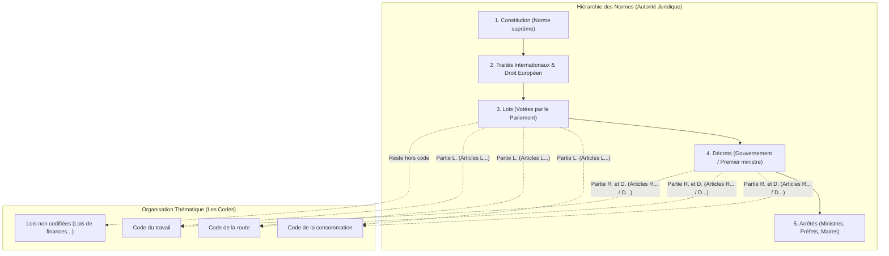
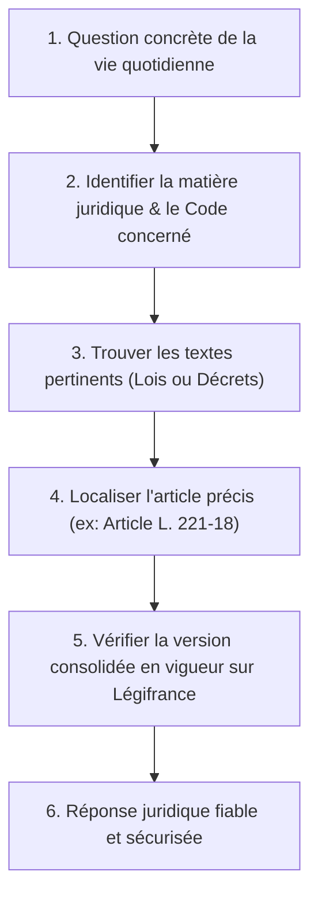

Ce guide s'adresse à tous ceux qui souhaitent comprendre le fonctionnement du droit français sans jargon inutile. Avec des mots simples, des schémas clairs et des exemples concrets de la vie quotidienne, vous allez découvrir comment les règles juridiques sont créées, organisées et mises à jour.

🔗 **Ressources complémentaires :** Pour accéder aux sites officiels et approfondir chaque sujet, consultez notre guide des [Ressources Juridiques Officielles](./ressources-juridiques.md).

---

## 🧭 1. Les 5 Briques Essentielles du Droit Français

Pour ne plus confondre les termes juridiques, voici une comparaison simple avec des objets du quotidien :

| Terme | Définition Simple | Qui le décide ? | Exemple Concret |
| :--- | :--- | :--- | :--- |
| **La Loi** | La règle générale qui fixe les grands principes et les droits fondamentaux. | Le **Parlement** (Assemblée nationale + Sénat) ou les citoyens par référendum. | La loi fixant le principe des congés payés ou l'obligation du passager d'attacher sa ceinture. |
| **Le Décret** | Le texte qui précise **comment appliquer concrètement** la loi sur le terrain. | Le **Président de la République** ou le **Premier ministre** (Pouvoir exécutif). | Le décret qui fixe le montant de l'amende en cas de ceinture non attachée (135 €). |
| **L'Arrêté** | Une décision locale ou spécialisée pour un domaine ou un territoire précis. | Un **Ministre**, un **Préfet** (département) ou un **Maire** (commune). | L'arrêté du maire interdisant le stationnement dans une rue pendant la fête du village. |
| **Le Code** | Un **grand classeur thématique** qui regroupe des lois et des décrets sur un même sujet. | L'État (par un travail de regroupement appelé la *codification*). | Le *Code de la route*, le *Code du travail*, le *Code de la consommation*. |
| **L'Article** | L'**unité de base** numérotée qui contient une règle précise. | L'auteur du texte (Parlement, Gouvernement, Maire). | L'article **L. 221-18** du Code de la consommation (délai de rétractation de 14 jours). |

---

## 📚 2. Un Code n'est pas une "Super-Loi" : C'est un Classeur Thématique

Une idée reçue très courante consiste à croire que le « Code » se situe au-dessus de la « Loi ». C'est faux !

- **Un code est un outil de rangement :** Imaginez une grande bibliothèque avec des classeurs thématiques. Au lieu de laisser traîner des milliers de feuilles volantes, on range les règles relatives au travail dans le *Code du travail*, celles sur le commerce dans le *Code de commerce*, etc.
- **Toutes les lois ne sont pas dans un code :** Certaines lois restent « hors code » (non codifiées). C'est le cas par exemple du budget annuel de l'État (la *Loi de finances de l'année*) ou de lois historiques spécifiques.
- **Un code mélange deux étages juridiques :** À l'intérieur d'un même code, on trouve :
  - **La Partie Législative (lettre `L.`) :** Les règles issues des **lois** votées par le Parlement (ex: `Article L. 1221-1`).
  - **La Partie Réglementaire (lettres `R.`, `D.` ou `A.`) :** Les règles issues des **décrets** et des **arrêtés** pris par le Gouvernement (ex: `Article R. 412-1` pour un décret en Conseil d'État, `Article D.` pour un décret simple, `Article A.` pour un arrêté).

---

## 🏛️ 3. Hiérarchie des Normes vs Classement dans les Codes

Il ne faut pas confondre **la valeur d'une règle** (son autorité juridique) et **son lieu de rangement** (le code) :

1. **La Hiérarchie des Normes (la Pyramide) :** Une règle inférieure doit toujours respecter les règles qui lui sont supérieures. Un arrêté du maire ne peut jamais contredire un décret, qui ne peut pas contredire une loi, qui ne peut pas contredire la Constitution.
2. **Le Code (le Classeur) :** Le code ne modifie pas la pyramide : il contient simplement des morceaux de la pyramide (lois et décrets) triés par thème pour faciliter leur lecture.



---

## 🔄 4. Comment une Nouvelle Loi Modifie les Codes ?

Le droit n'est pas figé dans le marbre : il évolue en permanence au gré des réformes.

Lorsqu'une nouvelle loi est votée par le Parlement, elle a souvent pour mission de **modifier, ajouter ou supprimer des articles existants** dans plusieurs codes à la fois.

### Exemple Concret : Une loi sur le pouvoir d'achat
Imaginons qu'une loi sur la protection du pouvoir d'achat soit adoptée :
- Elle modifie l'article **L. 221-18 du Code de la consommation** pour renforcer les droits des acheteurs.
- Elle ajoute un nouvel article **L. 3231-5 dans le Code du travail** pour ajuster les primes.
- Elle abroge (supprime) un vieil article du **Code de commerce**.

```
Nouvelle Loi votée (ex: Loi Pouvoir d'Achat)
    │
    ├── 1. Modifie ──> Article L. 221-18 du Code de la consommation
    ├── 2. Ajoute   ──> Article L. 3231-5 du Code du travail
    └── 3. Supprime ──> Ancien article du Code de commerce
```

---

## ⏱️ 5. Publication, Entrée en Vigueur et Version Consolidée

Pour savoir si un article de loi s'applique à votre situation, trois notions temporelles sont capitales :

1. **La Publication (Le Journal Officiel) :** Une loi ou un décret est imprimé et mis en ligne au **JORF (Journal Officiel de la République Française)**. C'est l'acte de naissance public du texte : _« Nul n'est censé ignorer la loi »_ dès lors qu'elle est publiée.
2. **L'Entrée en Vigueur :** C'est la date à partir de laquelle la règle devient **obligatoire** :
   - *Par défaut :* Le lendemain de sa publication au Journal Officiel.
   - *Date différée :* Le texte peut prévoir une application future (ex: _« La présente loi entre en vigueur le 1er janvier 2027 »_).
   - *Attente de décrets :* Certains articles nécessitent la parution d'un décret d'application pour être applicables.
3. **La Version Consolidée :** C'est le texte **à jour à une date précise**, intégrant toutes les modifications votées au fil des années. C'est cette version consolidée que vous devez toujours vérifier sur [Légifrance](https://www.legifrance.gouv.fr/).

---

## 🔍 6. Le Parcours de Recherche : De la Question au Texte en Vigueur

Comment un citoyen ou un juriste trouve-t-il la réponse exacte à une question juridique ? Voici la méthode pas-à-pas :



### 💡 Illustration avec un Exemple Concret et Vérifié

**Situation :** Vous avez commandé une paire de chaussures sur un site e-commerce français hier soir, mais vous regrettez votre achat. Quel est votre délai légal pour changer d'avis et vous faire rembourser ?

- **Étape 1 (Question) :** Quel est le délai de rétractation pour un achat en ligne ?
- **Étape 2 (Code) :** Il s'agit d'une relation entre un consommateur et un professionnel $\rightarrow$ **Code de la consommation**.
- **Étape 3 (Texte) :** Chapitre consacré aux contrats conclus à distance et hors établissement.
- **Étape 4 (Article) :** **Article L. 221-18 du Code de la consommation**.
  > _« Le consommateur dispose d'un délai de quatorze jours pour exercer son droit de rétractation d'un contrat conclu à distance... sans avoir à motiver sa décision ni à supporter d'autres coûts. »_
- **Étape 5 (Vérification) :** Sur Légifrance, la fiche de l'article indique le statut **« En vigueur »** (créé par l'ordonnance n° 2016-301 du 14 mars 2016 et consolidé).
- **Étape 6 (Réponse) :** Vous avez exactement **14 jours calendaires** à compter de la réception du colis pour vous rétracter.

---

## 🚀 Pour Aller Plus Loin dans ce Dossier

- 📚 **[Consulter le Guide des Ressources Juridiques Officielles](./ressources-juridiques.md)**
- ⚖️ **[1. Contexte Métier & Fabrique de la Loi](./01-contexte-metier-et-juridique.mdx)**
- 🧩 **[4. Spécifications de la Commande /loi dans Docs](./04-specifications-techniques-feature.mdx)**
