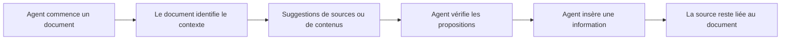
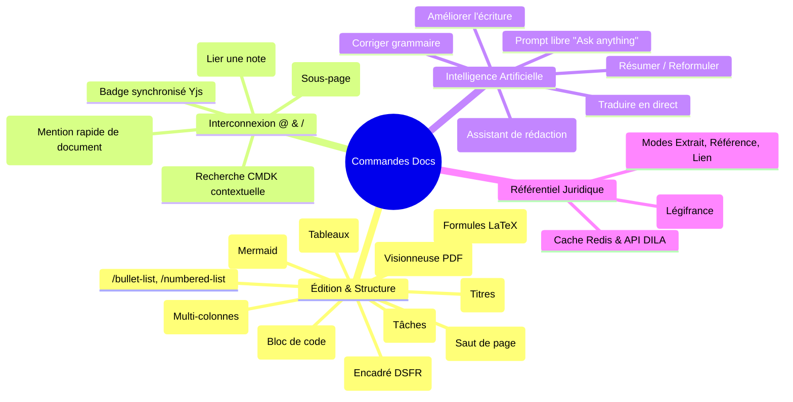
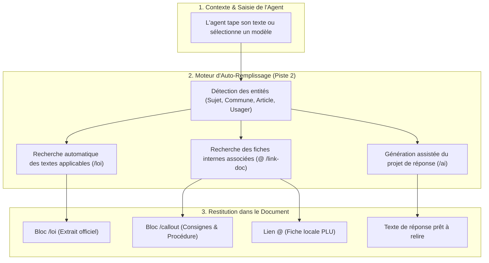
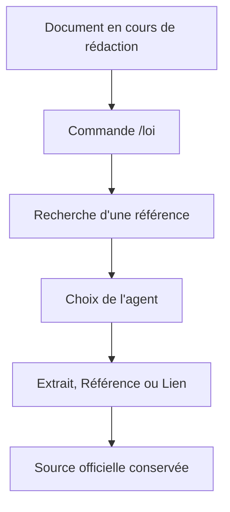

import { Mermaid } from "../../src/components/Mermaid";

> **Document de travail — première base**
>
> Cette page reprend la piste 2 à partir de son intitulé et de la vision du dossier `08-slash`. Elle sert de support de cadrage pour les prochaines itérations. Le contenu officiel de la piste est disponible sur la [page de référence des docs numériques](https://docs.numerique.gouv.fr/docs/51612d1e-1bf7-447c-a413-c5a9ede59d4e/).

# Le doc qui se remplit tout seul

## 🎯 Vision

L'objectif est d'explorer un document qui aide son auteur pendant la rédaction : il comprend le contexte saisi, retrouve les sources ou informations pertinentes et propose des contenus vérifiables directement dans le document.

Le document ne doit pas remplacer l'agent. Il doit réduire les recherches répétitives, conserver les sources utilisées et laisser l'utilisateur décider ce qui est inséré ou validé.

### Proposition de valeur

> **En tant qu'agent administratif, je souhaite être accompagné pendant la rédaction d'un document afin de retrouver plus rapidement les informations utiles, de les vérifier et de produire une réponse traçable.**

---

## 🧭 Parcours cible



Le parcours doit rester discret : les suggestions apparaissent dans le flux de rédaction, sans grande modale ni interruption inutile.

---

## 🧩 Première hypothèse fonctionnelle

Le document pourrait aider son auteur à :

- retrouver un article de loi, un décret ou un arrêté avec `/loi` ;
- proposer une source à partir d'une question ou d'un passage en cours de rédaction ;
- relier une source nationale à une règle locale ou à un document interne ;
- réutiliser une réponse ou une procédure existante ;
- signaler qu'une référence possède une version ou un statut à vérifier ;
- conserver le lien entre le contenu inséré et sa source ;
- afficher une suggestion sans l'insérer automatiquement ;
- laisser l'agent modifier, refuser ou supprimer chaque proposition.

---

## 🔍 1. Inventaire des Commandes Déjà Présentes dans Docs

Une exploration détaillée du code source de l'éditeur Docs (`src/docs/src/frontend/apps/impress/src/features/docs/doc-editor`) révèle que **quatre grandes familles de commandes et d'extensions sont déjà implémentées ou prêtes à l'emploi** :



### A. Les Commandes de Blocs Standards (BlockNote)

| Commande / Slash Item | Déclencheur / Alias | Description & Rendu |
| :--- | :--- | :--- |
| **Callout / Encadré** | `/callout` | Bloc d'avertissement ou de remarque stylisé avec bordure et fond teinté. |
| **Diagramme Mermaid** | `/diagram` | Insertion de schémas de flux, diagrammes de séquence ou architectures. |
| **Formule Mathématique** | `/math` | Bloc ou formule inline rendue avec KaTeX. |
| **Document PDF** | `/pdf` | Visionneuse PDF intégrée dans le corps de la note. |
| **Multi-colonnes** | `/columns` | Disposition du texte sur 2 ou 3 colonnes ajustables. |
| **Saut de page** | `/page-break` | Délimiteur de page pour les exports et impressions. |
| **Tableau structuré** | `/table` | Grille de données avec gestion des lignes et colonnes. |
| **Bloc de code** | `/code` | Éditeur de code sécurisé avec coloration syntaxique. |

---

### B. Les Commandes d'Interconnexion Documentaire (`Interlinking`)

Le module `custom-inline-content/Interlinking` permet de **relier dynamiquement les documents entre eux** :

- **Déclencheurs :** Saisie de `/link-doc` (ou alias `interlinking`, `link`, `anchor`, `a`) ou du caractère `@`.
- **Recherche intégrée (`SearchPage.tsx`) :** Ouvre un popover compact basé sur le composant `QuickSearch` / `cmdk` pour filtrer instantanément dans l'arborescence du document courant et des sous-documents.
- **Création de sous-page (`/new-sub-doc`) :** Crée une page enfant dans l'arbre documentaire sans quitter l'éditeur.
- **Rendu en badge cliquable (`LinkSelected.tsx`) :** Le titre du document lié est inséré sous forme de badge interactif dont le libellé se synchronise automatiquement en temps réel si le document cible est renommé.

---

### C. Les Commandes et Actions d'IA Souveraine (`BlockNoteAI`)

Le composant `AIMenu.tsx` et les hooks associés (`useDocAITransform.tsx`) exposent un ensemble complet d'actions de génération et de transformation :

- **Déclencheur :** `/ai` dans le menu slash ou sélection de texte + clic sur l'icône IA.
- **Actions disponibles :**
  - `improve_writing` : Améliore la clarté et le style du paragraphe sélectionné.
  - `rephrase` : Reformule une phrase ou une explication administrative.
  - `summarize` : Génère une synthèse condensée d'un texte long.
  - `correct` : Corrige l'orthographe et la syntaxe sans altérer le sens.
  - `translate` : Traduit instantanément le passage dans une autre langue.
  - `beautify` : Structure et met en page le texte brut.
  - `prompt` : Champ libre (*« Ask anything... »*) pour générer du contenu sur-mesure.
- **Endpoints backend :** `POST /api/v1.0/documents/{id}/ai-transform/` et `POST /api/v1.0/documents/{id}/ai-translate/`.

---

### D. La Commande Juridique `/loi` (Base du Dossier 08-slash)

La brique `/loi` développée dans ce dossier apporte l'accès direct au droit officiel :

- **Déclencheur :** `/loi` (alias `/law`, `/legifrance`, `/code`, `/article`, `/juris`).
- **3 Modes d'affichage au choix :**
  1. **Mode Extrait :** Bloc complet avec le texte officiel certifié et les métadonnées Légifrance.
  2. **Mode Référence :** Ligne compacte encadrée (48 à 56 px) avec titre cliquable et lien externe.
  3. **Mode Lien :** Lien fluide dans le paragraphe avec mini-barre d'outils flottante au clic.

---

## 🚀 2. Comment la Piste 2 Assemble ces Commandes pour « Auto-Remplir » le Doc

Le concept du **« doc qui se remplit tout seul »** ne nécessite pas de réinventer l'éditeur : il consiste à **orchestrer intelligemment les commandes existantes** (`/loi`, `@` interlinking, `/callout`, `/ai`, `/table`) en fonction du contexte de travail de l'agent :



### Les 3 Niveaux d'Auto-Remplissage à Développer

1. **Niveau 1 — Modèles interactifs pré-câblés :**
   Lors de la création d'un document type (ex: _Réponse Urbanisme_, _Demande de Subvention_), le document s'ouvre avec la structure pré-remplie, les blocs `/callout` de consignes et les emplacements de sources déjà prêts.
2. **Niveau 2 — Suggestions contextuelles automatiques :**
   Lorsque l'agent tape une phrase mentionnant un article de loi ou un document interne, l'éditeur propose automatiquement de convertir le texte brut en bloc certifié `/loi` ou en lien `@link-doc`.
3. **Niveau 3 — Génération complète avec traçabilité :**
   L'agent fournit les données d'entrée (ex: *Question du citoyen*, *Nom de la commune*). L'IA génère le projet de réponse en insérant automatiquement les vraies sources vérifiables (articles de code et PLU local) sans hallucination.

---

## 📋 3. Plan d'Itération pour Prototyper la Piste 2

| Étape | Intitulé | Description technique | Dépendances existantes |
| :--- | :--- | :--- | :--- |
| **Étape 1** | **Catalogue de templates pré-remplis** | Créer 3 modèles administratifs de base intégrant les blocs `/callout`, `/table` et `/loi`. | `createReactBlockSpec`, `DocsBlockSchema` |
| **Étape 2** | **Détection de références dans le texte** | Détecter les motifs type *« Article L. 221-18 »* et proposer l'insertion du bloc `/loi` en 1 clic. | `useShortcuts`, `find-and-replace` |
| **Étape 3** | **Menu de suggestion unifié (`/` et `@`)** | Fusionner la recherche de documents internes (`@`) et la recherche juridique (`/loi`) dans une palette unique. | `SearchPage.tsx`, `cmdk`, `QuickSearch` |
| **Étape 4** | **Génération IA avec injection de sources** | Brancher `useDocAITransform` sur un prompt système qui référence explicitement les articles trouvés via l'API Légifrance. | `ai-transform`, API PISTE / DILA |

---

## 📝 Exemple de situation administrative

Un agent doit répondre à un usager. Il commence à rédiger :

```text
Bonjour,

Concernant votre demande, la démarche dépend de la nature du projet et des règles applicables sur le territoire concerné.
```

Le document pourrait proposer :

```text
Sources potentiellement utiles

- Texte national : article ou code correspondant au sujet
- Règle locale : PLU, règlement territorial ou appel à projets
- Document interne : procédure ou fiche réflexe du service
```

L'agent consulte les propositions, vérifie leur pertinence et choisit celles qui doivent apparaître dans la réponse finale.

> La proposition est une aide à la recherche. Elle ne constitue pas une validation juridique automatique.

---

## ⚖️ Lien avec la commande `/loi`

La commande `/loi` peut constituer une première brique concrète de cette piste :

1. l'agent écrit ou déclenche `/loi` ;
2. le menu recherche un texte, un code ou un article ;
3. l'agent choisit une référence ;
4. la référence est insérée en mode **Extrait**, **Référence** ou **Lien** ;
5. l'identifiant, la source et la version sont conservés ;
6. le document reste relié à la source juridique.



Pour le détail de cette brique, consulter le [dossier Loi & Légifrance](/08-slash/loi) et les [user stories de réponses administratives](/08-slash/loi/08-user-stories-reponses-admin).

---

## 🔗 Types d'informations à relier

| Information | Exemple | Action attendue |
| :--- | :--- | :--- |
| **Texte national** | Loi, code, décret, arrêté | Rechercher et insérer une référence officielle. |
| **Règle locale** | PLU, règlement d'une collectivité | Ouvrir le document territorial applicable. |
| **Document interne** | Procédure, fiche réflexe, note de doctrine | Relier la réponse au référentiel du service. |
| **Réponse existante** | Courrier ou modèle validé | Retrouver un précédent et son contexte. |
| **Évolution** | Article modifié ou nouvelle version | Identifier les documents à revoir. |

---

## 👥 Utilisateurs potentiels

- rédacteur administratif ;
- agent instructeur ;
- gestionnaire de dossier ;
- référent métier ;
- juriste ;
- responsable documentaire ;
- chef de service ou de bureau ;
- contrôleur ou auditeur.

Les situations détaillées sont décrites dans le chapitre [Cas d'Usage Métier](/08-slash/loi/07-cas-usage-metier).

---

## 🔐 Principes de confiance

Pour rester utile dans un contexte administratif, le document doit :

- montrer lorsqu'une information est une suggestion ;
- distinguer une source officielle d'un document interne ;
- afficher la version ou la date lorsque ces données existent ;
- éviter d'affirmer qu'une règle est applicable sans vérification humaine ;
- permettre de consulter la source originale ;
- conserver la traçabilité des insertions ;
- préserver le texte déjà rédigé ;
- respecter les droits d'accès aux documents internes.

---

## 🚧 Base de prototype

### Périmètre initial

- recherche manuelle avec `/loi` ;
- insertion d'une référence juridique ;
- trois modes d'affichage : Extrait, Référence, Lien ;
- lien vers la source officielle ;
- métadonnées minimales : identifiant, titre, statut, version et URL ;
- possibilité d'associer un lien vers une ressource interne.

### Évolutions possibles

- suggestions à partir du texte en cours ;
- recherche dans le corpus documentaire interne ;
- regroupement automatique des sources par niveau ;
- détection de références potentiellement obsolètes ;
- recherche des documents dépendants d'un texte modifié ;
- génération d'une première réponse à relire ;
- historique des sources utilisées dans un document.

---

## 📌 Questions à traiter lors de la prochaine itération

- Quelles données la piste 2 fournit-elle précisément ?
- Le document analyse-t-il le texte en continu ou seulement à la demande ?
- Quelles sources sont accessibles : Légifrance, corpus interne, règles locales ?
- Comment l'agent valide-t-il une suggestion ?
- Quelles informations doivent être conservées dans le document ?
- Comment gérer les droits d'accès aux documents internes ?
- Quel est le périmètre du prototype attendu ?
- Quels critères permettent de mesurer le gain de temps et la qualité des réponses ?

👉 **[Retour au dossier Commandes Slash](/08-slash)**
