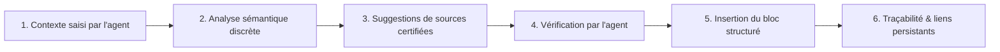
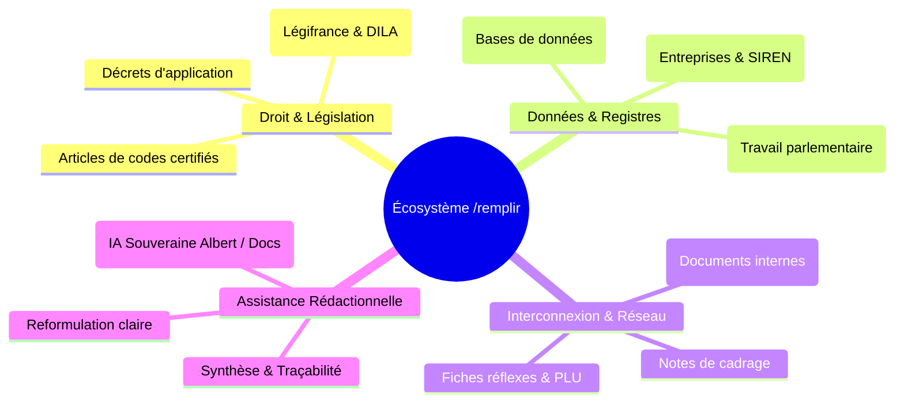

import { Mermaid } from "../../../src/components/Mermaid";

La commande **`/remplir`** (ou **`/auto`**, **`/source`**) concrétise la vision du **« document qui se remplit tout seul »** dans **La Suite Docs**. Elle permet d'assister l'agent public pendant la rédaction en identifiant le contexte, en suggérant des sources certifiées (lois, fiches internes, données d'entreprises) et en pré-remplissant des réponses administratives traçables sans hallucination.

---

## 🎯 Vision & Proposition de Valeur

L'objectif n'est pas de remplacer l'agent, mais de supprimer les recherches fastidieuses et les ruptures de charge :

> **En tant qu'agent administratif, je souhaite être accompagné pendant la rédaction afin de retrouver instantanément les informations utiles, de vérifier leur validité juridique et de produire une réponse opposable et traçable.**

---

## 🏗️ Orchestration des Commandes Slash Existantes

Le document intelligent n'impose pas de réinventer l'éditeur : il orchestre dynamiquement les commandes déjà disponibles dans **La Suite Docs** :

---

## ⚡ Les 3 Niveaux d'Auto-Remplissage

1. **Niveau 1 — Modèles interactifs pré-câblés :**
   À l'ouverture d'un template (ex: _Réponse Urbanisme_, _Rapport d'Analyse des Offres_), le document s'ouvre avec les blocs `/callout` de consignes et les emplacements de sources prêts.
2. **Niveau 2 — Suggestions contextuelles automatiques :**
   Dès que l'agent tape une mention juridique (*« selon l'article L. 111-1 »*) ou une entreprise (*« société X »*), l'éditeur propose en 1 clic de convertir le texte brut en bloc certifié `/loi` ou `/pappers`.
3. **Niveau 3 — Génération complète avec injection de sources :**
   L'agent fournit la demande de l'usager. L'assistant souverain génère le projet de réponse en intégrant directement les extraits officiels sans inventer de texte de loi.

---

## 🗺️ Matrice des Commandes & Alias

| Commande | Alias BlockNote | Fonction |
| :--- | :--- | :--- |
| **`/remplir`** | `remplir`, `auto`, `source`, `synthese`, `ia-doc` | Déclenche l'assistant de suggestion et d'injection de sources |
| **`/loi`** | `loi`, `law`, `legifrance`, `code`, `article` | Insertion directe d'articles de loi Légifrance |
| **`/pappers`** | `pappers`, `entreprise`, `siren`, `siret` | Insertion de fiches d'entreprises certifiées |
| **`/assemblee`** | `assemblee`, `assemble`, `an`, `amendement` | Suivi des projets de loi et amendements parlementaires |
| **`/meet`** | `meet`, `visio`, `salon` | Génération de salon de visioconférence |
| **`/decision`** | `decision`, `vote`, `arbitrage` | Bloc de vote et d'arbitrage en équipe |
