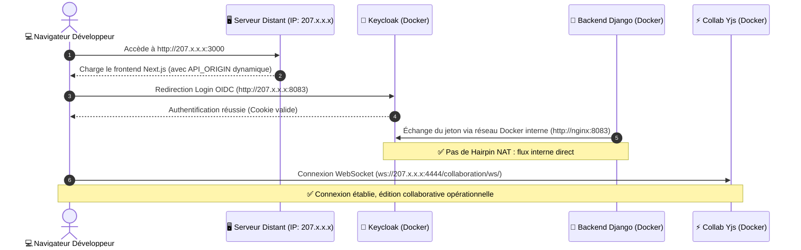

import { Mermaid } from "../../src/components/Mermaid";

Ce document fournit le **dossier complet et argumenté de Pull Request** à destination des mainteneurs de **La Suite Numérique (DINUM)** pour le dépôt officiel [`suitenumerique/docs`](https://github.com/suitenumerique/docs).

---

## 📌 Synthèse de la Contribution

| Paramètre | Spécification |
| :--- | :--- |
| **Dépôt Cible** | [`suitenumerique/docs`](https://github.com/suitenumerique/docs) |
| **Titre Suggéré** | `feat(dev): make development URLs configurable for remote servers and cloud VMs` |
| **Impact Rétrocompatible** | **100% Rétrocompatible** — Les valeurs par défaut restent `localhost` pour les postes locaux. |
| **Bénéfice Principal** | Déploiement et tests sur machine distante (VM SecNumCloud, Codespaces, VPS) sans modifier une seule ligne de code source. |

---

## 🎯 1. Contexte & Problématique Rencontrée

Sur une machine distante (VM hébergée dans un cloud souverain ou VPS de développement), plusieurs origines réseau étaient historiquement codées en dur sur `localhost` :
1. **Redirection Keycloak OIDC :** `KC_HOSTNAME=http://localhost:8083` forçait une redirection du navigateur vers le poste client au lieu de la VM.
2. **Hairpin NAT Timeout :** Les appels machine-à-machine (Django validant le jeton Keycloak) échouaient si Django tentait d'appeler l'IP publique de son propre hôte.
3. **Serveur de Collaboration Temps Réel :** Le client Next.js tentait de contacter `ws://localhost:4444` au lieu de l'IP du serveur distant.



---

## 📝 2. Diff Git Exhaustif de la PR 1

### 🐳 2.1. Docker Compose (`compose.yml` & `compose-e2e.yml`)

```diff
--- a/compose.yml
+++ b/compose.yml
@@ -152,7 +152,7 @@ services:
       dockerfile: ./src/frontend/Dockerfile
       target: impress-dev
       args:
-        API_ORIGIN: "http://localhost:8071"
+        API_ORIGIN: "${API_ORIGIN:-http://localhost:8071}"
         PUBLISH_AS_MIT: "false"
         SW_DEACTIVATED: "true"
     image: impress:frontend-development

--- a/compose-e2e.yml
+++ b/compose-e2e.yml
@@ -6,7 +6,7 @@ services:
       dockerfile: ./src/frontend/Dockerfile
       target: frontend-production
       args:
-        API_ORIGIN: "http://localhost:8071"
+        API_ORIGIN: "${API_ORIGIN:-http://localhost:8071}"
         PUBLISH_AS_MIT: "false"
         SW_DEACTIVATED: "true"
```

---

### ⚛️ 2.2. Configuration Next.js (`src/frontend/apps/impress/next.config.js`)

```diff
--- a/src/frontend/apps/impress/next.config.js
+++ b/src/frontend/apps/impress/next.config.js
@@ -8,7 +8,7 @@ const buildId = crypto.randomBytes(256).toString('hex').slice(0, 8);
 
 /** @type {import('next').NextConfig} */
 const nextConfig = {
-  allowedDevOrigins: ['docs.127.0.0.1.nip.io'],
+  allowedDevOrigins: ['docs.127.0.0.1.nip.io', process.env.ALLOWED_DEV_ORIGIN].filter(Boolean),
   output: 'export',
   trailingSlash: true,
```

---

## 🧪 3. Procédure de Test & Validation

```bash
# 1. Définir l'IP publique de votre serveur distant
export HOST_IP="207.175.155.66"
export API_ORIGIN="http://${HOST_IP}:8071"
export ALLOWED_DEV_ORIGIN="${HOST_IP}"

# 2. Lancer les conteneurs
make dev

# 3. Ouvrir dans votre navigateur
# http://207.175.155.66:3000 -> Login OIDC et WebSocket 100% opérationnels
```
