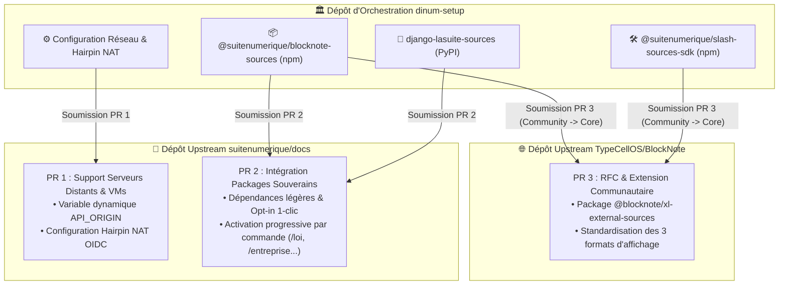

import { Mermaid } from "../../src/components/Mermaid";
import { FeatureCard, FeatureGrid } from "../../src/components/Cards";

L'ensemble des travaux d'ingénierie et d'optimisation réalisés dans le cadre de `dinum-setup` se matérialise par des **Pull Requests (PR) formelles, ciblées et catégorisées par dépôt de destination**.

Ce hub centralise les spécifications complètes, les contextes de contribution, les diffs de code et les protocoles de recette pour chaque projet amont.

---

## 🧭 1. Panorama des Contributions par Dépôt Cible

<FeatureGrid cols={3}>
  <FeatureCard
    icon="🌐"
    title="PR 1 : Docs — Support Serveurs Distants & VMs"
    badge="suitenumerique/docs"
    description="Rendre La Suite Docs compatible avec les déploiements distants et VMs sans modifier le code source (Hairpin NAT & API_ORIGIN)."
    href="/09-PR/01-docs-serveur-config"
  />
  <FeatureCard
    icon="📦"
    title="PR 2 : Docs — Intégration Socle Souverain"
    badge="suitenumerique/docs"
    description="Intégration modulaire low-code (< 10 lignes) des packages souverains avec activation progressive par étape des commandes."
    href="/09-PR/02-docs-packages-souverains"
  />
  <FeatureCard
    icon="📝"
    title="PR 3 : BlockNote — Extension Sources Externes"
    badge="TypeCellOS/BlockNote"
    description="RFC et package communautaire @blocknote/xl-external-sources standardisant les blocs de données distantes aux 3 formats."
    href="/09-PR/03-blocknote-external-sources"
  />
</FeatureGrid>

---

## 🏗️ 2. Cartographie des Contributions Amont & Flux Git

---

## 📊 3. Tableau Récapitulatif des Contributions

| ID PR | Dépôt Cible | Intitulé & Portée | Lignes Modifiées | Bénéfice Clé |
| :--- | :--- | :--- | :---: | :--- |
| **PR-01** | [`suitenumerique/docs`](https://github.com/suitenumerique/docs) | Support des VM & serveurs distants (`API_ORIGIN`) | `~15` lignes | Déploiement instantané sur VM/Cloud sans erreur OIDC |
| **PR-02** | [`suitenumerique/docs`](https://github.com/suitenumerique/docs) | Packages souverains & activation progressive | `< 10` lignes | Zéro pollution in-tree, activation par étape des commandes |
| **PR-03** | [`TypeCellOS/BlockNote`](https://github.com/TypeCellOS/BlockNote) | RFC Blocs de Données Externes & Multi-Formats | Package externe | Standardisation open source, passerelle vers l'écosystème officiel |
| **REF-04**| *Arbitrage Interne* | Guide d'Arbitrage & Matrice de Décision | Référentiel | Tableau comparatif Monolithe vs Packages Découplés |

---

## 🚀 4. Accès Détaillé aux Dossiers de PR

Consultez les dossiers complets prêts à copier-coller pour l'ouverture des Pull Requests :
- 🔗 [Dossier PR 1 : Support des Serveurs Distants & VMs (suitenumerique/docs)](/09-PR/01-docs-serveur-config)
- 🔗 [Dossier PR 2 : Intégration des Packages Souverains & Activation Progressive (suitenumerique/docs)](/09-PR/02-docs-packages-souverains)
- 🔗 [Dossier PR 3 : RFC & Extension Communautaire BlockNote (TypeCellOS/BlockNote)](/09-PR/03-blocknote-external-sources)
- 🔗 [Guide d'Arbitrage Stratégique & Matrice de Décision](/09-PR/04-guide-d-arbitrage-et-migration)
