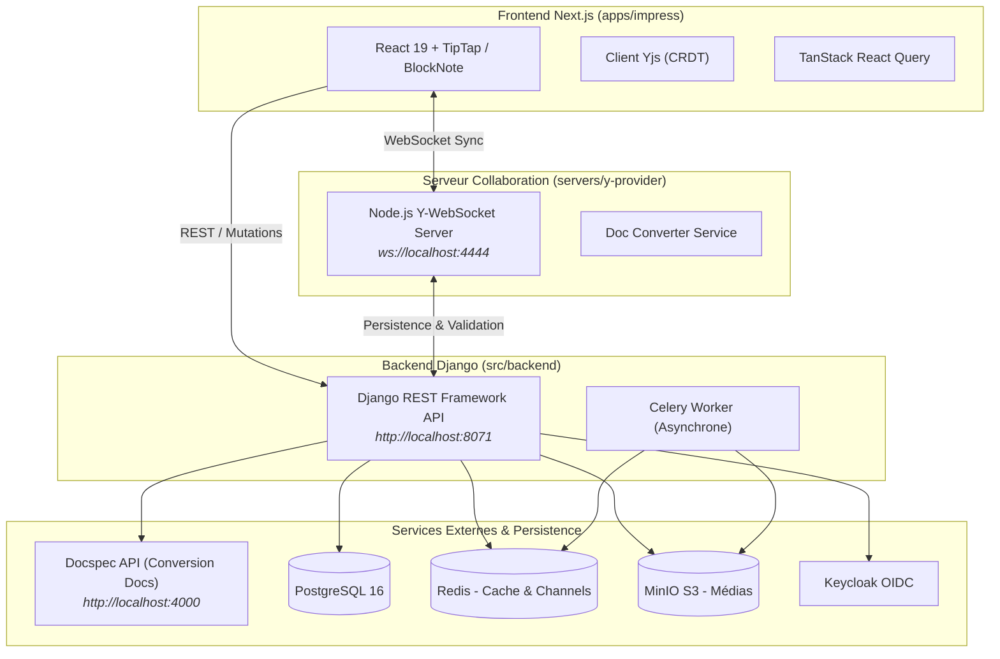
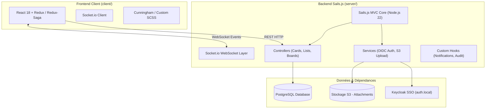
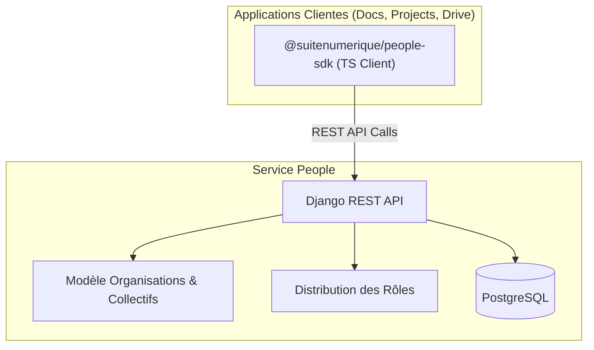

# 🏗️ Architecture Globale & Technique de La Suite Numérique

Ce document constitue la référence d'architecture pour comprendre en profondeur le fonctionnement, les briques logicielles, les choix technologiques et les flux de communication de l'ensemble des projets de **La Suite numérique** (DINUM / ANCT).

---

## 🌐 1. Vue d'Ensemble de l'Écosystème

L'écosystème de La Suite repose sur une architecture distribuée de micro-applications spécialisées, fédérées par une identité unique (**OpenID Connect**) et interconnectées via des API REST et des flux temps réel (**WebSockets / CRDT / WebRTC**).

```mermaid
graph TB
    subgraph Clients["📱 Navigateurs & Postes Clients"]
        UserBrowser["Navigateur Utilisateur"]
    end

    subgraph AuthLayer["🔐 Couche Identité & SSO"]
        Keycloak["Keycloak / ProConnect (OIDC)<br/><i>Port: 8080 / 8083</i>"]
        Accounts["Accounts (Gestion Identités)<br/><i>Port: 9900</i>"]
    end

    subgraph AppLayer["🚀 Applications & Micro-services"]
        DocsFront["Docs (Next.js/React)<br/><i>Port: 3000</i>"]
        DocsBack["Docs API (Django 5)<br/><i>Port: 8071</i>"]
        DocsYjs["Docs Yjs CRDT Server<br/><i>Port: 4444</i>"]
        Docspec["Docspec Conversion API<br/><i>Port: 4000</i>"]

        ProjectsApp["Projects (Node.js/Sails/React)<br/><i>Port: 8000</i>"]

        MeetFront["Meet Frontend (React/LiveKit)<br/><i>Port: 3001</i>"]
        MeetLiveKit["LiveKit SFU (WebRTC Engine)<br/><i>Port: 7880 / UDP</i>"]
        MeetAgents["Meet IA Agents (Transcription/Summary)"]

        TransfersFront["Transfers (Vite/TanStack)<br/><i>Port: 8980</i>"]
        TransfersBack["Transfers API (Django/Celery)<br/><i>Port: 8981</i>"]

        PeopleApp["People (Django/React - Annuaire)<br/><i>Port: 8071</i>"]
    end

    subgraph DataLayer["💾 Couche Données & Stockage"]
        PostgresDocs[(PostgreSQL Docs<br/><i>Port: 15432</i>)]
        PostgresProjects[(PostgreSQL Projects)]
        PostgresTransfers[(PostgreSQL Transfers)]
        PostgresKC[(PostgreSQL Keycloak<br/><i>Port: 5433</i>)]
        RedisCache[(Redis Cache & Queues<br/><i>Port: 6379</i>)]
        S3Storage[(Stockage S3 / MinIO / RustFS<br/><i>Port: 9000/9001</i>)]
    end

    %% Relations Auth
    UserBrowser -->|1. Authentification OIDC| Keycloak
    Keycloak <--> Accounts
    DocsFront -.->|JWT Token| Keycloak
    ProjectsApp -.->|JWT Token| Keycloak
    MeetFront -.->|JWT Token| Keycloak
    TransfersFront -.->|JWT Token| Keycloak

    %% Relations Docs
    UserBrowser -->|HTTPS / UI| DocsFront
    UserBrowser -->|CRDT WebSocket| DocsYjs
    DocsFront -->|REST API| DocsBack
    DocsBack --> PostgresDocs
    DocsBack --> RedisCache
    DocsBack --> S3Storage
    DocsBack --> Docspec

    %% Relations Projects
    UserBrowser -->|HTTP + WebSocket| ProjectsApp
    ProjectsApp --> PostgresProjects
    ProjectsApp --> S3Storage

    %% Relations Meet
    UserBrowser <-->|WebRTC Audio/Vidéo| MeetLiveKit
    MeetFront -->|Room Tokens| MeetLiveKit
    MeetLiveKit <--> MeetAgents

    %% Relations Transfers
    UserBrowser -->|Upload Multipart S3| TransfersFront
    TransfersFront -->|REST API| TransfersBack
    TransfersBack --> PostgresTransfers
    TransfersBack --> RedisCache
    TransfersBack --> S3Storage

    %% Relations People
    PeopleApp -.->|Rôles & Permissions| DocsBack
    PeopleApp -.->|Rôles & Permissions| ProjectsApp
```



---

## 📝 2. Docs (Édition Collaborative)

### A. Rôle Fonctionnel
Docs (anciennement *Impress*) est l'alternative souveraine à Notion et Google Docs. Il permet l'édition de texte enrichi en temps réel multi-utilisateurs, la hiérarchie de documents, le mode présentation automatique et l'assistance rédactionnelle par IA.

### B. Schéma d'Architecture Détaillé



### C. Stack Technique & Choix des Bibliothèques

| Composant | Technologie / Librairie | Justification Technique |
|---|---|---|
| **Moteur Temps Réel** | **Yjs** (`yjs`, `y-prosemirror`, `y-protocols`) | Algorithme CRDT (Conflict-free Replicated Data Type) ultra-performant assurant la fusion de texte sans conflit en P2P/Client-Serveur. |
| **Éditeur Riche** | **BlockNote** & **TipTap / ProseMirror** | Éditeur par blocs moderne (style Notion) extensible avec commandes slash (`/`), support Markdown et intégrations mathématiques (MathJax/KaTeX). |
| **Framework Frontend** | **Next.js 16** / React 19 / Turbopack | Server-Side Rendering (SSR), génération statique, Fast Refresh et intégration moderne. |
| **Design System** | **@gouvfr-lasuite/ui-components** / Cunningham | Composants UI officiels conformes à la charte graphique interministérielle de l'État. |
| **Backend API** | **Python 3.14 / Django 5** / DRF | Écosystème éprouvé, robustesse de l'ORM, typage fort avec Pydantic/DRF et gestion native de l'i18n. |
| **Gestionnaire de Tâches** | **Celery + Redis** | Traitements asynchrones lourds (génération PDF, imports/exports, notifications emails). |
| **Rendu & Conversions** | **Docspec** (`ghcr.io/docspec/api`) | Service dédié pour convertir et compiler les documents vers formats PDF/ODT/DOCX. |

### D. Architecture des Fichiers Clés

```text
src/docs/
├── compose.yml                     # Stack Docker locale (11 conteneurs)
├── Makefile                        # Commandes de build, bootstrap, migrations
├── docker/
│   ├── auth/realm.json             # Fixtures du realm Keycloak (utilisateurs de test)
│   └── files/etc/nginx/conf.d/     # Reverse-proxy local (port 8083)
└── src/
    ├── backend/                    # Code Python Django
    │   ├── core/                   # Modèles principaux (Documents, Folders, Permissions)
    │   ├── impress/                # Configuration Django, urls, wsgi/asgi
    │   ├── manage.py
    │   └── pyproject.toml          # Dépendances gérées avec uv (Astral)
    └── frontend/                   # Monorepo Yarn Workspaces
        ├── package.json
        ├── apps/
        │   ├── impress/            # Application Next.js principale
        │   │   ├── src/components/ # Blocs d'édition, barre latérale, modales
        │   │   ├── src/hooks/      # Hooks React (useDoc, useCollaboration)
        │   │   └── scripts/        # Scripts prebuild/postbuild (emojis, thèmes)
        │   └── e2e/                # Tests Playwright end-to-end
        ├── packages/
        │   ├── i18n/               # Traductions partagées (Crowdin)
        │   └── eslint-plugin-docs/ # Règles de linting internes
        └── servers/
            └── y-provider/         # Serveur Node.js WebSocket Yjs (CRDT)
```

---

## 📊 3. Projects (Gestion de Tâches & Kanban)

### A. Rôle Fonctionnel
Projects est le gestionnaire de projet agile de La Suite. Il organise les activités sous forme de tableaux Kanban (listes, cartes, étiquettes, membres assignés, échéances, pièces jointes) avec synchronisation synchrone multi-écrans.

### B. Schéma d'Architecture Détaillé



### C. Stack Technique & Choix des Bibliothèques

| Composant | Technologie / Librairie | Justification Technique |
|---|---|---|
| **Serveur Backend** | **Node.js (v22) + Sails.js** | Framework MVC basé sur Express, intégrant nativement Socket.io pour la diffusion d'événements temps réel sur les tableaux. |
| **Gestion d'État Frontend** | **Redux + Redux-Saga** | Gestion prédictive et robuste des flux asynchrones complexes (drag & drop de cartes, synchronisation d'état distant, optimistic updates). |
| **Interface & Styles** | **React 18 / Cunningham** | Cohérence visuelle avec les produits DINUM et rapidité de rendu. |
| **Accès Données & Migrations** | **Knex.js + PostgreSQL** | Schémas relationnels stricts pour les structures projets > tableaux > listes > cartes > tâches. |

### D. Architecture des Fichiers Clés

```text
src/projects/
├── docker-compose-dev.yml          # Définition Docker dev
├── Dockerfile                      # Build multi-stage Node.js + Frontend
├── client/                         # Code Frontend React
│   ├── package.json
│   └── src/
│       ├── actions/                # Actions Redux (boards, cards, attachments)
│       ├── components/             # Composants UI (Board, List, CardModal)
│       ├── sagas/                  # Effets asynchrones Redux-Saga
│       └── reducers/               # Réducteurs d'état
└── server/                         # Code Backend Node.js
    ├── package.json
    ├── app.js                      # Point d'entrée serveur
    ├── api/
    │   ├── controllers/            # Contrôleurs REST (CardController, BoardController)
    │   ├── models/                 # Modèles de données (Card, Board, Task, User)
    │   ├── services/               # Logique métier & connecteurs OIDC/S3
    │   └── hooks/                  # Intercepteurs Sails.js
    ├── config/                     # Configuration routes, datastores, sockets
    └── db/migrations/              # Migrations SQL Knex
```

---

## 📹 4. Meet (Visioconférence Sécurisée)

### A. Rôle Fonctionnel
Meet (*Visio*) est la solution de visioconférence sécurisée de l'État français. Elle permet la tenue de réunions vidéo/audio haute définition jusqu'à 100+ participants dans le navigateur, avec partage multi-écrans, chat éphémère, enregistrement et transcription IA.

### B. Schéma d'Architecture Détaillé

```mermaid
graph TD
    subgraph Browser["Navigateur Utilisateur"]
        WebRTCClient["WebRTC Media Engine"]
        LiveKitSDK["@livekit/components-react"]
        MeetApp["Meet Frontend (React)"]
    end

    subgraph MediaServer["Moteur Média LiveKit (Go)"]
        LiveKitSFU["LiveKit SFU Server<br/><i>Selective Forwarding Unit</i>"]
        EgressService["LiveKit Egress Service (Enregistrement)"]
    end

    subgraph BackendAPI["Backend Meet (Python/Django)"]
        MeetDjango["Django REST API<br/><i>Gestion des Rooms & Droits</i>"]
        TokenGenerator["Générateur de JWT LiveKit"]
    end

    subgraph AIAgents["Agents IA & Résumés"]
        STTAgent["LiveKit STT Agent (Speech-To-Text)"]
        SummaryAgent["AI Summary Agent (Transcription / Synthèse)"]
    end

    Browser <-->|Flux Média WebRTC (UDP)| LiveKitSFU
    Browser -->|Requête de Token de Salle| MeetDjango
    MeetDjango -->|Génération Token Signé| Browser
    LiveKitSFU <-->|Enregistrement Vidéo| EgressService
    LiveKitSFU <-->|Audio Stream| STTAgent
    STTAgent --> SummaryAgent
```

### C. Stack Technique & Choix des Bibliothèques

| Composant | Technologie / Librairie | Justification Technique |
|---|---|---|
| **Moteur WebRTC (SFU)** | **LiveKit Server** (Go) | Architecture SFU (Selective Forwarding Unit) moderne en Go, capable de redistribuer des flux simulcast VP9/AV1 avec une latence ultra-faible. |
| **SDK Frontend WebRTC** | **@livekit/components-react** / LiveKit Client | Gestion native de la sélection de flux, détection de l'interlocuteur actif (*active speaker*) et reconnexion transparente. |
| **Backend applicatif** | **Django / DRF** | Gestion des salles pérennes, des listes d'attente, des droits de modération et des intégrations agenda. |
| **Agents IA** | **LiveKit Agent Framework + Whisper/LLM** | Traitement du flux audio en temps réel pour la transcription et la synthèse automatique de fin de réunion. |

---

## 📦 5. Transfers (Envoi Sécurisé de Fichiers Volumineux)

### A. Rôle Fonctionnel
Transfers est le service souverain d'échange de fichiers volumineux (jusqu'à 20 Go par envoi). Il assure la découpe, le téléversement parallèle, le chiffrement et la purge automatique des données après expiration.

### B. Schéma d'Architecture Détaillé

```mermaid
graph LR
    subgraph Frontend["Frontend React / Vite"]
        Chunker["Chunker Multi-part (25 Mo)"]
        UploadWorker["Upload Parallèle (4 flux)"]
    end

    subgraph Backend["Backend Django DRF"]
        TransferAPI["API Django"]
        Presigner["Générateur Presigned URLs S3"]
        CeleryCleaner["Celery Beat (Daemon Purge)"]
    end

    subgraph Storage["Stockage S3"]
        S3Bucket[(S3 Bucket / RustFS / MinIO)]
    end

    Frontend -->|1. Créer transfert & Demander URLs| TransferAPI
    TransferAPI -->|2. URLs pré-signées S3| Frontend
    Frontend -->|3. Upload direct des chunks (PUT)| S3Bucket
    Frontend -->|4. Finaliser transfert| TransferAPI
    CeleryCleaner -->|5. Suppression après expiration| S3Bucket
```

### C. Stack Technique & Choix des Bibliothèques

| Composant | Technologie / Librairie | Justification Technique |
|---|---|---|
| **Frontend Framework** | **Vite + React 18 + TanStack Router** | Bundler ultra-rapide, routage typé à 100% avec TanStack Router et cache serveur via TanStack Query. |
| **Upload Multipart** | **Direct S3 Presigned URLs** | Le flux de données volumineux transite directement du navigateur vers le stockage S3 sans surcharger le serveur backend Django. |
| **Purge & Expiration** | **Celery Beat + Redis** | Tâche planifiée périodique supprimant les objets S3 dès que la date de validité (1, 7 ou 30 jours) est atteinte. |

---

## 👥 6. People (Annuaire & Gestion des Équipes)

### A. Rôle Fonctionnel
People centralise l'annuaire d'utilisateurs, la composition des collectifs de travail et la distribution des droits et rôles à travers toute La Suite numérique.

### B. Schéma d'Architecture



### C. Stack Technique
- **Backend :** Django REST Framework, PostgreSQL.
- **Client TypeScript (`src/people/src/tsclient`) :** Client fortement typé généré à partir du schéma OpenAPI pour être consommé directement par les autres frontends de La Suite.
- **Interopérabilité :** Endpoints normalisés (`/api/v1.0/teams/`, `/api/v1.0/users/`, `/api/v1.0/roles/`).

---

## 🔐 7. Accounts (Gestion des Identités)

### A. Rôle Fonctionnel
Accounts gère les profils utilisateurs, la séparation entre utilisateurs et identités d'authentification (ex: ProConnect + identifiant local + invite externe), ainsi que les fonctionnalités de sécurité avancées (2FA/MFA/TOTP).

### B. Stack Technique
- **Frontend :** Next.js / React / Tailwind CSS.
- **Backend :** Django REST Framework, PostgreSQL.
- **Architecture de données :** Modèle découplé `User` $\leftrightarrow$ `Identity` pour permettre à un même utilisateur d'associer plusieurs fournisseurs d'identité.

---

## 📊 8. Matrice Récapitulative des Projets

| Projet | Langage Backend | Langage Frontend | Base de Données | Communication Temps Réel | Ports Principaux |
|---|---|---|---|---|---|
| **Docs** | Python 3.14 (Django 5) | TypeScript (Next.js 16) | PostgreSQL 16 | WebSockets + Yjs CRDT | `3000` (Front), `8071` (API), `4444` (Yjs), `8080/8083` (Auth) |
| **Projects** | JavaScript (Node.js 22 / Sails) | JavaScript/TypeScript (React 18) | PostgreSQL 16 | WebSockets (Socket.io) | `8000` (App) |
| **Meet** | Python (Django) / Go (LiveKit) | TypeScript (React) | PostgreSQL / Redis | WebRTC / LiveKit SFU | `3001` (Front), `7880` (LiveKit SFU) |
| **Transfers** | Python (Django 5 / Celery) | TypeScript (React / Vite) | PostgreSQL / S3 | REST + Presigned S3 | `8980` (Front), `8981` (API), `8902` (KC) |
| **People** | Python (Django) | TypeScript (React) | PostgreSQL | REST (TS Client SDK) | `8071` (API) |
| **Accounts** | Python (Django) | TypeScript (Next.js) | PostgreSQL | REST / OIDC | `9900` (App) |
