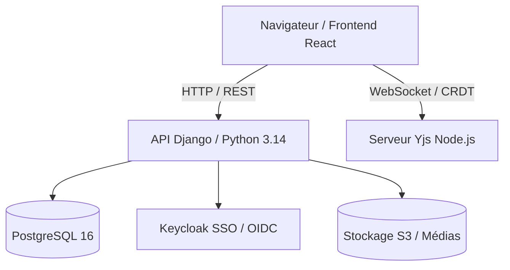

# 📝 Docs : Édition Collaborative de Documents

**Docs** est l'application d'édition de texte et de gestion de connaissances collaborative temps réel de **La Suite numérique**, conçue comme une alternative souveraine et open source à des outils tels que *Notion* ou *Google Docs*.

- **Dépôt officiel :** [suitenumerique/docs](https://github.com/suitenumerique/docs)
- **Licence :** MIT
- **Label :** [Digital Public Good (DPG)](https://digitalpublicgoods.net/r/docs-collaborative-text-editing)
- **Canal Matrix :** [`#docs-official:matrix.org`](https://matrix.to/#/#docs-official:matrix.org)
- **Contact :** `docs@numerique.gouv.fr`

---

## 🌟 Fonctionnalités Clés

### ✍️ Rédaction & Organisation
- **Éditeur par blocs & Markdown :** Commandes slash (`/`), formatage riche, listes, tableaux, blocs de code avec coloration syntaxique.
- **Mode Présentation automatique :** Génération de diaporamas plein écran ou export PDF à partir du séparateur `---`.
- **Hiérarchie & Sous-pages :** Arborescence complète pour structurer la base de connaissances d'une équipe.
- **Assistance IA souveraine :** Reformulation, résumé, traduction et correction orthographique.

### 🤝 Collaboration Temps Réel
- **Synchronisation CRDT ultra-rapide** basée sur Yjs et WebSockets.
- **Curseurs et présences en direct.**
- **Fils de commentaires et mentions.**
- **Gestion fine des permissions** (lecture, écriture, partage public/restreint).

---

## 🏗️ Architecture & Stack Technique



- **Frontend :** React, Next.js, Tailwind CSS, TipTap / ProseMirror.
- **Backend API :** Python (3.14), Django REST Framework, gestion des traductions (Crowdin).
- **Temps réel :** Yjs provider (WebSocket server) pour la synchronisation multi-utilisateurs.
- **Base de données :** PostgreSQL.
- **Authentification :** OpenID Connect (Keycloak).

---

## 🗺️ Roadmap & Ressources

- 📋 **Jalons & Milestones GitHub :** [suitenumerique/docs/milestones](https://github.com/suitenumerique/docs/milestones)
- 🐛 **Issues & Bugs :** [suitenumerique/docs/issues](https://github.com/suitenumerique/docs/issues)
- 📖 **Documentation interne :** Disponible dans `src/docs/documentation/`
- 💬 **Échanger avec l'équipe :** Rejoindre le salon Matrix [`#docs-official:matrix.org`](https://matrix.to/#/#docs-official:matrix.org)

---

## 🚀 Démarrage et Commandes Locales

### Commandes Makefile

```bash
# 1. Cloner Docs
REPOS="docs" make clone

# 2. Préparer les variables d'environnement locales
make env-docs

# 3. Initialiser les conteneurs, migrations et fixtures
make bootstrap-docs

# 4. Lancer le serveur de développement
make dev-docs

# 5. Consulter les logs en temps réel
make logs-docs
```

### URLs et Services Locaux

| Service | URL / Port | Identifiants par défaut | Rôle |
|---|---|---|---|
| **Frontend Docs** | [http://localhost:3000](http://localhost:3000) | `impress` / `impress` *(pas besoin de créer de compte)* | Interface utilisateur Next.js / React |
| **API Django** | [http://localhost:8071](http://localhost:8071) | — | API REST backend |
| **Admin Django** | [http://localhost:8071/admin](http://localhost:8071/admin) | `admin` / `admin` | Administration des modèles de données |
| **Keycloak SSO** | [http://localhost:8080](http://localhost:8080) (ou [http://localhost:8083](http://localhost:8083)) | `admin` / `admin` | Serveur d'authentification OIDC |
| **Console MinIO** | [http://localhost:9001](http://localhost:9001) | `impress` / `password` | Stockage S3 des pièces jointes et médias |
| **Mailcatcher** | [http://localhost:1081](http://localhost:1081) | — | Boîte de réception des emails générés |
| **Docspec API** | [http://localhost:4000](http://localhost:4000) | — | Service de conversion et rendu de documents |
| **Serveur Yjs** | `ws://localhost:4444` | — | Serveur WebSockets temps réel (CRDT) |

---

## ⚡ Fonctionnement du Hot-Reload

1. **Backend Django (`app-dev`) :**
   - **Déjà en hot-reload par défaut.** Le dossier `./src/backend` est monté en volume dans `/app`. Toute modification d'un fichier Python recharge automatiquement le serveur backend.

2. **Serveur de collaboration (`y-provider`) :**
   - **Déjà en hot-reload.** Le serveur Node.js Yjs redémarre à chaque modification du code TypeScript sous `src/frontend/servers/y-provider`.

3. **Frontend Next.js (`frontend-development`) :**
   - **Mode conteneurisé (par défaut avec `make dev`) :** Le volume `./src/frontend` est monté dans `/home/frontend` et tourne avec Turbopack / Fast Refresh.
   - **Mode local (recommandé pour les développeurs frontend) :**
     Pour un confort optimal et des temps de réponse instantanés :
     ```bash
     # 1. Faire tourner les services et le backend dans Docker
     make -C src/docs run-backend

     # 2. Lancer le frontend directement sur votre machine hôte
     make -C src/docs run-frontend-development
     ```

