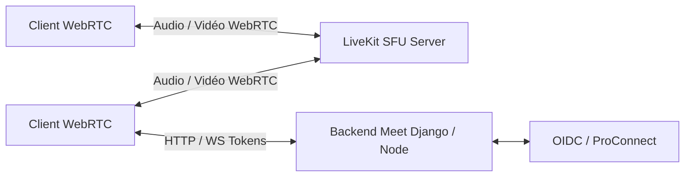

# 📹 Meet (Visio) : Visioconférence Sécurisée & Haute Performance

**Meet** (déployé sous le nom de **Visio** pour les agents publics français) est le service de visioconférence sécurisé et open source de **La Suite numérique**, propulsé par la technologie [LiveKit](https://livekit.io/).

- **Dépôt officiel :** [suitenumerique/meet](https://github.com/suitenumerique/meet)
- **Licence :** MIT
- **Label :** [Digital Public Good (DPG)](https://digitalpublicgoods.net/r/la-suite-meet-simple-video-conferencing)
- **Canal Matrix :** [`#meet-official:matrix.org`](https://matrix.to/#/#meet-official:matrix.org)
- **Contact :** `visio@numerique.gouv.fr`

---

## 🌟 Fonctionnalités Clés

- **Performances & Stabilité :** Conçu pour supporter sans difficulté des réunions de plus de **100 participants**.
- **Sans installation :** Accès direct depuis n'importe quel navigateur web moderne (desktop et mobile).
- **Partage multi-écrans :** Support simultané de plusieurs partages d'écran.
- **Messagerie instantanée sécurisée :** Chat éphémère chiffré intégré à la réunion.
- **Fonctionnalités IA avancées :** Transcription automatique et génération de comptes-rendus de réunion.
- **Intégration Téléphonie (SIP) :** Possibilité de rejoindre les visioconférences par numéro de téléphone.
- **Optimisations LiveKit avancées :** Détection de l'interlocuteur actif (*active speaker*), simulcast, codecs vidéo de nouvelle génération (VP9, AV1), abonnements sélectifs de flux.

---

## 🏗️ Architecture & Stack Technique



- **Frontend :** React, TypeScript, SDK LiveKit WebRTC client, composants d'interface personnalisables.
- **Moteur Média (SFU) :** [LiveKit](https://livekit.io/) (Selective Forwarding Unit ultra-performant en Go).
- **Enregistrement & Egress :** LiveKit Egress service avec export vidéo et transcription.
- **Authentification :** OpenID Connect (ProConnect / Keycloak).

---

## 🗺️ Roadmap & Ressources

- 🎯 **Feuille de route publique (GitHub Board) :** [suitenumerique Projects / Meet Roadmap](https://github.com/orgs/suitenumerique/projects/3/views/2)
- 📝 **Journal des modifications :** [CHANGELOG.md upstream](https://github.com/suitenumerique/meet/blob/main/CHANGELOG.md)
- 🐛 **Rapports de bugs et demandes :** [suitenumerique/meet/issues](https://github.com/suitenumerique/meet/issues)
- 💬 **Rejoindre la communauté sur Matrix :** [`#meet-official:matrix.org`](https://matrix.to/#/#meet-official:matrix.org)

---

## 🚀 Utilisation et Démarrage

- **Cloner le projet :**
  ```bash
  REPOS="meet" make clone
  ```
- **Lancement :**
  Meet nécessite une instance LiveKit opérationnelle ainsi que des clés API configurées. Pour le développement complet d'une salle de test, référez-vous au guide de démarrage dans `src/meet/README.md`.

