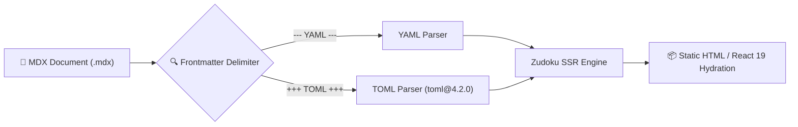

+++
title = "TOML Frontmatter Support"
sidebar_label = "TOML Support"
description = "Verification of TOML 4.2.0 parser compatibility, security overrides, and multi-ecosystem metadata standards in the Zudoku MDX build pipeline."
+++

# TOML Frontmatter Support & Multi-Ecosystem Metadata

This document specifies and validates the integration of the **TOML frontmatter parser (`toml@4.2.0`)** within the **Zudoku MDX** documentation build pipeline.

---

## 🏛️ Why Support TOML Frontmatter?

In addition to traditional YAML frontmatter (`---`), the Slasher monorepo documentation portals natively support TOML delimiters (`+++`).



### Key Advantages of TOML Frontmatter:

1. **Python & Rust Ecosystem Parity:** Developers working on `pyproject.toml` (Python/Django backend) and `Cargo.toml` (Rust services) benefit from a single, unified configuration syntax.
2. **Strict Typing & Quoting Rules:** TOML eliminates YAML ambiguity around boolean values (`yes`, `no`, `true`, `on`) and string types.
3. **Multi-SSG Interoperability:** Hugo and Zudoku static site generators share seamless cross-compatibility when using TOML delimiters.

---

## 📝 Syntax Comparison: TOML vs YAML

### Example A: TOML Frontmatter (`+++`)

```toml
+++
title = "TOML Frontmatter Support"
sidebar_label = "TOML Support"
description = "Verification of TOML 4.2.0 parser compatibility."
tags = ["documentation", "security", "zudoku"]
weight = 5
+++
```

### Example B: Equivalent YAML Frontmatter (`---`)

```yaml
---
title: "TOML Frontmatter Support"
sidebar_label: "TOML Support"
description: "Verification of TOML 4.2.0 parser compatibility."
tags:
  - "documentation"
  - "security"
  - "zudoku"
weight: 5
---
```

---

## 🛡️ Security & Dependency Overrides

Historical versions of the `toml` package suffered from prototype pollution vulnerabilities (such as **GHSA-2jhq-8534-4299** / CVE-2020-7608).

In this monorepo, the dependency tree is explicitly pinned in the root `package.json`:

```json
{
  "overrides": {
    "toml": "4.2.0"
  }
}
```

### Automated CI Verification

The integrity of TOML parsing and its dependency override is continuously verified in the test suite:

- **Unit Test File:** `packages/blocknote-sources/tests/unit/tomlAndOverrides.test.ts`
- **Quality Gate:** `npm run docs:build` verifies 0 SSR build failures and 0 hydration warnings when parsing TOML-delimited MDX pages.

---

## 🔗 Related Resources

- [Dependency Security & Overrides Report](/00-overview/engineering-standards)
- [Official TOML Specification v1.0.0](https://toml.io/en/)
- [Zudoku Documentation Framework](https://zudoku.dev)
