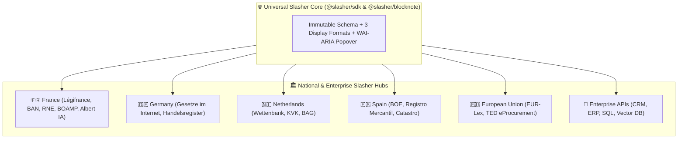

# 🌍 Multi-Country Extensibility Model

Slasher is designed from the ground up as a **universal, borderless standard** for rich connected documents. Any country, public administration, or enterprise can implement its own custom slasher providers in less than 15 minutes.

