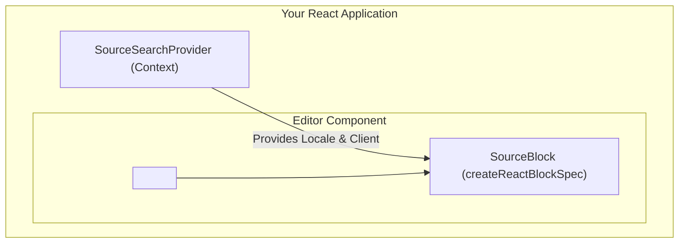

Install the package in your React project:

<PackageInstallTabs package="@suitenumerique/blocknote-sources @blocknote/core @blocknote/react" />

---

## 🏗️ Architecture & Component Tree

The Slasher extension operates by injecting a custom block definition into the BlockNote schema. It heavily relies on React Context to distribute internationalization and the HTTP client instances.



---

## ⚡ Quick Integration

```tsx
import { BlockNoteSchema, defaultBlockSpecs } from "@blocknote/core";
import { BlockNoteView } from "@blocknote/mantine";
import { useCreateBlockNote } from "@blocknote/react";
import { SourceBlock } from "@suitenumerique/blocknote-sources";

const schema = BlockNoteSchema.create({
  blockSpecs: {
    ...defaultBlockSpecs,
    sourceBlock: SourceBlock,
  },
});

export function Editor() {
  const editor = useCreateBlockNote({ schema });

  // Wrap your editor in the SourceSearchProvider to enable live queries
  return (
    <SourceSearchProvider client={mySearchClient} locale="en">
      <BlockNoteView editor={editor} />
    </SourceSearchProvider>
  );
}
```

> **Note:** The `SourceSearchProvider` is mandatory if you want to bypass the demo mocks and perform real HTTP requests against the backend proxy.

---

## 🎮 Interactive Live Playground

<BlockNoteSlashPlayground />
