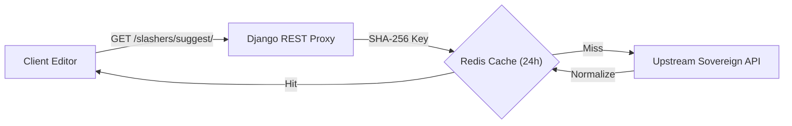

# 🛡️ Backend Proxy & Deterministic Caching

The backend layer (`django-slasher-core`) acts as a secure, high-performance gateway between client-side rich text editors and upstream sovereign APIs.

---

## 🔒 Security & Resilience Features

<FeatureGrid cols={2}>
  <FeatureCard
    title="Anti-SSRF IP Filtering"
    description="Strict rejection of private IPv4/IPv6 ranges (10.x, 127.x, 172.16-31.x, 192.168.x, 169.254.x)."
    icon="shield-check"
    href="/03-backend-proxy/defensive-security-ssrf"
  />
  <FeatureCard
    title="Deterministic SHA-256 Cache"
    description="Normalized query parameters hashed with SHA-256 for optimal cache hits across instances."
    icon="database"
    href="/03-backend-proxy/deterministic-cache"
  />
  <FeatureCard
    title="Distributed Quotas & Rate Limiting"
    description="80% safety margin threshold, per-user burst limits, and graceful degradation."
    icon="gauge"
    href="/03-backend-proxy/quota-and-rate-limiting"
  />
  <FeatureCard
    title="Circuit Breaker (3.5s & 429)"
    description="Captures Retry-After on HTTP 429 and trips on repeated 5xx errors with non-blocking fallback."
    icon="zap"
    href="/03-backend-proxy/quota-and-rate-limiting"
  />
</FeatureGrid>
