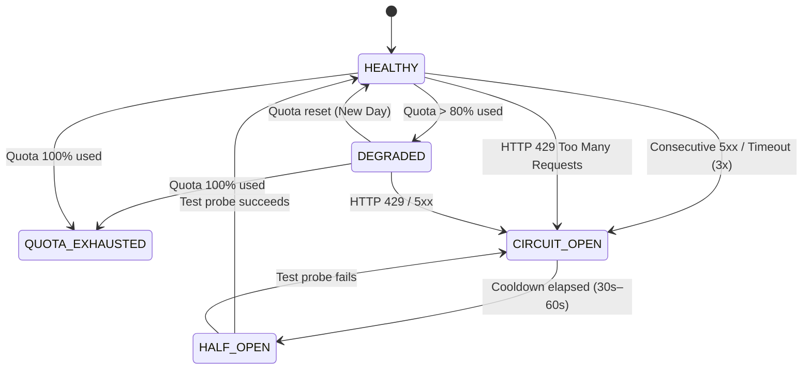

# ⚡ Distributed Quota Management & Resilience Engine

In enterprise and public-sector collaborative deployments, public APIs often enforce strict rate limits and daily quota ceilings.

Slasher implements a **resilient multi-tier architecture** ensuring that documents **never break** even when upstream APIs experience outages or exhaust their quotas.

---

## 🧭 1. Provider Runtime State Machine

Every sovereign connector operates under a 5-state health machine:



| State | Condition | Backend Behavior | Frontend / UI Impact |
|---|---|---|---|
| 🟢 **`HEALTHY`** | Quota $< 80\%$, API operational | Direct search & suggest with 24h caching | Live green indicator (`⚡ Live`) |
| 🟡 **`DEGRADED`** | Quota $\ge 80\%$, $< 100\%$ | Serve cache on priority; reserve $20\%$ quota for detail lookups | Subtle warning badge; priority cache lookup |
| 🟠 **`CACHED_ONLY`** | Circuit breaker open (HTTP 429 / 5xx) | Zero external network calls; serve verified cache & local index | `🕒 Cache Mode` badge; no editor disruption |
| 🔴 **`QUOTA_EXHAUSTED`** | Daily quota $100\%$ consumed | Return verified cached records with `verifiedAt` timestamp | Explanatory message; editing remains fluid |

---

## 🛡️ 2. Rate Limiting & Anti-Abuse Hierarchy

To prevent a single user or runaway automation from exhausting global public API quotas, Slasher enforces a 3-tier limit:

```mermaid
flowchart TD
    Req["Incoming User Keystroke (/law 'procurement')"] --> L1{"Per-User Burst Limit<br/>(Max 60 req/min)"}
    L1 -->|Exceeded| Cache1["Serve local suggest cache"]
    L1 -->|Allowed| L2{"Global Quota Ceiling<br/>(80% Safety Margin)"}
    L2 -->|Quota Exhausted| Cache2["Serve verified cached DTO"]
    L2 -->|Quota Available| L3{"Circuit Breaker Open?"}
    L3 -->|Open (429 / 5xx)| Cache3["Serve local index"]
    L3 -->|Closed| API["Live Sovereign API (e.g. Légifrance, EUR-Lex)"]
```

---

## 📡 3. Telemetry & Health Endpoint

The backend exposes a real-time status endpoint for monitoring:

```http
GET /api/v1.0/sources/status/
Authorization: Bearer <jwt-token>
```

**Response Payload (`200 OK`):**

```json
{
  "count": 41,
  "providers": {
    "law": {
      "status": "healthy",
      "message": "Live API operational.",
      "remaining_quota_percent": 94,
      "circuit_open_until": null,
      "last_error": null,
      "is_live": true
    },
    "eurlex": {
      "status": "cached_only",
      "message": "Circuit breaker open until 03:45:00 due to upstream failure.",
      "remaining_quota_percent": 0,
      "circuit_open_until": 1789698300,
      "last_error": "Upstream service timeout / 5xx error",
      "is_live": false
    }
  }
}
```

---

## 💡 4. Immutable Block Snapshots Guarantee

A fundamental rule of Slasher is **lossless document persistence**:
- When an entity is inserted into a BlockNote document, its full normalized snapshot (`title`, `excerpt`, `meta1..3`, `url`, `verifiedAt`) is saved directly into the document AST.
- If the remote ministerial API goes down years later, the document **renders identically** without breaking or showing empty boxes.
