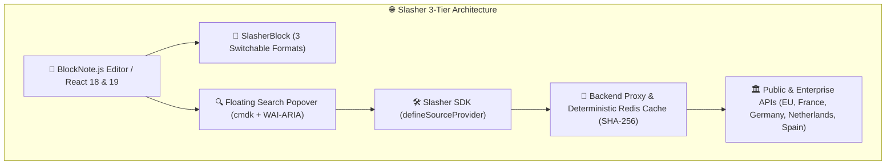

# 🌐 Slasher — Universal Remote Data Connectors for BlockNote

**Slasher** (`@blocknote/xl-external-sources`) is an open source community extension and lightweight SDK (`@blocknote/source-provider-sdk` < 5 kB) that connects rich text editors with remote public and private APIs.

---

## ✨ Key Features

<FeatureGrid>
  <FeatureCard
    title="3 Switchable Display Formats"
    description="Switch seamlessly between Callout (institutional quote), Card (3-column metadata grid), and Inline Mention (compact inline pill) on any block."
    icon="layout"
  />
  <FeatureCard
    title="WAI-ARIA & Keyboard Accessible"
    description="Fully accessible floating popover with cmdk autocomplete, focus trapping, screen-reader announcements, and arrow key navigation."
    icon="check-circle"
  />
  <FeatureCard
    title="Multi-Country Sovereign Presets"
    description="Out-of-the-box verified datasets for France 🇫🇷, Germany 🇩🇪, Netherlands 🇳🇱, Spain 🇪🇸, and the European Union 🇪🇺."
    icon="globe"
  />
  <FeatureCard
    title="Native Document Exporters"
    description="Lossless vector exporters for PDF (@react-pdf/renderer), Word DOCX (docx), and LibreOffice ODF/ODT."
    icon="file-text"
  />
</FeatureGrid>

---

## 🎮 Interactive Live Playground

Try typing `/` in the editor below or click the quick insertion buttons:

<BlockNoteSlashPlayground />

---

## 🧭 Navigation & Language Switch

- 🇫🇷 **French Documentation (Socle Souverain DINUM) :** [/fr](/fr)
- 🇬🇧 **English Documentation (Universal Standard) :** [/en](/en)
