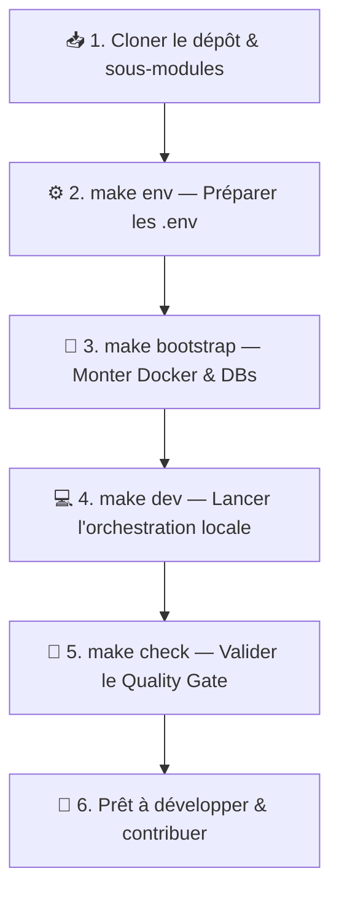

Bienvenue dans l'espace d'**Onboarding & Démarrage Rapide** pour **La Suite numérique** et le socle souverain **`/slash`** !

Ce guide accompagne les nouveaux développeurs, contributeurs open source et agents de l'État dans la prise en main de l'environnement de développement, de la configuration système jusqu'à la soumission de leur première Pull Request.

---

## 🚀 Le Parcours d'Intégration en 5 Étapes



---

## 🧭 Sommaire du Guide d'Onboarding

<FeatureGrid cols={3}>
  <FeatureCard
    icon="💻"
    title="Environnement Hôte"
    badge="Étape 1"
    description="Prérequis système, moteurs Docker légers (OrbStack, Colima) et runtimes (Node 22 LTS, Python 3.12+)."
    href="/01-onboarding/01-demarrage/environnement-machine-hote"
  />
  <FeatureCard
    icon="🔑"
    title="Git & Clés SSH"
    badge="Étape 2"
    description="Génération de clés Ed25519, configuration multi-comptes (~/.ssh/config) et signature des commits."
    href="/01-onboarding/01-demarrage/git-ssh"
  />
  <FeatureCard
    icon="🧩"
    title="Configuration VS Code"
    badge="Étape 3"
    description="Extensions recommandées (Ruff, ESLint, Prettier), formatage automatique à la sauvegarde et SQLTools 1-clic."
    href="/01-onboarding/01-demarrage/vscode"
  />
  <FeatureCard
    icon="🌐"
    title="URLs & Identifiants"
    badge="Étape 4"
    description="Tableau récapitulatif des ports locaux, services Docker et identifiants par défaut pour PostgreSQL."
    href="/01-onboarding/01-demarrage/urls-et-identifiants"
  />
  <FeatureCard
    icon="🏛️"
    title="Normes DINUM & Qualité"
    badge="Étape 5"
    description="Standards stricts : 0 any, 0 cast, RGAA v4.1 AA, 0 violation Axe-Core et sécurité défensive Anti-SSRF."
    href="/01-onboarding/02-workflow-et-contribution/bonnes-pratiques-dinum"
  />
  <FeatureCard
    icon="🚀"
    title="Premier Commit & PR"
    badge="Validation"
    description="Guide pas-à-pas pour formater, tester avec make check, signer son commit et ouvrir une PR."
    href="/01-onboarding/02-workflow-et-contribution/guide-du-premier-commit"
  />
</FeatureGrid>

---

## ⚡ Commandes d'Amorçage Rapide (Cheat Sheet)

Exécutez cette séquence dans votre terminal pour initialiser l'ensemble du projet :

```bash
# 1. Cloner le dépôt et initialiser les dépendances
git clone git@github.com:suitenumerique/dinum-setup.git
cd dinum-setup

# 2. Préparer les fichiers d'environnement locaux (.env)
make env

# 3. Amorcer les conteneurs et les bases de données PostgreSQL
make bootstrap

# 4. Lancer les services en mode développement
make dev

# 5. Valider l'intégrité de la stack locale (16 étapes de contrôle)
make check
```

---

## 📚 Ressources Annexes & Contexte

- 🤝 **Contexte & Hackathon :** [Challenge 42 x DINUM](/01-onboarding/00-contexte/challenge-42) • [Planning](/01-onboarding/00-contexte/planning)
- 📐 **Décisions d'Architecture :** [Registre des ADRs](/01-onboarding/02-workflow-et-contribution/adr)
- 🛟 **Assistance :** [Glossaire Technique](/01-onboarding/03-support/glossaire) • [Guide de Dépannage](/01-onboarding/03-support/troubleshooting)
