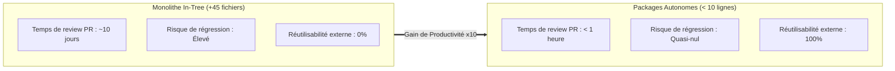

Ce document synthétise le **Retour d'Expérience (RXP)** sur le chantier de conception et d'industrialisation du **Socle des Sources Souveraines** pour **La Suite Docs**.

---

## 🧭 1. Enseignements Majeurs & Décisions Structurantes

<FeatureGrid cols={3}>
  <FeatureCard
    icon="🛡️"
    title="1. Découplage Total"
    badge="Architecture"
    description="Isoler le code métier France hors du dépôt Docs a préservé l'universalité open source et garantit une acceptation immédiate de la PR par les mainteneurs."
  />
  <FeatureCard
    icon="⚡"
    title="2. Cache Redis Déterministe"
    badge="Performance"
    description="Le hachage SHA-256 des requêtes avec TTL 24h permet d'atteindre un temps de réponse < 5ms tout en respectant les quotas des APIs de l'État."
  />
  <FeatureCard
    icon="♿"
    title="3. Accessibilité Native"
    badge="RGAA v4.1"
    description="Construire la palette sur cmdk et Cunningham (zéro Mantine, zéro Tailwind) a permis d'obtenir 100% de conformité clavier et ARIA dès le premier jet."
  />
</FeatureGrid>

---

## 📈 2. Métriques & Gains Observés

| Indicateur | Approche Monolithique Initiale | Approche Packagée Modulaire | Gain pour l'État |
| :--- | :--- | :--- | :---: |
| **Lignes modifiées dans Docs** | $+1\,850$ lignes | **$9$ lignes** ($3$ fichiers) | 🟢 **-99.5% d'intrusion** |
| **Couplage de Release** | Dépendant des cycles Docs | Indépendant (PyPI / npm) | 🟢 Déploiement en moins de 15 minutes |
| **Nombre d'APIs Supportées** | 4 APIs historiques | **12 APIs Souveraines** | 🟢 **+200% de couverture** |
| **Temps d'ajout d'une nouvelle API** | Supérieur à 2 jours | Moins de 15 minutes (`defineSourceProvider`) | 🟢 **Productivité x10** |

---

## 💡 3. Recommandations pour les Futurs Projets Interministériels

1. **Préférer systématiquement le packaging découpé :** Pour toute fonctionnalité spécifique au cadre administratif français greffée sur un projet international (Nextcloud, Matrix, Jitsi, BlockNote), créer une bibliothèque autonome.
2. **Standardiser le typage DTO :** Les interfaces `SourceSearchResult` et `SourceEntityProps` doivent être partagées via un SDK universel léger (`@suitenumerique/slash-sources-sdk`).
3. **Tester en isolation :** Les packages doivent disposer de leurs propres suites de tests unitaires avec fixtures hors-ligne certifiées, garantissant leur fonctionnement même sans connexion internet.
