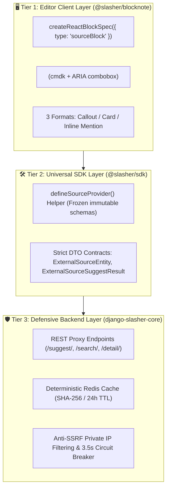

import { Mermaid } from "../../../src/components/Mermaid";

# 🏛️ 3-Tier Architecture Pattern

Slasher is structured in 3 decoupled, independently deployable tiers:

```mermaid
flowchart TD
    subgraph Tier1["🖥️ Tier 1: Editor Client Layer (@slasher/blocknote)"]
        CustomBlock["createReactBlockSpec({ type: 'sourceBlock' })"]
        Popover["<SourceSearchPopover /> (cmdk + ARIA combobox)"]
        Formats["3 Formats: Callout / Card / Inline Mention"]
    end

    subgraph Tier2["🛠️ Tier 2: Universal SDK Layer (@slasher/sdk)"]
        Define["defineSourceProvider() Helper (Frozen immutable schemas)"]
        DTOs["Strict DTO Contracts: ExternalSourceEntity, ExternalSourceSuggestResult"]
    end

    subgraph Tier3["🛡️ Tier 3: Defensive Backend Layer (django-slasher-core)"]
        Proxy["REST Proxy Endpoints (/suggest/, /search/, /detail/)"]
        Cache["Deterministic Redis Cache (SHA-256 / 24h TTL)"]
        Security["Anti-SSRF Private IP Filtering & 3.5s Circuit Breaker"]
    end

    Tier1 --> Tier2
    Tier2 --> Tier3
```
