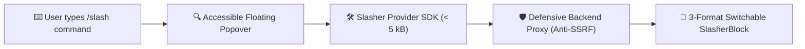

import { FeatureCard, FeatureGrid } from "../../../../src/components/Cards";
import { Mermaid } from "../../../../src/components/Mermaid";

# 🌐 The Universal Connected Data Standard

**Slasher** standardizes how rich text documents interact with verified remote public records, legal databases, corporate registers, and AI knowledge bases.

---

## 🏛️ Why Slasher?

<FeatureGrid cols={3}>
  <FeatureCard
    title="Zero UI Lock-in"
    description="Render entities in 3 switchable layouts: Callout quotes, 3-column metadata Cards, or Inline Mention badges."
    icon="layout"
  />
  <FeatureCard
    title="WAI-ARIA Compliant"
    description="Full keyboard navigation, focus trapping, and screen-reader announcements using cmdk."
    icon="check-circle"
  />
  <FeatureCard
    title="Multi-Country Presets"
    description="Ready-to-use sovereign connectors for France, Germany, Netherlands, Spain, and the European Union."
    icon="globe"
  />
</FeatureGrid>
