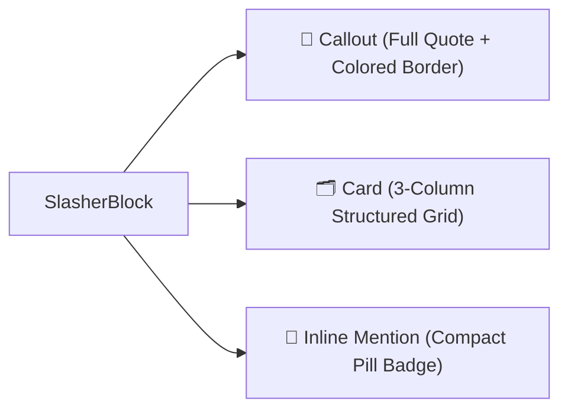

import { FeatureCard, FeatureGrid } from "../../../../src/components/Cards";
import { Mermaid } from "../../../../src/components/Mermaid";

# 🧩 3 Switchable Display Formats

Every Slasher block can be dynamically switched in place between **3 distinct visual formats** to fit any editorial context:

---

## 1. 📢 Callout Format (`displayMode: 'callout'`)
Ideal for legal citations, official regulations, or public notices where the full excerpt must be prominent. Features a colored institutional border (e.g., `#000091` for Marianne, `#AA151B` for Spain).

## 2. 🗂️ Card Format (`displayMode: 'card'`)
Ideal for companies, procurement notices, and cadastral parcels where structured key-value metadata fields are highlighted in a clean 3-column layout.

## 3. 🔗 Inline Mention Format (`displayMode: 'link'`)
Ideal for dense paragraphs where an unobtrusive, verifiable badge is embedded directly in the text flow.
