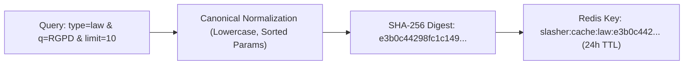

import { Mermaid } from "../../../src/components/Mermaid";

# ⚡ Deterministic Redis Caching Strategy

To minimize outbound network roundtrips and avoid rate-limiting on governmental gateways, Slasher employs deterministic key normalization:

