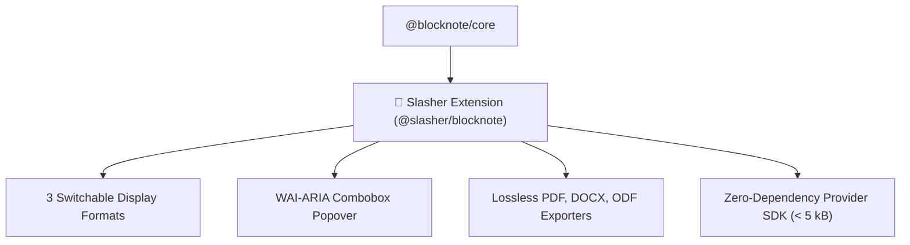

import { Mermaid } from "../../../../src/components/Mermaid";

# 🐙 BlockNote Upstream RFC

This document contains the official Request for Comments (RFC) proposed to [`TypeCellOS/BlockNote`](https://github.com/TypeCellOS/BlockNote) for introducing `@slasher/blocknote` (or `blocknote-slasher`) and `@slasher/sdk`.

---

## 🎯 Summary of Contribution

| Aspect | Specification |
| :--- | :--- |
| **Target Repository** | [`TypeCellOS/BlockNote`](https://github.com/TypeCellOS/BlockNote) |
| **Proposed Module** | `@slasher/blocknote` / `@blocknote/slasher-sdk` |
| **Architecture** | 3 switchable display formats (Callout / Card / Inline Mention), WAI-ARIA popover, lossless PDF/DOCX/ODF exporters |
| **Compatibility** | React 18 & 19, BlockNote >= 0.54.0 |

