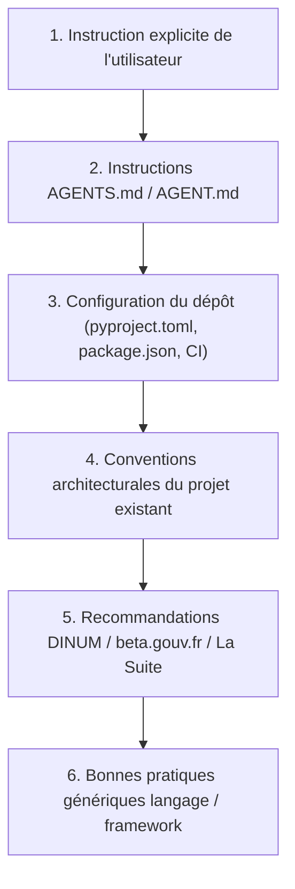

import { Mermaid } from "../../../../src/components/Mermaid";
import { FeatureCard, FeatureGrid } from "../../../../src/components/Cards";

Ce document compile et formalise les **bonnes pratiques de développement et d'ingénierie logicielle** appliquées au sein de la **Direction Interministérielle du Numérique (DINUM)**, de **beta.gouv.fr** et de **La Suite Numérique**.

---

## 🏛️ 1. Corpus des Références Officielles

Les normes appliquées dans ce monorepo s'appuient sur les référentiels officiels de l'État :

<FeatureGrid cols={3}>
  <FeatureCard
    icon="📖"
    title="Developer Handbook La Suite"
    description="Manuel officiel des développeurs de La Suite numérique (Architecture, revues, accessibilité et sécurité)."
    href="https://suitenumerique.gitbook.io/handbook"
    badge="Officiel DINUM"
  />
  <FeatureCard
    icon="🐍"
    title="Python Best Practices La Suite"
    description="Guide de style Python, typage strict, architecture Django/DRF et gestion des imports."
    href="https://github.com/suitenumerique/dev-handbook/blob/main/python.md"
    badge="La Suite GitBook"
  />
  <FeatureCard
    icon="♿"
    title="DesignGouv — Mémo Dev RGAA"
    description="Checklist et mémo accessibilité numérique pour les développeurs web de l'État."
    href="https://design.numerique.gouv.fr/outils/memo-dev/"
    badge="DesignGouv"
  />
  <FeatureCard
    icon="⚡"
    title="Standards beta.gouv.fr"
    description="Standards d'impact, uniformité du code source, tests unitaires/E2E et documentation produit."
    href="https://standards.beta.gouv.fr/standards"
    badge="beta.gouv.fr"
  />
  <FeatureCard
    icon="🎨"
    title="UI Kit La Suite"
    description="Bibliothèque officielle des composants d'interface de La Suite (@gouvfr-lasuite/ui-components)."
    href="https://github.com/suitenumerique/ui-kit"
    badge="Open Source"
  />
  <FeatureCard
    icon="🛡️"
    title="Règles de Sécurité La Suite"
    description="Hygiène des secrets, validation anti-SSRF, défense en profondeur et gestion des permissions."
    href="https://github.com/suitenumerique/dev-handbook/blob/main/security.md"
    badge="Sécurité État"
  />
</FeatureGrid>

---

## 🎯 2. Ordre de Préséance des Règles (Règle d'Or)

Pour éviter les conflits d'outillage entre projets historiques et modernes, l'ordre de priorité suivant est **strictement appliqué** :

> 💡 **Exemple concret :** Le handbook historique recommande PEP 8 avec une longueur de ligne à 99 caractères, tandis que les dépôts récents de La Suite configurent Ruff à 88 caractères. **La configuration locale du projet gagne toujours.**

---

## ⚛️ 3. Standards Frontend (React, TypeScript & DSFR)

### A. Règle d'Inspection Préalable
Avant toute modification de code frontend :
- Inspecter `package.json`, `tsconfig.json`, la configuration ESLint/Biome/Prettier.
- Identifier les composants et primitives de design system existants (`@codegouvfr/react-dsfr`, Cunningham).
- Ne jamais introduire une dépendance superflue si un package du projet résout déjà le besoin.

### B. Typage Strict & Purity
- **Zéro `any`** et **zéro assertion de type abusive** (`as ...`).
- Modéliser explicitement les états optionnels et nullables (`null | undefined`).
- Typer exhaustivement les `props` de composants et les retours d'API.

### C. Conception de Composants
- Composants de taille réduite, à responsabilité unique.
- Privilégier la dérivation d'état au rendu plutôt que des synchronisations complexes par `useEffect`.
- Gestion systématique des 6 états d'interface : *Initial, Chargement, Succès, Vide (Empty State), Erreur récupérable, Désactivé*.

### D. Accessibilité RGAA v4.1 (Niveau AA)
- Privilégier les éléments sémantiques HTML natifs (`<button>`, `<a>`, `<nav>`, `<main>`, `<dialog>`).
- Navigation 100% au clavier sans piège au focus (`Tab`, `Flèches`, `Échap`, `Entrée`).
- Focus visible et contraste de couleurs $\ge 4.5:1$.

---

## 🐍 4. Standards Backend (Python, Django & Sécurité)

### A. Conventions de Code & Formatage
- Suivre les linters/formateurs configurés (Ruff, Flake8, Black, isort).
- Imports structurés par blocs distincts :
  1. `__future__`
  2. Bibliothèque standard Python
  3. Frameworks (Django, DRF, FastAPI)
  4. Dépendances tierces
  5. Modules applicatifs locaux / relatifs.

### B. Base de Données & Optimisation Django
- Traitement préventif des requêtes $N+1$ (`select_related`, `prefetch_related`).
- Utilisation des transactions atomiques (`transaction.atomic`) pour les mutations critiques.
- Évolution sûre des migrations de base de données (compatibilité ascendante et descendante).

### C. Sécurité Défensive (Anti-SSRF & Secrets)
- Zéro secret ou mot de passe commité en clair (utilisation obligatoire de SOPS/age ou `.env.example`).
- Filtrage défensif des URLs distantes pour empêcher les attaques SSRF (blocage des plages IP privées `127.0.0.0/8`, `10.0.0.0/8`, `172.16.0.0/12`, `192.168.0.0/16`, `169.254.169.254`).
- Circuit Breaker avec timeout strict (3.5s max) sur les appels d'APIs tierces.

---

## 🔗 5. Liens & Documentation de Référence

- **Standards beta.gouv.fr :**
  - [Code source uniforme et linting](https://github.com/betagouv/standards/blob/main/qualit%C3%A9-logicielle/le-code-source-est-uniforme.md)
  - [Tests unitaires et E2E obligatoires](https://github.com/betagouv/standards/blob/main/qualit%C3%A9-logicielle/le-code-est-instrumente-par-des-tests-unitaires-et-des-tests-e2e.md)
  - [Documentation technique des produits](https://github.com/betagouv/standards/blob/main/qualit%C3%A9-logicielle/les-aspects-techniques-du-produit-sont-documentes.md)
- **La Suite Numérique :**
  - [Dev Handbook — Code Reviews](https://github.com/suitenumerique/dev-handbook/blob/main/code-reviews.md)
  - [Dev Handbook — Accessibility](https://github.com/suitenumerique/dev-handbook/blob/main/accessibility.md)
  - [Dev Handbook — Security](https://github.com/suitenumerique/dev-handbook/blob/main/security.md)
  - [Configuration Python Docs](https://github.com/suitenumerique/docs/blob/main/src/backend/pyproject.toml)
  - [Configuration Frontend Impress](https://github.com/suitenumerique/docs/blob/main/src/frontend/apps/impress/package.json)
