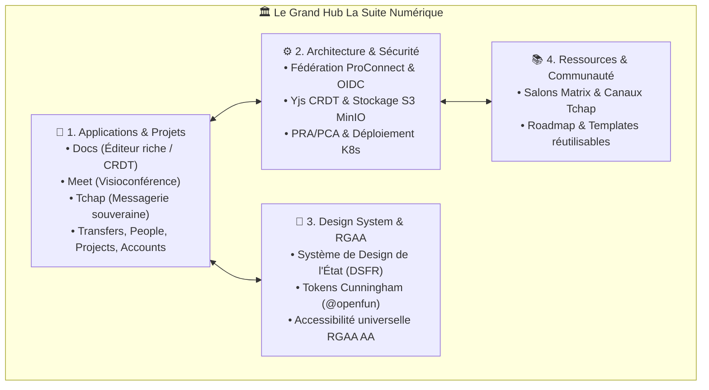

import { FeatureCard, FeatureGrid } from "../../../src/components/Cards";
import { Mermaid } from "../../../src/components/Mermaid";

# 🏛️ L'Écosystème de La Suite Numérique

**La Suite numérique** est un ensemble d'outils collaboratifs souverains, libres et sécurisés développés par la Direction Interministérielle du Numérique (**DINUM**) et l'Agence Nationale de la Cohésion des Territoires (**ANCT**), à destination de tous les agents publics.

---

## 🗂️ Les 4 Piliers du Hub La Suite

<FeatureGrid cols={2}>
  <FeatureCard
    title="📱 Applications & Fiches Projets"
    description="Documentation technique, guides d'installation et spécifications de Docs, Meet, Tchap, Transfers, People, Projects et Accounts."
    href="/fr/02-la-suite/01-applications"
    icon="layout"
  />
  <FeatureCard
    title="⚙️ Architecture & Données"
    description="Fédération d'identité ProConnect, collaboration temps réel Yjs/CRDT, stockage S3 MinIO et déploiement souverain."
    href="/fr/02-la-suite/02-architecture"
    icon="layers"
  />
  <FeatureCard
    title="🎨 Design System & DSFR"
    description="Composants officiels DSFR, Tokens Cunningham (@openfun/cunningham-tokens) et critères d'accessibilité RGAA v4.1 AA."
    href="/fr/02-la-suite/03-design-system"
    icon="palette"
  />
  <FeatureCard
    title="📚 Ressources & Communauté"
    description="Accès aux salons de discussion Tchap / Matrix, feuille de route collaborative et modèles réutilisables."
    href="/fr/02-la-suite/04-ressources"
    icon="map"
  />
</FeatureGrid>
