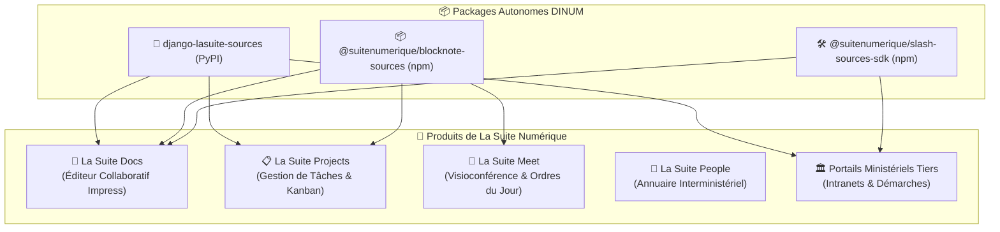

import { Mermaid } from "../../../src/components/Mermaid";
import { FeatureCard, FeatureGrid } from "../../../src/components/Cards";

L'un des avantages majeurs du découpage en **packages autonomes** (`django-lasuite-sources` et `@suitenumerique/blocknote-sources`) est leur capacité à être **réutilisés instantanément** par l'ensemble des applications de l'État français, sans aucun couplage avec *La Suite Docs*.

---

## 🏛️ 1. Matrice de Mutualisation dans La Suite Numérique



---

## 📋 2. Cas d'Usage : Intégration dans *La Suite Projects*

Dans l'application de gestion de tâches et projets **Projects**, les agents ont un besoin fréquent d'associer des tickets ou cartes Kanban à des références légales ou des entreprises contractantes :

### Exemple : Rattachement d'un Marché Public ou d'un Numéro SIRET à une Tâche
```tsx
import React, { useState } from 'react';
import { SourceSearchPopover, SourceEntityProps } from '@suitenumerique/blocknote-sources';
import { Box, Button } from '@openfun/cunningham-tokens';

export const TaskSourceAttacher = ({ taskId }: { taskId: string }) => {
  const [isOpen, setIsOpen] = useState(false);
  const [attachedSource, setAttachedSource] = useState<SourceEntityProps | null>(null);

  return (
    <Box $direction="column" $gap="sm">
      {attachedSource ? (
        <Box $padding="xs" className="fr-badge fr-badge--info">
          🏷️ Source liée : {attachedSource.title}
        </Box>
      ) : (
        <Button onClick={() => setIsOpen(true)}>
          Lier une source souveraine (Loi, Marché, Entreprise)
        </Button>
      )}

      {isOpen && (
        <SourceSearchPopover
          sourceType="all"
          onSelect={(source) => {
            setAttachedSource(source);
            setIsOpen(false);
          }}
          onClose={() => setIsOpen(false)}
        />
      )}
    </Box>
  );
};
```

---

## 🎥 3. Cas d'Usage : Intégration dans *La Suite Meet* (Ordres du Jour)

Dans **La Suite Meet**, lors de la préparation d'une réunion interministérielle :
1. Les participants ajoutent des **points à l'ordre du jour**.
2. Chaque point peut citer directement le **numéro d'article de loi** ou le **dossier législatif de l'Assemblée nationale** concerné.
3. Le bloc s'affiche sous forme d'encadré Marianne accessible à tous les participants connectés.

---

## 🚀 4. Guide d'Installation pour un Projet Django Externe

N'importe quel ministère ou collectivité développant un portail web en Python/Django peut bénéficier des 12 connecteurs souverains en 2 étapes :

```bash
# 1. Installation du package
pip install django-lasuite-sources
```

```python
# 2. Ajout dans settings.py & urls.py
INSTALLED_APPS += ["lasuite_sources"]

# urls.py
urlpatterns += [path("api/sources/", include("lasuite_sources.urls"))]
```

👉 **Résultat immédiat :** Vos applications disposent de `/search/`, `/suggest/`, du cache Redis 24h, du rate-limiting et du filtrage anti-SSRF sans avoir à développer un seul connecteur d'API ministérielle.
