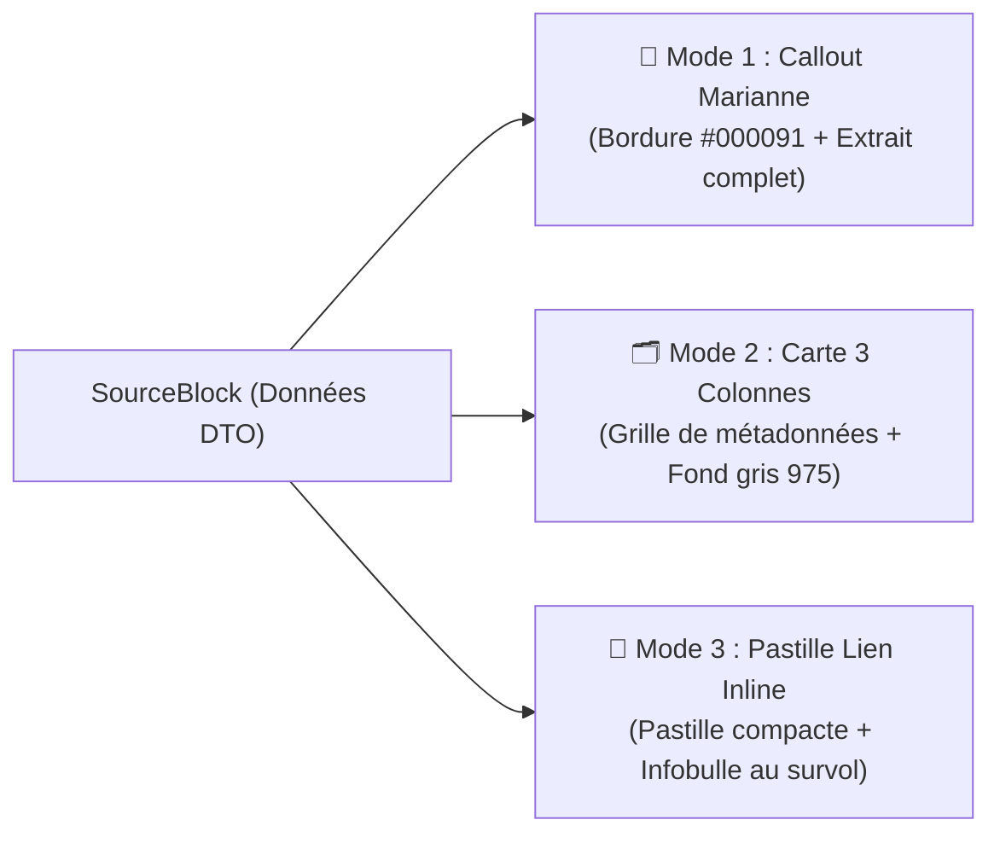

# 🎨 Spécification des 3 Formats d'Affichage DSFR & Personnalisation (`formats.md`)

> **Package :** `@suitenumerique/blocknote-sources`  
> **Auteur :** Direction Interministérielle du Numérique (DINUM)  
> **Conformité :** DSFR (`@codegouvfr/react-dsfr`), Cunningham (`@openfun/cunningham-tokens`), RGAA v4.1 (Niveau AA)

---

## 🧭 1. Le Pattern Multi-Formats Permutable sans Perte

Le bloc `SourceBlock` implémente un pattern d'affichage universel à **3 modes permutables à chaud** via la barre d'outils de survol (`SourceBlockToolbar`) :



---

## 📢 2. Mode 1 : Encadré Callout Marianne (`callout`)

### Usage & Sémantique
Recommandé pour les citations de textes juridiques (`/loi`), décisions de justice, extraits de rapports de marchés publics (`/marche`) ou fiches d'aides territoriales (`/subvention`).

### Caractéristiques Graphiques & Tokens
- **Liseré latéral gauche :** Largeur `4px`, couleur par défaut **Bleu Marianne `#000091`** (`var(--c--contextuals--border--primary)`).
- **Fond de surface :** Blanc en thème clair, gris sombre en dark mode (`var(--c--globals--colors--gray-975)`).
- **Badge de statut officiel :** En haut à droite (`En vigueur`, `Certifié`, `Clôturé`).
- **Lien hypertexte sécurisé :** Lien officiel vers Légifrance, BOAMP ou data.gouv.fr avec icône externe accessible.

---

## 🗂️ 3. Mode 2 : Carte Structurée 3 Colonnes (`card`)

### Usage & Sémantique
Recommandé pour les fiches entreprises (`/entreprise`), statistiques démographiques (`/stats`), parcelles foncières (`/cadastre`) et avis de marchés (`/marche`).

### Caractéristiques Graphiques & Tokens
- **Grille de données :** Répartition en 3 colonnes égales de métadonnées (ex: Numéro SIREN, Statut RCS, Date de création).
- **Typographie :** Libellés secondaires en gris 500, valeurs principales en gras.
- **Bordure intégrale :** Liseré fin `1px` neutre (`var(--c--globals--colors--gray-200)`).

---

## 🔗 4. Mode 3 : Pastille Lien Inline (`link`)

### Usage & Sémantique
Recommandé pour insérer une référence discrète au fil du texte sans rompre la lecture du paragraphe (ex: *« Conformément à l'Article L. 111-1 du Code de la commande publique, nous avons procédé... »*).

### Caractéristiques Graphiques & Tokens
- **Affichage inline :** Pastille compacte avec icône thématique et libellé.
- **Infobulle interactive (Tooltip) :** Révèle au survol ou au focus clavier l'extrait textuel complet et l'organisme émetteur.

---

## 🎨 5. Personnalisation du Liseré Institutionnel (`borderColor`)

Pour les organisations partenaires (collectivités territoriales, administrations francophones comme la Belgique, la Suisse ou le Canada, ou entreprises privées), le composant accepte une prop optionnelle `borderColor` :

```tsx
import { SourceBlock } from '@suitenumerique/blocknote-sources';

// Instanciation personnalisée avec liseré spécifique (ex: Vert ANCT #008000 ou Rouge #D32F2F)
const customSourceBlock = SourceBlock({
  defaultDisplayMode: 'callout',
  borderColor: '#008000', // Surcharge du bleu Marianne
});
```

---

## ♿ 6. Conformité Accessibilité RGAA v4.1 (Niveau AA)

| Critère RGAA | Implémentation dans `@suitenumerique/blocknote-sources` | Statut |
| :--- | :--- | :---: |
| **Contraste des textes** | Ratio de contraste $\ge 4.5:1$ en thème clair et sombre | ✅ Conforme |
| **Navigation clavier** | Commutation des formats via boutons accessibles (`Tab` + `Enter`) | ✅ Conforme |
| **Rôles ARIA** | `role="toolbar"`, `aria-label="Modes d'affichage de la source"` | ✅ Conforme |
| **Infobulles** | `role="tooltip"` lié par `aria-describedby` | ✅ Conforme |
