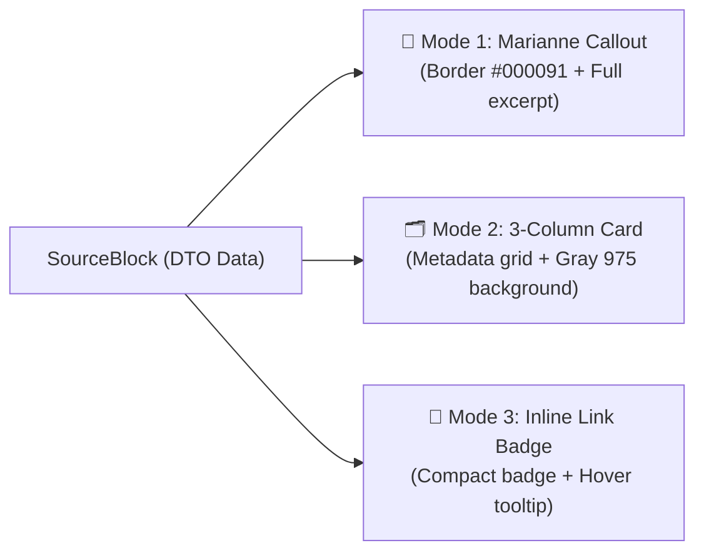

# 🎨 3-Format Display Specification & Customization (`formats.md`)

> **Package:** `@suitenumerique/blocknote-sources`  
> **Author:** Direction Interministérielle du Numérique (DINUM)  
> **Compliance:** DSFR (`@codegouvfr/react-dsfr`), Cunningham (`@openfun/cunningham-tokens`), RGAA v4.1 (Level AA)

---

## 🧭 1. Lossless Hot-Switchable Multi-Format Pattern

The `SourceBlock` implements a universal display pattern with **3 hot-switchable display modes** via the hover toolbar (`SourceBlockToolbar`):



---

## 📢 2. Mode 1: Marianne Callout (`callout`)

### Usage & Semantics
Recommended for legal text citations (`/loi`), judicial rulings, public procurement extracts (`/marche`), or territorial grant summaries (`/subvention`).

### Graphical Attributes & CSS Tokens
- **Left Accent Border:** Width `4px`, default color **Marianne Blue `#000091`** (`var(--c--contextuals--border--primary)`).
- **Surface Background:** White in light theme, dark gray in dark mode (`var(--c--globals--colors--gray-975)`).
- **Official Status Badge:** Top-right (`In effect`, `Certified`, `Closed`).
- **Secure Hyperlink:** Official link to Légifrance, BOAMP, or data.gouv.fr with accessible external link icon.

---

## 🗂️ 3. Mode 2: Structured 3-Column Card (`card`)

### Usage & Semantics
Recommended for enterprise company profiles (`/entreprise`), demographic statistics (`/stats`), land registry parcels (`/cadastre`), and tender notices (`/marche`).

### Graphical Attributes & CSS Tokens
- **Metadata Grid:** 3-column equal distribution of key metadata (e.g., SIREN number, RCS status, registration date).
- **Typography:** Secondary labels in gray-500, primary values in bold.
- **Full Border:** Thin `1px` neutral border (`var(--c--globals--colors--gray-200)`).

---

## 🔗 4. Mode 3: Inline Link Badge (`link`)

### Usage & Semantics
Recommended for inserting a discrete in-text reference without breaking paragraph flow (e.g., *"Pursuant to Article L. 111-1 of the Public Procurement Code, the commission decided..."*).

### Graphical Attributes & CSS Tokens
- **Inline Display:** Compact badge with thematic icon and title label.
- **Interactive Tooltip:** Displays full text excerpt and issuing body on hover or keyboard focus.

---

## 🎨 5. Customizing Institutional Accent Border (`borderColor`)

For partner institutions (local governments, administrations such as Belgium, Switzerland, Germany, Spain, Netherlands, or private organizations), the component accepts an optional `borderColor` prop:

```tsx
import { SourceBlock } from '@suitenumerique/blocknote-sources';

// Custom instantiation with custom border accent (e.g. Green #008000 or Red #D32F2F)
const customSourceBlock = SourceBlock({
  defaultDisplayMode: 'callout',
  borderColor: '#008000', // Overrides Marianne blue
});
```

---

## ♿ 6. Accessibility Compliance RGAA v4.1 / WCAG 2.1 (Level AA)

| Criterion | Implementation in `@suitenumerique/blocknote-sources` | Status |
| :--- | :--- | :---: |
| **Text Contrast** | Contrast ratio $\ge 4.5:1$ in both light and dark modes | ✅ Compliant |
| **Keyboard Navigation** | Accessible format switching via buttons (`Tab` + `Enter`) | ✅ Compliant |
| **ARIA Roles** | `role="toolbar"`, `aria-label="Source display modes"` | ✅ Compliant |
| **Tooltips** | `role="tooltip"` bound via `aria-describedby` | ✅ Compliant |
